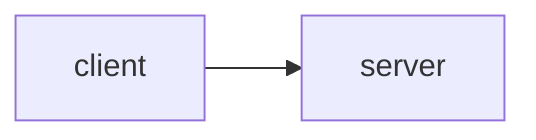

# Lab 4: Agent serving infra

Reference blueprint. Serve the kernel.

## Data
- Script: `lab4_agent_serving_infra.py`

## Information
Chapter 10 + 11.

## Knowledge
Run or rewrite.

## Wisdom
Not a new cloud.

## The When and Why
- **When:** you need a port.
- **Why:** scripts are not a service.

## How it works



## Data contract
HTTP 202 / SSE

## Run

```bash
python education/15_synthesis/lab4_agent_serving_infra.py
```

## What you should see
A listening server or a dry-run print.

## What this becomes later
Done with blueprints.

## Related
- **Chapter 10.**

## Notes

