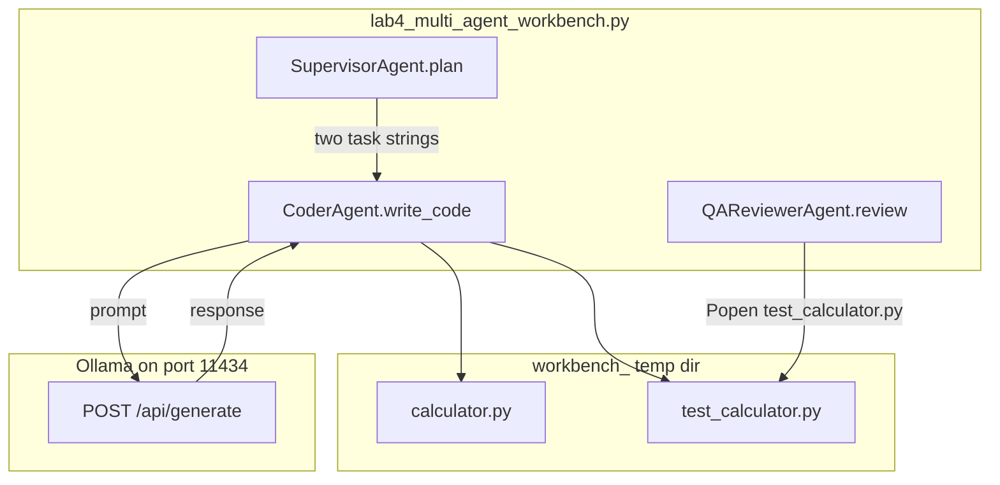

# Lab 4: Multi-agent workbench

A supervisor, a coder, and a QA reviewer share one temp dir. This reuses chapter 08 roles and the chapter 09 sandbox. Not a new topology.

## What you touch
- Script: `lab4_multi_agent_workbench.py`
- Functions: `SupervisorAgent.plan`, `CoderAgent.write_code`, `QAReviewerAgent.review`, `run_local_multi_agent_workbench`, `llm_call`
- URL / path: `{OLLAMA_HOST}/api/generate` (default `http://192.168.1.29:11434/api/generate`)
- Keys sent: `model`, `prompt`, `stream` (`false`), `options.temperature` (`0.0`)
- Keys read: `response`
- Files written: `calculator.py`, `test_calculator.py` in a `workbench_` temp dir

## Steps


1. Read `OLLAMA_HOST` and `OLLAMA_MODEL` from the environment. If they are unset, use `http://192.168.1.29:11434` and `qwen3.6:35b-a3b-65k`.
2. Call `SupervisorAgent.plan(goal)` with `Create a calculator module and automated unit test suite.` Intended: handoff JSON with a next role and a task. The reference `plan` returns two hardcoded strings (write `calculator.py` with `add` and `multiply`, then write `test_calculator.py`).
3. Open a temp dir prefixed `workbench_`.
4. For each task, call `CoderAgent.write_code`. That POSTs `model`, `prompt`, `stream: false`, `options.temperature: 0.0` to `{host}/api/generate` and writes the `response` (fences stripped) to `calculator.py` then `test_calculator.py`.
5. Call `QAReviewerAgent.review(work_dir, "test_calculator.py")`. That starts `[sys.executable, test_calculator.py]` with `cwd` set to the temp dir and `communicate(timeout=5)`.
6. Print pass if the exit code is 0. Print `stderr` if it is not.

## Data contract

**Intended handoff** (chapter 08 shape)

```json
{
  "next_role": "coder",
  "task": "string"
}
```

**Request** `POST /api/generate`

```json
{
  "model": "qwen3.6:35b-a3b-65k",
  "prompt": "Write runnable Python code for this requirement: string. Return ONLY valid Python code.",
  "stream": false,
  "options": { "temperature": 0.0 }
}
```

**Response**

```json
{
  "response": "string"
}
```

**QA return**

```json
{
  "exit_code": 0,
  "stderr": "string"
}
```

`review` returns a tuple `(exit_code, stderr)`. The supervisor does not POST. See Notes.

## Run
From the repo root:

```bash
python education/15_synthesis/lab4_multi_agent_workbench.py
```

```powershell
$env:OLLAMA_HOST="http://192.168.1.29:11434"
$env:OLLAMA_MODEL="qwen3.6:35b-a3b-65k"
python education/15_synthesis/lab4_multi_agent_workbench.py
```

## What you should see
`[SUPERVISOR AGENT]`, two `[CODER AGENT]` lines, `[QA REVIEWER] Executing 'test_calculator.py' in sandbox...`, then either `[WORKBENCH COMPLETE] [PASSED]` or `[WORKBENCH QA FAILED]` plus a traceback. If you see `URLError` or `Connection refused`, the provider is not reachable at that host. If you see HTTP 404, the model name is wrong or not pulled. A QA fail can also mean the model wrote code that does not import or does not assert.

## Stop here
Do not add a new primitive; compose what you already have. Three roles in one process plus a temp-dir child is enough. Do not add a queue service, a second PID per role, or a new handoff protocol. Those would hide whether the miss came from the POST, the files, or the extra.

## Notes
- Reference blueprint. Reuse chapter 08 roles and chapter 09 `subprocess.Popen`.
- Contract drift vs `lab4_multi_agent_workbench.py`: no `OLLAMA_HOST` / `OLLAMA_MODEL` read (URL and model are literals). Route is `/api/generate`. No handoff JSON. `plan` is hardcoded. `llm_call` strips a leading ` ```python ` fence. QA returns only `exit_code` and `stderr` (stdout is discarded). Timeout is 5 seconds. Temp dir prefix is `workbench_`. The intended contract is chapter 08 handoff JSON plus a sandbox run of `test_calculator.py`. Write that in your copy. Leave the reference file as-is.
