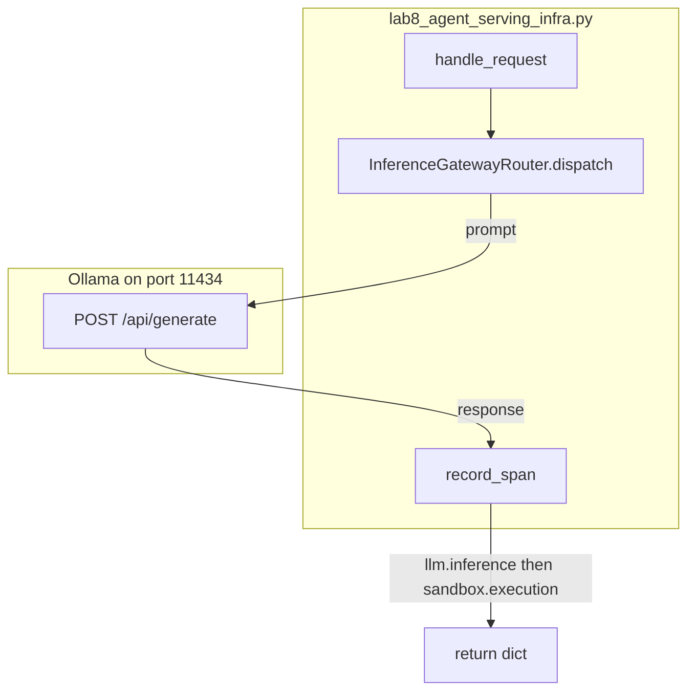

# Lab 8: Agent serving infra

A client request hits a gateway POST and a span list. This reuses chapter 10 (handle a request) and chapter 11 (endpoint list). Not a new cloud.

## What you touch
- Script: `lab8_agent_serving_infra.py`
- Classes: `OTelSpanCollector`, `InferenceGatewayRouter`, `ProductionAgentServingRuntime`
- Functions: `record_span`, `dispatch`, `handle_request`
- URL / path: `{OLLAMA_HOST}/api/generate` (default `http://192.168.1.29:11434/api/generate`)
- Keys sent: `model`, `prompt`, `stream` (`false`), `options.temperature` (`0.0`)
- Keys read: `response`, `prompt_eval_count`, `eval_count`

## Steps


1. Read `OLLAMA_HOST` and `OLLAMA_MODEL` from the environment. If they are unset, use `http://192.168.1.29:11434` and `qwen3.6:35b-a3b-65k`.
2. Call `handle_request("tenant_session_9921", "Summarize 3 production serving best practices.")`.
3. `dispatch` picks `endpoints[0]` (the Ollama generate URL) and POSTs `model`, `prompt`, `stream: false`, `options.temperature: 0.0`.
4. `record_span` for `llm.inference` with `model`, `endpoint`, `prompt_tokens`, `completion_tokens`.
5. Sleep 0.05s and `record_span` for `sandbox.execution` with `isolation_type` `SubprocessSandbox`, `exit_code` 0, `memory_limit_mb` 512. The reference script does not start a child.
6. Return the dict. Intended: a listening server that returns HTTP 202 or SSE (chapter 10). The reference script is a dry-run print.

## Data contract

**Intended serve** (chapter 10)

```json
{
  "status_code": 202,
  "session_id": "tenant_session_9921"
}
```

**Request** `POST /api/generate`

```json
{
  "model": "qwen3.6:35b-a3b-65k",
  "prompt": "string",
  "stream": false,
  "options": { "temperature": 0.0 }
}
```

**What `handle_request` actually returns**

```json
{
  "status": "SUCCESS",
  "session_id": "tenant_session_9921",
  "output": "string",
  "telemetry_spans": []
}
```

There is no listening port and no SSE stream. See Notes.

## Run
From the repo root:

```bash
python education/15_synthesis/lab8_agent_serving_infra.py
```

```powershell
$env:OLLAMA_HOST="http://192.168.1.29:11434"
$env:OLLAMA_MODEL="qwen3.6:35b-a3b-65k"
python education/15_synthesis/lab8_agent_serving_infra.py
```

## What you should see
`=== STARTING PRODUCTION AGENT SERVING INFRASTRUCTURE LAB ===`, `[SERVING RUNTIME] Handling Session: 'tenant_session_9921'`, two `[OTel SPAN]` lines (`llm.inference` and `sandbox.execution`), then a JSON payload with `status` `SUCCESS`. This is a dry-run print, not a listening server. If you see `URLError` or `Connection refused`, the provider is not reachable. If you see HTTP 404, the model name is wrong.

## Stop here
Do not add a new primitive; compose what you already have. A POST plus a span list is enough. Do not add a new cloud, a load balancer product, or a second HTTP stack. Chapter 10 already has FastAPI / SSE. A new server would hide whether the miss came from the POST or from the extra.

## Notes
- Reference blueprint. Serve the kernel. Reuse chapter 10 request handle and chapter 11 gateway.
- Contract drift vs `lab8_agent_serving_infra.py`: no `OLLAMA_HOST` / `OLLAMA_MODEL` read (URL and model are literals). Route is `/api/generate`. No listen socket, no HTTP 202, no SSE. Gateway always uses `endpoints[0]`. Sandbox span is `time.sleep(0.05)`, not `subprocess.Popen`. Session id is only a string on the return dict. The intended contract is a chapter 10 server in front of the kernel. Write that in your copy. Leave the reference file as-is.
