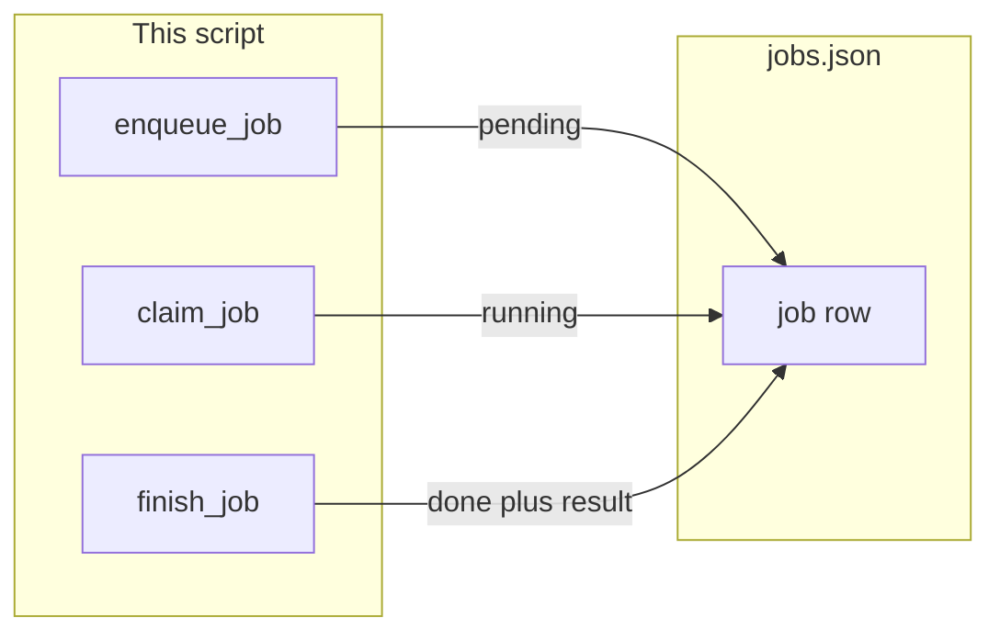

# 16: The job

After this page a job is a JSON object with `job_id`, `status`, `prompt`, and `result`. Status is `pending`, `running`, or `done` (`failed` is allowed). The process can exit and the file still has the row.

## Data
A **job** is one object in a list written to `jobs.json`.

Required keys: `job_id` (string), `status` (string), `prompt` (string), `result` (string or null).

Allowed `status` values: `pending`, `running`, `done`. `failed` is allowed.

Functions: `enqueue_job(prompt)` writes a `pending` row and returns that dict. `claim_job()` finds the first `pending` row, sets `running`, and returns it (or `None`). `finish_job(job_id, result)` sets `status` to `done` and writes `result`.

The file sits next to the script: `os.path.join(os.path.dirname(__file__), "jobs.json")`.

No HTTP. These labs do not read `OLLAMA_HOST` or `OLLAMA_MODEL`.

## Information
Chapter 07 starts a loop from stdin. This chapter starts the same kind of work from a row. The row lives in a file, so the work outlives the process.

A session file is one conversation. A job row is one unit of work. A worker claims a row, runs it, and writes the result back.

Two workers can read the same list. A claimed row is `running`, so the next worker skips it.

## Knowledge
1. Write `jobs.json` as a list of job objects.
2. Call `enqueue_job(prompt)` to append a `pending` row.
3. Call `claim_job()` to take the first `pending` row and set it `running`.
4. Call `finish_job(job_id, result)` to set `done` and store `result`.
5. Exit the process. Open the file. The row is still there.

## Wisdom
A session file (chapters 05 and 07) is one conversation. A job row is one unit of work that a worker claims. Do not add Redis or Kafka. A list in a file is enough.

## The When and Why
- **When:** the work must outlive the terminal, or more than one worker must pick work.
- **Why:** stdin dies with the process. A row in a file does not.

## How it works



Walkthrough of one job:

1. `enqueue_job("Add 2 and 3")` appends `{ "job_id": "...", "status": "pending", "prompt": "Add 2 and 3", "result": null }`.
2. `claim_job()` finds that row, sets `status` to `running`, and returns the dict.
3. The worker runs the prompt (lab 1 uses a mock that returns a fixed string).
4. `finish_job(job_id, result)` sets `status` to `done` and writes `result`.
5. The process can exit. `jobs.json` still has the row.

## Data contract

**jobs.json** (list of rows)

```json
[
  {
    "job_id": "string",
    "status": "pending",
    "prompt": "string",
    "result": null
  }
]
```

`status` is `pending`, `running`, `done`, or `failed`. `result` is a string after `finish_job`, or `null` before that.

**enqueue_job(prompt)** returns the new row with `status` `pending`.

**claim_job()** returns the first `pending` row (now `running`) or `None`.

**finish_job(job_id, result)** writes `status` `done` and `result`.

## Lab
Done when a worker claims a row, writes a result, and the file still has that row after the process exits.

- Module: [this file](./00_the_job.md)
- Lab 1: [lab1_jobs_table.md](./lab1_jobs_table.md) - one list, enqueue, claim, finish.
- Lab 2: [lab2_two_workers.md](./lab2_two_workers.md) - two worker names, `claimed_by`, no double claim.

## Related
- **Chapter 05 `messages.json`:** a conversation list. A job row is one unit of work, not a chat.
- **Chapter 07 session:** one process, one conversation file. The loop starts from stdin.
- **Chapter 10 `job_id`:** in-memory id for a request. It dies with the process.
- **Chapter 08 two agents:** two job titles in one process. Not a fleet of workers on a table.

## Notes
- Write the lab `.py` files next to the briefs. There is no reference `.py` in the repo yet.
- Do not add Redis, Kafka, or a queue product.
- Do not POST. Do not read `OLLAMA_HOST` or `OLLAMA_MODEL`.
