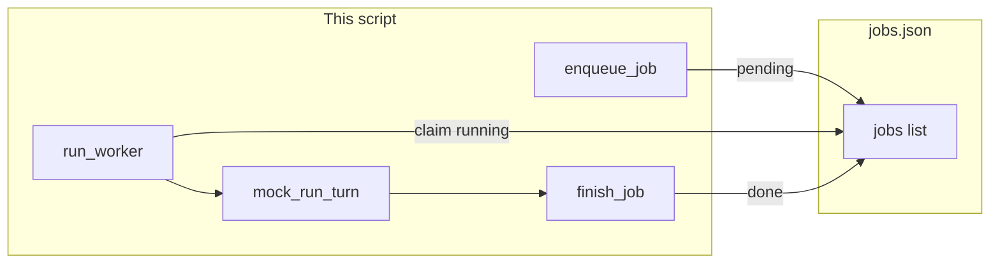

# Lab 1: Jobs table

A `jobs.json` list holds job rows. `enqueue_job` writes `pending`. `claim_job` sets `running`. `finish_job` sets `done`. `run_worker` claims, mocks one turn, and finishes.

## What you touch
- Script: `lab1_jobs_table.py` (write it next to this brief; there is no reference `.py` yet)
- Functions: `enqueue_job(prompt)`, `claim_job()`, `finish_job(job_id, result)`, `mock_run_turn(prompt)`, `run_worker()`
- File: `jobs.json` beside the script (`os.path.join(os.path.dirname(__file__), "jobs.json")`)
- Row keys: `job_id`, `status`, `prompt`, `result`
- Status values: `pending`, `running`, `done`
- No HTTP. This script does not read `OLLAMA_HOST` or `OLLAMA_MODEL`.
- No HITL. No budget.

## Steps


1. Set the path to `os.path.join(os.path.dirname(__file__), "jobs.json")`.
2. Write `enqueue_job(prompt)`. Load the list (or `[]` if the file is missing). Append `{ "job_id": a new string, "status": "pending", "prompt": prompt, "result": null }`. Dump the list. Return the new row.
3. Write `claim_job()`. Load the list. Find the first row with `status` `pending`. Set that row to `running`. Dump the list. Return that row. If none, return `None`.
4. Write `finish_job(job_id, result)`. Load the list. Find the row. Set `status` to `done` and `result` to the string. Dump the list.
5. Write `mock_run_turn(prompt)`. Return a fixed string. Do not POST.
6. Write `run_worker()`. Call `claim_job()`. If `None`, return. Print the claimed `status`. Call `mock_run_turn` with the row `prompt`. Call `finish_job`. Print the finished `status`.
7. In `__main__`, call `enqueue_job` twice with two prompts. Call `run_worker` twice. Print each status as it changes.

## Data contract
Only the keys this script writes and reads.

**jobs.json**

```json
[
  {
    "job_id": "job-1",
    "status": "pending",
    "prompt": "Add 2 and 3",
    "result": null
  }
]
```

**enqueue_job(prompt)** returns that row with `status` `pending`.

**claim_job()** returns the first `pending` row with `status` now `running`, or `None`.

**finish_job(job_id, result)** writes `status` `done` and `result` as a string.

**mock_run_turn(prompt)** returns a fixed string. Example: `"ok"`.

## Run
From the repo root:

```bash
python education/16_the_job/lab1_jobs_table.py
```

```powershell
python education/16_the_job/lab1_jobs_table.py
```

This script does not read `OLLAMA_HOST` or `OLLAMA_MODEL`. Do not set those vars for this lab.

## What you should see
Two enqueue prints with `pending`. Then two worker runs. Each run prints `running` then `done`. `jobs.json` has two rows with `result` set. If claim prints nothing, both rows were already `running` or `done`. If you see a URL error, you added HTTP.

## Stop here
This is not a queue product. Do not add Redis. Do not add HITL. Do not add a budget. Next: [lab2_two_workers.md](./lab2_two_workers.md).

## Notes
- Write `lab1_jobs_table.py` next to this brief. There is no reference `.py` in the repo yet.
- `jobs.json` sits next to the script. Do not commit a huge dump.
- Keys written and read match this brief. Do not edit other `.py` files in the repo.
- Chapter 17 adds a stop reason. Chapter 18 adds `needs_hitl`.
