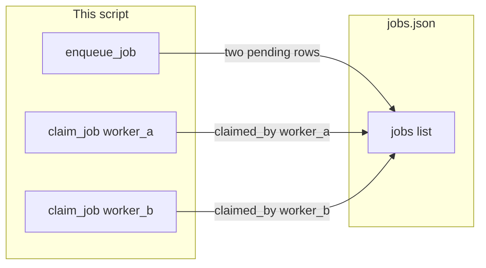

# Lab 2: Two workers

The same `jobs.json` list. `claim_job(worker)` stores `claimed_by`. A row cannot be claimed twice. Two workers each get one job.

## What you touch
- Script: `lab2_two_workers.py` (write it next to this brief; there is no reference `.py` yet)
- Functions: `enqueue_job(prompt)`, `claim_job(worker)`
- File: `jobs.json` beside the script (`os.path.join(os.path.dirname(__file__), "jobs.json")`)
- Row keys: `job_id`, `status`, `prompt`, `result`, `claimed_by`
- Worker names: `worker_a`, `worker_b`
- No HTTP. This script does not read `OLLAMA_HOST` or `OLLAMA_MODEL`.
- No queue product.

## Steps


1. Reuse the `jobs.json` shape from lab 1. Add `claimed_by` (string or null).
2. Write `enqueue_job(prompt)` as in lab 1. Set `claimed_by` to `null`.
3. Write `claim_job(worker)`. Load the list. Find the first row with `status` `pending` and no `claimed_by`. Set `status` to `running` and `claimed_by` to `worker`. Dump the list. Return that row. If none, return `None`.
4. A row that is already `running` or already has `claimed_by` must not be claimed again.
5. In `__main__`, enqueue two prompts. Call `claim_job("worker_a")`. Call `claim_job("worker_b")`. Print each `job_id`, `claimed_by`, and `status`.
6. Do not POST. Do not add Redis.

## Data contract
Only the keys this script writes and reads.

**jobs.json**

```json
[
  {
    "job_id": "job-1",
    "status": "running",
    "prompt": "Add 2 and 3",
    "result": null,
    "claimed_by": "worker_a"
  }
]
```

**enqueue_job(prompt)** returns a row with `status` `pending` and `claimed_by` `null`.

**claim_job(worker)** returns the first free `pending` row with `status` `running` and `claimed_by` set to `worker`, or `None`.

## Run
From the repo root:

```bash
python education/16_the_job/lab2_two_workers.py
```

```powershell
python education/16_the_job/lab2_two_workers.py
```

This script does not read `OLLAMA_HOST` or `OLLAMA_MODEL`. Do not set those vars for this lab.

## What you should see
Two enqueue rows. Then `worker_a` prints one `job_id`, `claimed_by` `worker_a`, `status` `running`. Then `worker_b` prints the other `job_id`, `claimed_by` `worker_b`, `status` `running`. If both prints show the same `job_id`, claim did not skip a claimed row.

## Stop here
This is not a fleet. Two names on one file is enough. Do not add Redis or Kafka. Next: [../17_the_budget/00_the_budget.md](../17_the_budget/00_the_budget.md).

## Notes
- Write `lab2_two_workers.py` next to this brief. There is no reference `.py` in the repo yet.
- `jobs.json` sits next to the script. Do not commit a huge dump.
- Keys written and read match this brief. Do not edit other `.py` files in the repo.
- Chapter 08 two agents is two job titles, not many workers on one table.
