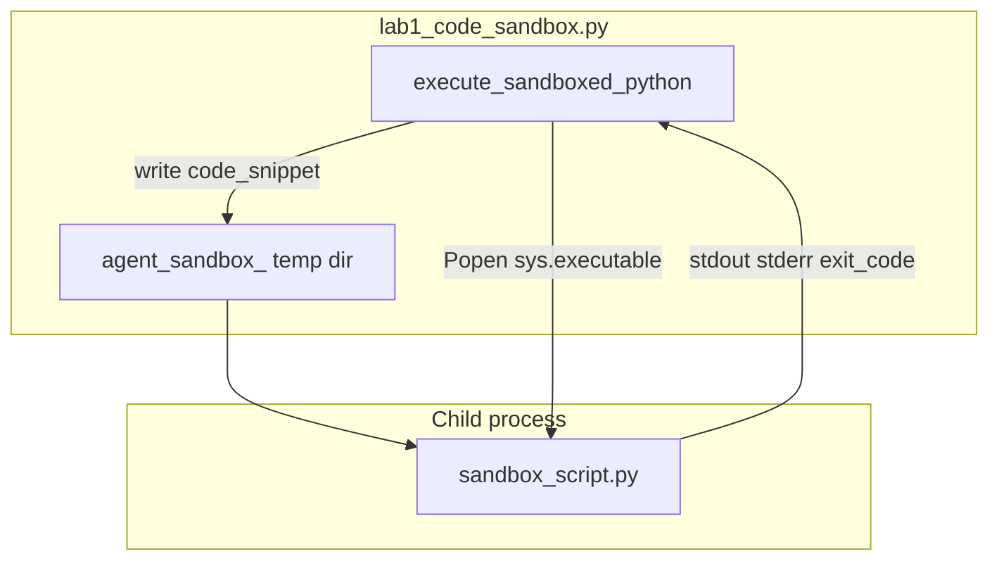

# 16: Sandbox: Isolated Subprocess Execution with Timeouts

By the end of this chapter, you will implement a secure code execution sandbox (`execute_sandboxed_python`) that runs untrusted LLM-generated code in an isolated subprocess with strict execution timeouts and temporary directory working spaces.

When agents generate and execute Python code, running untrusted code directly in the main agent process poses severe risks to system memory, environment variables, and filesystem integrity.

## Data
An isolated **Execution Sandbox** manages runtime isolation using Python's `subprocess` module:
- **Temporary Working Directory**: Created per execution using `tempfile.TemporaryDirectory(prefix="agent_sandbox_")` to isolate disk side effects.
- **Isolated Subprocess**: Launched via `subprocess.Popen([sys.executable, script_path], cwd=temp_dir, stdout=PIPE, stderr=PIPE)`.
- **Execution Watchdog & Timeout**: Hard timeout limits (e.g. `5.0s`). If execution exceeds the ceiling, the watchdog invokes `process.kill()` and returns `TIMEOUT_EXCEEDED` (`exit_code: -1`).
- **Telemetry Payload**: Returns `{"status": "COMPLETED" | "FAILED" | "TIMEOUT_EXCEEDED", "exit_code": int, "stdout": str, "stderr": str, "duration_seconds": float}`.

## Information
Never use Python's built-in `eval()` or `exec()` on arbitrary model outputs within your primary agent process.

A subprocess sandbox provides essential safeguards:
- **Crash Containment**: Syntax errors, unhandled exceptions, and memory leaks terminate only the ephemeral child process.
- **Runaway Loop Protection**: Infinite loops (`while True: pass`) are killed deterministically by the timeout watchdog.
- **Clean Environment**: The parent process retains full control over stdout, stderr, and exit codes.

## Knowledge
Here is the step-by-step procedure:
1. Write untrusted code snippets to a temporary file (`sandbox_script.py`) inside an ephemeral directory.
2. Spawn a subprocess targeting `sys.executable` with redirected stdout and stderr pipes.
3. Call `process.communicate(timeout=timeout_seconds)` within a try/except block.
4. Catch `subprocess.TimeoutExpired`, invoke `process.kill()`, and return status `TIMEOUT_EXCEEDED`.
5. Capture and return trimmed stdout, stderr, and process exit codes.

## Wisdom
A subprocess sandbox with timeout enforcement is the minimum security baseline for any agent capable of code execution.

## The When and Why
- **When**: Whenever an agent generates, tests, or evaluates executable code, shell scripts, or mathematical calculations.
- **Why**: In-process `exec()` can corrupt host application memory, leak credentials, or hang the entire server indefinitely. Subprocesses enforce hard boundaries.

## How it works



Walkthrough of the three tests in `__main__`:

1. Valid code: `print('Calculating 15 * 3...'); result = 15 * 3; print(f'Result: {result}')`. The child exits 0. `status` is `COMPLETED`. `stdout` contains `Result: 45`.
2. Runtime error: `data = [1, 2, 3]; print(data[10])`. The child raises `IndexError`. `status` is `FAILED`. `stderr` holds the traceback. `exit_code` is not 0.
3. Infinite loop: `while True: time.sleep(0.1)` with `timeout_seconds=2.0`. `communicate` raises `TimeoutExpired`. The function kills the child and returns `status` `TIMEOUT_EXCEEDED`, `exit_code` `-1`.

The new fact is the child process. The parent never `exec`s the string.

## Data contract

**Intended return**

```json
{
  "stdout": "string",
  "stderr": "string",
  "exit_code": 0
}
```

**What the reference script actually returns**

```json
{
  "status": "COMPLETED",
  "exit_code": 0,
  "stdout": "string",
  "stderr": "string",
  "duration_seconds": 0.0
}
```

`status` is `COMPLETED` (exit 0), `FAILED` (nonzero exit), or `TIMEOUT_EXCEEDED` (killed). Timeout sets `exit_code` to `-1`. See Notes.

## Lab
Done when a valid snippet prints `stdout`, an error prints `stderr`, and a loop is killed.

- Module: [this file](./00_sandbox.md)
- Lab 1: [lab1_code_sandbox.py](./lab1_code_sandbox.py) / [lab1_code_sandbox.md](./lab1_code_sandbox.md) - `execute_sandboxed_python` on three snippets. Done when you see `COMPLETED`, `FAILED`, and `TIMEOUT_EXCEEDED`.
- Lab 2: [lab2_permissions.md](./lab2_permissions.md) - high-risk allowlist. After this page, before lab 3 RBAC and chapter 17 HITL.
- Lab 3: [lab3_agent_rbac.md](./lab3_agent_rbac.md) - RBAC interceptor.
- Chapter 17: [lab1_hitl_approval.md](../17_hitl_and_park_resume/lab1_hitl_approval.md) - HITL pause.

## Related
- **Docker / gVisor / Wasm:** same job, a container runtime. Not in the lab.
- **01_security_overview.md:** sandbox is one control. The allowlist, RBAC, and HITL are the others.
- **subprocess:** the primitive. `Popen` plus `communicate(timeout=...)` plus `kill`.

## Notes
- Keep the existing lab facts: temp dir prefix `agent_sandbox_`, script name `sandbox_script.py`, three tests (valid, `IndexError`, infinite loop).
- Contract drift vs `lab1_code_sandbox.py`: return object adds `status` and `duration_seconds` on top of `stdout`, `stderr`, `exit_code`. No `OLLAMA_HOST` / `OLLAMA_MODEL` (this script does not POST). No CPU or memory cgroup. The child can still open the network; isolation is a temp `cwd` and a timeout. The intended contract is a child process that returns text and an exit code. Write that in your copy. Leave the reference file as-is.
