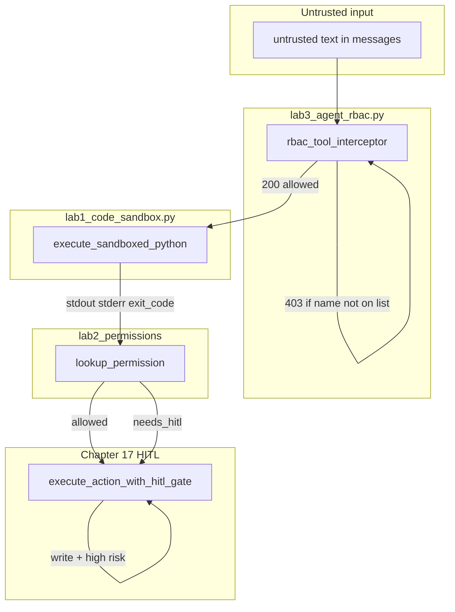

# 16: Security Overview: Defense-in-Depth for Agent Systems

By the end of this chapter, you will understand the full defense-in-depth security model for autonomous agents: combining **Code Sandboxing**, **High-Risk Permission Allowlisting**, **Role-Based Access Control (RBAC)**, and **Human-in-the-Loop (HITL)** approval gates.

Agent systems connect natural language reasoning directly to real-world actuators. A robust security model enforces defense-in-depth across multiple independent layers.

## Data
We define four distinct security controls:
1. **Subprocess Sandbox**: Runs untrusted code in isolated child processes with hard timeout limits (`execute_sandboxed_python`).
2. **Permission Allowlist**: Evaluates tool risk classifications (`TOOL_HIGH_RISK: dict[str, bool]`). Non-destructive tools execute automatically (`{"allowed": true}`), while destructive tools require approval (`{"needs_hitl": true, "tool": str}`).
3. **Role-Based Access Control (RBAC)**: Enforces least-privilege tool grants per agent role, returning HTTP 403 Forbidden for unauthorized tools (`rbac_tool_interceptor`).
4. **Human-in-the-Loop (HITL)**: Pauses execution before irreversible write actions (e.g. database migrations), checkpointing state until a human operator approves (`execute_action_with_hitl_gate`).

## Information
Each security control protects against a different class of failure:
- **Sandbox** prevents CPU lockups and host process memory corruption.
- **RBAC** prevents role privilege escalation (e.g. an auditor executing arbitrary bash commands).
- **Allowlists & HITL** prevent destructive write actions and data loss without human review.
- **Prompt Sanitization** defends against prompt injection from untrusted external text.

No single control is sufficient on its own. Layering them provides comprehensive defense-in-depth.

## Knowledge
Here is the step-by-step procedure:
1. Treat all external text (files, web pages, tool outputs) as untrusted data.
2. Enforce strict role-based tool whitelists via `rbac_tool_interceptor()`.
3. Check `TOOL_HIGH_RISK` allowlists before invoking any actuator tool.
4. If a tool is flagged high-risk, pause execution with an HITL checkpoint before proceeding.
5. Isolate all script execution inside sandboxed subprocesses with watchdog timeouts.

## Wisdom
Security is not a single feature—it is a layered defense. Enforce policies deterministically in Python rather than relying on prompt guidelines.

## The When and Why
- **When**: In all production agent deployments capable of reading files, modifying databases, executing shell commands, or interacting with users.
- **Why**: Prompt instructions alone can be bypassed by prompt injection. Deterministic code interceptors and sandboxes guarantee hard security boundaries.

## How it works



Walkthrough of the scripts:

1. A `tool_calls` name arrives. `rbac_tool_interceptor("ARCHITECT", "run_command", ...)` looks up `ROLE_TOOL_PERMISSIONS`. `run_command` is not on the Architect list, so the return is `{ "status": 403, "error": "..." }` and the function does not run.
2. An allowed code-exec tool would call `execute_sandboxed_python`. The snippet runs in a child. The parent reads `stdout`, `stderr`, and `exit_code`.
3. `lookup_permission("apply_db_migration")` reads `TOOL_HIGH_RISK` and returns `{ "needs_hitl": true, "tool": "apply_db_migration" }`. It does not call the tool.
4. A write named `apply_db_migration` with `is_high_risk=True` hits `execute_action_with_hitl_gate`. The engine stores a checkpoint, emits an SDUI frame, and returns `{ "status": "PAUSED", "approval_id", "sdui_frame" }`. `resume_agent_execution(approval_id, "APPROVED")` continues.

The new fact is separate checks. Skipping one does not do the job of the others.

## Data contract

**Lab 2 lookup**

```json
{ "allowed": true }
```

or

```json
{ "needs_hitl": true, "tool": "apply_db_migration" }
```

**Intended HITL pause**

```json
{
  "action": "approval_required",
  "tool": "string",
  "args": {}
}
```

**What `lab1_hitl_approval.py` in chapter 17 actually returns** on a high-risk call

```json
{
  "status": "PAUSED",
  "approval_id": "appr-1",
  "sdui_frame": {
    "type": "GENERATIVE_UI_FRAME",
    "component": "HITLApprovalModal",
    "props": {
      "approval_id": "appr-1",
      "action": "apply_db_migration",
      "proposed_changes": {}
    }
  }
}
```

**Intended RBAC deny**

```json
{
  "error": "Execution rejected by policy engine"
}
```

**What `lab3_agent_rbac.py` actually returns** on deny: `{ "status": 403, "error": "Permission Denied: ..." }`. On allow: `{ "status": 200, "result": "string" }`.

See Notes.

## Lab
Done when you can name which script stops code, which names a high-risk tool, which stops the wrong tool, and which pauses a write.

- Module: [this file](./01_security_overview.md)
- Lab 1: [lab1_code_sandbox.py](./lab1_code_sandbox.py) / [lab1_code_sandbox.md](./lab1_code_sandbox.md) - child process. Covered on the sandbox page.
- Lab 2: [lab2_permissions.md](./lab2_permissions.md) - write `lab2_permissions.py`. `TOOL_HIGH_RISK` plus `lookup_permission`. Done when `read_file` is `{ "allowed": true }` and `apply_db_migration` is `{ "needs_hitl": true, "tool": "apply_db_migration" }`.
- Lab 3 RBAC: [lab3_agent_rbac.py](./lab3_agent_rbac.py) / [lab3_agent_rbac.md](./lab3_agent_rbac.md) - `rbac_tool_interceptor`. Done when Architect `run_command` is `403`.
- Chapter 17 HITL: [../17_hitl_and_park_resume/lab1_hitl_approval.py](../17_hitl_and_park_resume/lab1_hitl_approval.py) / [../17_hitl_and_park_resume/lab1_hitl_approval.md](../17_hitl_and_park_resume/lab1_hitl_approval.md) - `execute_action_with_hitl_gate` then `resume_agent_execution`. Done when a high-risk action returns `PAUSED` and resume prints `RESUMED_SUCCESS`.

## Related
- **WAF / input filter:** same job in front of HTTP. Not in the labs.
- **00_sandbox.md:** the child-process control.
- **Chapter 14 roles:** the grant list this chapter enforces.
- **Chapter 19:** the socket that can stream the HITL pause to a browser.

## Notes
- Moved from modules/15. No new advanced topics.
- Contract drift vs lab 3 RBAC and chapter 17 HITL: HITL does not return `{ "action": "approval_required" }`. It returns `{ "status": "PAUSED", "approval_id", "sdui_frame" }`. RBAC does not return `{ "error": "Execution rejected by policy engine" }`. It returns `{ "status": 403, "error": "Permission Denied: ..." }`. Neither script POSTs. Neither reads `OLLAMA_HOST`. The intended teaching objects stay on this page. Write those in your copy. Leave the reference files as-is.
- Lab 2 has no reference `.py` yet. Write `lab2_permissions.py` next to the brief.
