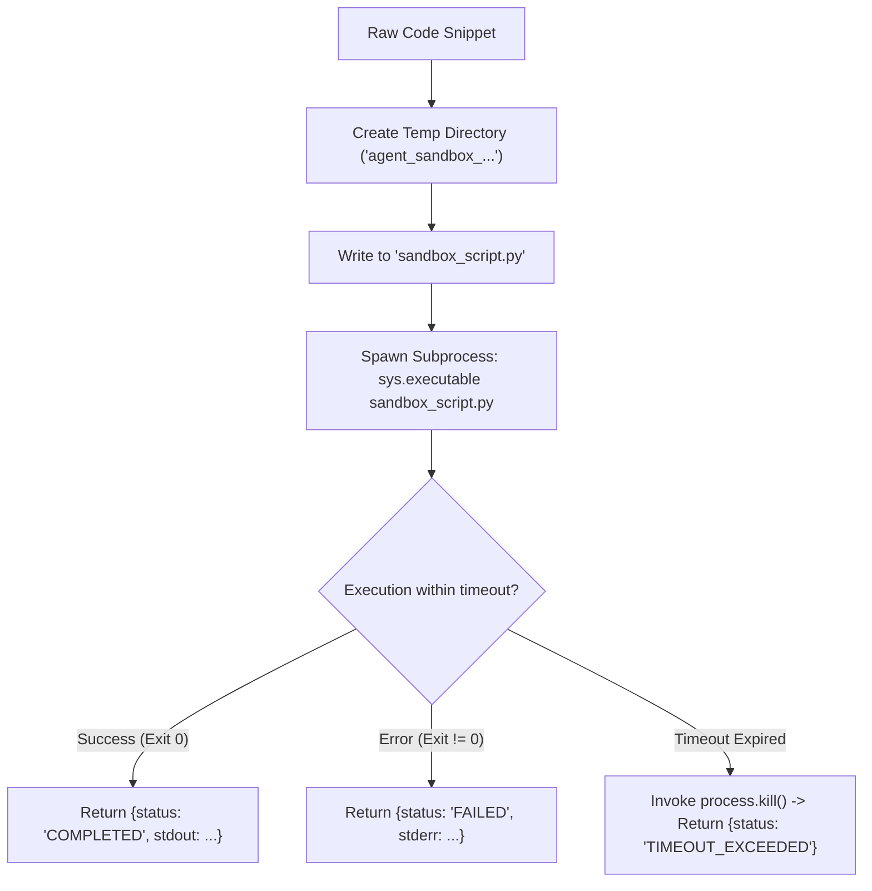

# Lab 1: Building a Subprocess Code Execution Sandbox

In this lab, you will build an isolated code execution sandbox `execute_sandboxed_python()` that runs untrusted Python code in an ephemeral temporary directory, captures `stdout`/`stderr`, and enforces a watchdog timeout to kill infinite loops.

---

## What you touch
- Script: `lab1_code_sandbox.py`
- Main Function: `execute_sandboxed_python(code_snippet: str, timeout_seconds: float = 5.0) -> dict`
- Isolation Mechanisms:
  - Working Directory: `tempfile.TemporaryDirectory(prefix="agent_sandbox_")`
  - Subprocess Execution: `subprocess.Popen([sys.executable, script_path], cwd=temp_dir, stdout=PIPE, stderr=PIPE)`
  - Timeout Watchdog: `process.communicate(timeout=timeout_seconds)` $\rightarrow$ `process.kill()` on timeout
- Pure Python logic (no network calls required)

---

## Steps


1. Implement `execute_sandboxed_python(code_snippet, timeout_seconds=5.0)`:
   - Create a temporary working directory with prefix `"agent_sandbox_"`.
   - Write `code_snippet` into `sandbox_script.py` inside the temporary directory.
   - Launch the subprocess using `sys.executable` and capture text streams.
   - Call `process.communicate(timeout=timeout_seconds)` within a try/except block.
   - On `subprocess.TimeoutExpired`, kill the process and return status `TIMEOUT_EXCEEDED` with `exit_code: -1`.
   - On normal completion, set status to `COMPLETED` if exit code is 0, else `FAILED`.
2. In `__main__`, run the sandbox against three test cases:
   - **Case 1 (Valid)**: Simple multiplication calculation (`15 * 3`).
   - **Case 2 (Runtime Error)**: List indexing error (`IndexError`).
   - **Case 3 (Runaway Loop)**: Infinite `while True` loop with a short 2.0-second timeout.
3. Verify that all three statuses (`COMPLETED`, `FAILED`, `TIMEOUT_EXCEEDED`) are handled cleanly.

---

## Data contract

**Sandbox Return Payload**

```json
{
  "status": "COMPLETED",
  "exit_code": 0,
  "stdout": "Result: 45",
  "stderr": "",
  "duration_seconds": 0.08
}
```

**Timeout Return Payload**

```json
{
  "status": "TIMEOUT_EXCEEDED",
  "exit_code": -1,
  "stdout": "",
  "stderr": "Execution exceeded timeout limit of 2.0 seconds.",
  "duration_seconds": 2.01
}
```

---

## Run
From the repository root, run:

```bash
python education/16_the_shield/lab1_code_sandbox.py
```

```powershell
python education/16_the_shield/lab1_code_sandbox.py
```

---

## What you should see
- **Test 1**: Status `COMPLETED`, `exit_code: 0`, and `stdout: "Result: 45"`.
- **Test 2**: Status `FAILED`, non-zero exit code, and captured `IndexError` in `stderr`.
- **Test 3**: Status `TIMEOUT_EXCEEDED`, `exit_code: -1`, with watchdog kill message after 2.0 seconds.

---

## Stop here
You have successfully built an isolated code execution sandbox! In Lab 2, we will implement a high-risk tool permission allowlist.

Next up: [Lab 2: Permissions Allowlist](./lab2_permissions.md).

---

## Notes
*(Record your sandbox test outputs and execution timings here)*

