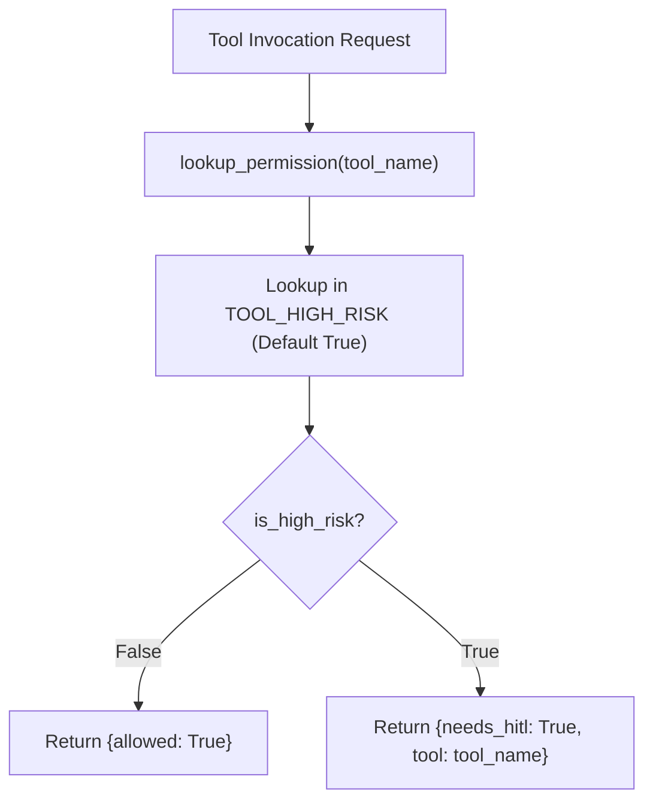

# Lab 2: Tool Permission Allowlist and Risk Classification

In this lab, you will implement a risk-evaluation function `lookup_permission()` using a dictionary allowlist (`TOOL_HIGH_RISK`) that flags sensitive actions for Human-in-the-Loop review before execution.

---

## What you touch
- Script to create: `lab2_permissions.py`
- Permission Allowlist: `TOOL_HIGH_RISK = {"read_file": False, "write_file": True, "run_command": True, "apply_db_migration": True}`
- Main Function: `lookup_permission(tool_name: str) -> dict`
- Test Tools: `read_file`, `write_file`, `run_command`, `apply_db_migration`
- Pure Python logic (no network calls required)

---

## Steps


1. Define `TOOL_HIGH_RISK = {"read_file": False, "write_file": True, "run_command": True, "apply_db_migration": True}`.
2. Implement `lookup_permission(tool_name: str) -> dict`:
   - Query `TOOL_HIGH_RISK.get(tool_name, True)` (defaulting unknown tools to `True` for safe fail-closed behavior).
   - If not high risk, return `{"allowed": True}`.
   - If high risk, return `{"needs_hitl": True, "tool": tool_name}`.
3. In `__main__`:
   - Test `read_file` -> assert `{"allowed": True}`.
   - Test `write_file`, `run_command`, and `apply_db_migration` -> assert `{"needs_hitl": True, "tool": ...}`.

---

## Data contract

**Allowed Non-Destructive Tool**

```json
{
  "allowed": true
}
```

**High-Risk Tool Requiring Operator Approval**

```json
{
  "needs_hitl": true,
  "tool": "apply_db_migration"
}
```

---

## Run
From the repository root, run:

```bash
python education/16_the_shield/lab2_permissions.py
```

```powershell
python education/16_the_shield/lab2_permissions.py
```

---

## What you should see
- `Tool: read_file -> {'allowed': True}`
- `Tool: write_file -> {'needs_hitl': True, 'tool': 'write_file'}`
- `Tool: run_command -> {'needs_hitl': True, 'tool': 'run_command'}`
- `Tool: apply_db_migration -> {'needs_hitl': True, 'tool': 'apply_db_migration'}`

---

## Stop here
You have successfully implemented a high-risk tool allowlist! In Lab 3, we will build role-based access control (RBAC) tool interceptors.

Next up: [Lab 3: Agent RBAC](./lab3_agent_rbac.md).

---

## Notes
*(Record your permission lookup outputs here)*

