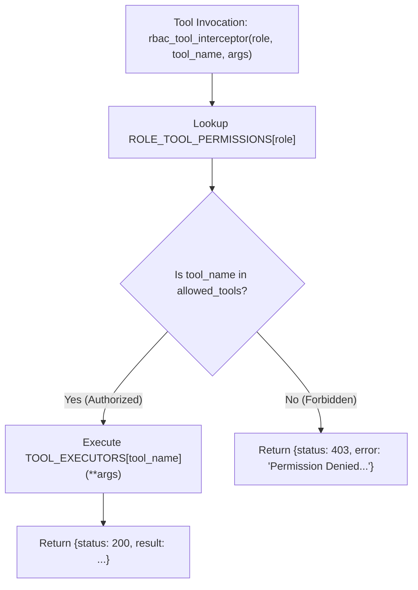

# Lab 3: Role-Based Access Control (RBAC) Tool Interceptor

In this lab, you will implement an RBAC permission gate `rbac_tool_interceptor()` that checks incoming tool calls against an explicit role whitelist (`ROLE_TOOL_PERMISSIONS`), allowing authorized tools (`status: 200`) and blocking unauthorized actions with HTTP 403 Forbidden.

---

## What you touch
- Script: `lab3_agent_rbac.py`
- Permission Grants: `ROLE_TOOL_PERMISSIONS` mapping roles (`ARCHITECT`, `DEVELOPER`, `AUDITOR`) to allowed tool lists
- Interceptor: `rbac_tool_interceptor(agent_role: str, tool_name: str, tool_args: dict) -> dict`
- Mock Tool Executors: `read_file`, `write_file`, `run_tests`, `run_command` in `TOOL_EXECUTORS`
- Test Scenarios in `__main__`:
  - Architect: `read_file` (Allow $\rightarrow$ 200), `run_command` (Deny $\rightarrow$ 403)
  - Developer: `write_file` (Allow $\rightarrow$ 200), `run_tests` (Deny $\rightarrow$ 403)

---

## Steps


1. Define role permission grants:
   - `ARCHITECT`: `["read_file", "list_dir"]`
   - `DEVELOPER`: `["read_file", "write_file"]`
   - `AUDITOR`: `["read_file", "run_tests"]`
2. Implement mock functions in `TOOL_EXECUTORS` for `read_file`, `write_file`, `run_tests`, and `run_command`.
3. Implement `rbac_tool_interceptor(agent_role, tool_name, tool_args)`:
   - Query `allowed_tools = ROLE_TOOL_PERMISSIONS.get(agent_role, [])`.
   - If `tool_name` is not in `allowed_tools`, return `{"status": 403, "error": f"Permission Denied: Role '{agent_role}' cannot execute tool '{tool_name}'."}`.
   - If authorized, execute the target tool and return `{"status": 200, "result": output}`.
4. In `__main__`, test both allowed and denied calls across roles, asserting proper HTTP 200 vs 403 responses.

---

## Data contract

**Authorized Tool Result (HTTP 200)**

```json
{
  "status": 200,
  "result": "Content of file 'architecture.md'"
}
```

**Denied Tool Result (HTTP 403)**

```json
{
  "status": 403,
  "error": "Permission Denied: Role 'ARCHITECT' cannot execute tool 'run_command'."
}
```

---

## Run
From the repository root, run:

```bash
python education/16_the_shield/lab3_agent_rbac.py
```

```powershell
python education/16_the_shield/lab3_agent_rbac.py
```

---

## What you should see
- `[GRANTED] Role 'ARCHITECT' executed 'read_file' -> Status: 200`
- `[DENIED] Role 'ARCHITECT' blocked from 'run_command' -> Status: 403`
- `[GRANTED] Role 'DEVELOPER' executed 'write_file' -> Status: 200`
- `[DENIED] Role 'DEVELOPER' blocked from 'run_tests' -> Status: 403`

---

## Stop here
You have successfully enforced role-based tool permissions! In Chapter 17, we will implement Human-in-the-Loop approval workflows and stateful park/resume lifecycles.

Next up: [Chapter 17: Human in the Loop and Park/Resume](../17_hitl_and_park_resume/00_hitl_and_park_resume.md).

---

## Notes
*(Record your RBAC authorization and rejection logs here)*

