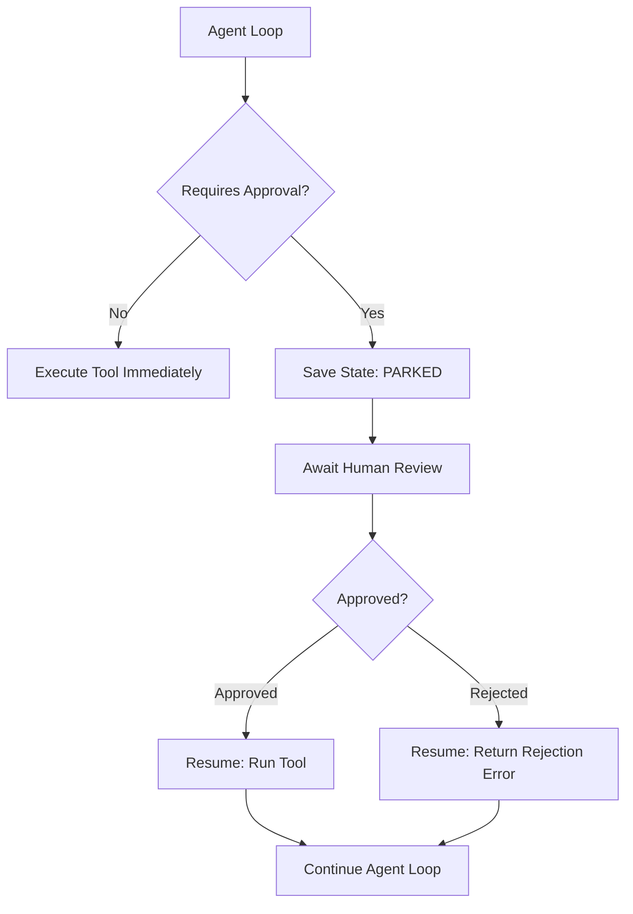

# 17: Human-in-the-Loop and Park/Resume

Pause execution before high-risk actions to await human approval, and persist state so long-running workflows can resume asynchronously across processes.

## Data
A **human approval gate** intercepts dangerous or irreversible tool calls (e.g. deleting files, sending financial transactions, deploying code) and requires explicit confirmation (`"needs_approval": true`).
**Park state** is a serialized snapshot of an in-progress agent execution stored in a persistent database or JSON file when an interactive gate is reached or an external asynchronous dependency is pending.
**Resume** reloads the serialized snapshot by session ID or job ID, injects the user's approval or rejection decision into the message history, and continues execution from the exact point of suspension.
The labs in this chapter are `lab1_hitl_approval.py` and `lab2_park_and_resume.py`.

## Information
Autonomous agents operating in production environments require safety boundaries. Rather than allowing unrestricted actuator access, high-impact tools trigger an execution halt.
Because human reviews may take minutes or days, the runtime process cannot simply block synchronously in memory. The agent parks its execution state to persistent storage and terminates or yields the thread. When approval arrives via web UI or CLI, a worker process resumes the state and completes the turn.

## Knowledge
1. Define a tool permission tier with a `requires_human_approval` flag in the tool registry.
2. In the dispatch loop, check whether a requested tool call requires approval before invoking the function.
3. If approval is required, construct an approval request payload with tool name, arguments, and risk explanation.
4. Serialize the current execution state (`messages`, turn index, pending action) to disk/database with status `PARKED_WAITING_APPROVAL`.
5. When the user approves or rejects the action, load the parked state, record the human decision, and invoke or skip the tool.
6. Continue the execution loop to produce the final response.

## Wisdom
Use human approval gates selectively on irreversible operations. Over-gating trivial read operations creates user friction and defeats the purpose of automation; under-gating destructive operations exposes systems to catastrophic errors.

## The When and Why
- **When:** the agent is about to execute irreversible side effects (database writes, deletions, financial charges, external API modifications) or long-running tasks requiring human oversight.
- **Why:** synchronous blocking crashes on timeouts and consumes server resources; park/resume ensures durable resilience across process boundaries.

## How it works



1. The agent decides to call a protected tool (e.g., `execute_sql_write`).
2. The runtime intercepts the call and saves the execution frame to disk with status `PARKED`.
3. The human reviewer receives a notification containing the pending tool arguments and proposed action.
4. The reviewer submits an approval or rejection token.
5. The resume worker loads the state from disk, executes the tool if approved, and continues the conversation turn.

## Data contract

**Parked State Schema**

```json
{
  "session_id": "string",
  "status": "ACTIVE | PARKED_WAITING_APPROVAL | COMPLETED | REJECTED",
  "turn": 2,
  "pending_tool_call": {
    "name": "string",
    "arguments": {}
  },
  "messages": []
}
```

**Approval Decision Payload**

```json
{
  "session_id": "string",
  "decision": "APPROVED | REJECTED",
  "feedback": "string"
}
```

## Lab
Done when a high-risk tool call pauses execution to request approval, parks state to disk, and successfully resumes upon receiving an approval decision.

- Module: [this file](./00_hitl_and_park_resume.md)
- Lab 1: [lab1_hitl_approval.py](./lab1_hitl_approval.py) / [lab1_hitl_approval.md](./lab1_hitl_approval.md) — approval gates and structured approval requests.
- Lab 2: [lab2_park_and_resume.py](./lab2_park_and_resume.py) / [lab2_park_and_resume.md](./lab2_park_and_resume.md) — persistent state parking and async resumption.

## Related
- **Chapter 07 (The State):** basic JSON and SQLite message persistence.
- **Chapter 16 (The Shield):** sandboxing and role-based access control.
- **Chapter 18 (The Job):** persistent multi-worker job queues.

## Notes
- State parking allows long human review delays without holding open HTTP connections or server memory.
- Store explicit rejection reasons in message history so the model understands why an action was cancelled.
