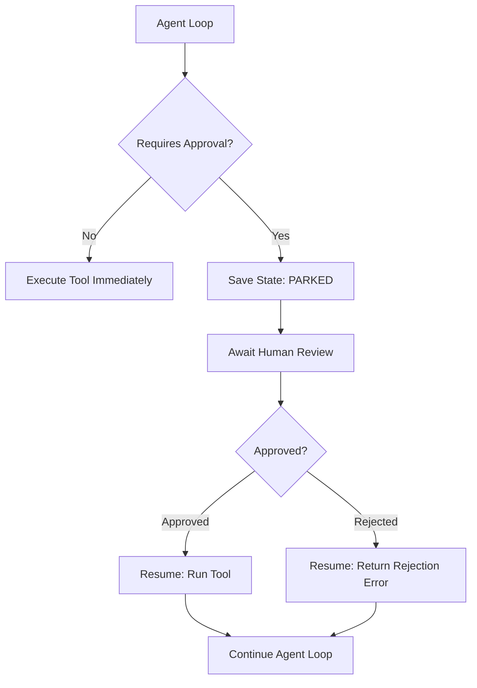

# 17: Human-in-the-Loop & State Parking: Pausing and Resuming High-Risk Workflows

By the end of this chapter, you will understand how to build resilient Human-in-the-Loop (HITL) approval gates that pause execution before destructive actions, park serialized state safely to persistent storage, and resume execution asynchronously once a human decision is received.

Real-world production agents frequently interact with irreversible systems—such as dropping database columns, making financial payments, or deploying code.

## Data
We define three core concepts in the HITL lifecycle:
1. **Approval Gate**: Intercepts high-risk tool actions (e.g. `apply_db_migration`), halting immediate execution and generating structured approval payloads (`sdui_frame` / `HITLApprovalModal`).
2. **Parked State Snapshot**: The serialized execution state (session ID, message history, current turn, pending action payload) persisted to disk or a database with status `PARKED_AWAITING_APPROVAL`.
3. **Resume Worker**: Reads the parked checkpoint by ID, injects the user's human decision (`APPROVED` or `REJECTED`), executes the authorized tool, and resumes the conversation loop.

## Information
Human reviews take time—ranging from seconds in an interactive chat to hours or days across email or incident queues.

Keeping long-lived synchronous HTTP connections open or holding state in memory while waiting for human input is brittle and resource-intensive:
- Connections time out, servers restart, and worker threads are starved.
- **State Parking** decouples execution time from review latency. The agent safely writes its state to persistent storage and releases server memory.
- When an operator approves or rejects the action via CLI or Webhook, a worker hydrates the snapshot and continues execution without data loss.

## Knowledge
Here is the step-by-step procedure:
1. Tag destructive tools as `is_high_risk = True`.
2. Before invoking an actuator, evaluate risk via `execute_action_with_hitl_gate()`.
3. If high risk, generate a unique `approval_id`, persist a checkpoint with status `PAUSED_AWAITING_APPROVAL`, and emit an approval UI frame.
4. Yield execution without running the underlying tool.
5. When the operator submits a decision, invoke `resume_agent_execution(approval_id, decision)`.
6. If `APPROVED`, execute the action and record the result; if `REJECTED`, record user feedback and cancel the operation.

## Wisdom
Reserve human gates for truly dangerous or irreversible side effects. Over-gating routine read actions causes operator fatigue, while under-gating destructive operations invites system outages.

## The When and Why
- **When**: High-impact, irreversible actions (database schema migrations, file deletions, payment processing, DNS updates).
- **Why**: Synchronous blocking fails across process restarts and network timeouts. State parking enables durable, asynchronous human review.

## How it works



1. The agent decides to call a protected tool (e.g., `execute_sql_write`).
2. The runtime intercepts the call and saves the execution frame to disk with status `PARKED`.
3. The human reviewer receives a notification containing the pending tool arguments and proposed action.
4. The reviewer submits an approval or rejection token.
5. The resume worker loads the state from disk, executes the tool if approved, and continues the conversation turn.

## Data contract

**Parked State Schema**

```json
{
  "session_id": "string",
  "status": "ACTIVE | PARKED_WAITING_APPROVAL | COMPLETED | REJECTED",
  "turn": 2,
  "pending_tool_call": {
    "name": "string",
    "arguments": {}
  },
  "messages": []
}
```

**Approval Decision Payload**

```json
{
  "session_id": "string",
  "decision": "APPROVED | REJECTED",
  "feedback": "string"
}
```

## Lab
Done when a high-risk tool call pauses execution to request approval, parks state to disk, and successfully resumes upon receiving an approval decision.

- Module: [this file](./00_hitl_and_park_resume.md)
- Lab 1: [lab1_hitl_approval.py](./lab1_hitl_approval.py) / [lab1_hitl_approval.md](./lab1_hitl_approval.md) — approval gates and structured approval requests.
- Lab 2: [lab2_park_and_resume.py](./lab2_park_and_resume.py) / [lab2_park_and_resume.md](./lab2_park_and_resume.md) — persistent state parking and async resumption.

## Related
- **Chapter 07 (The State):** basic JSON and SQLite message persistence.
- **Chapter 16 (The Shield):** sandboxing and role-based access control.
- **Chapter 18 (The Job):** persistent multi-worker job queues.

## Notes
- State parking allows long human review delays without holding open HTTP connections or server memory.
- Store explicit rejection reasons in message history so the model understands why an action was cancelled.
