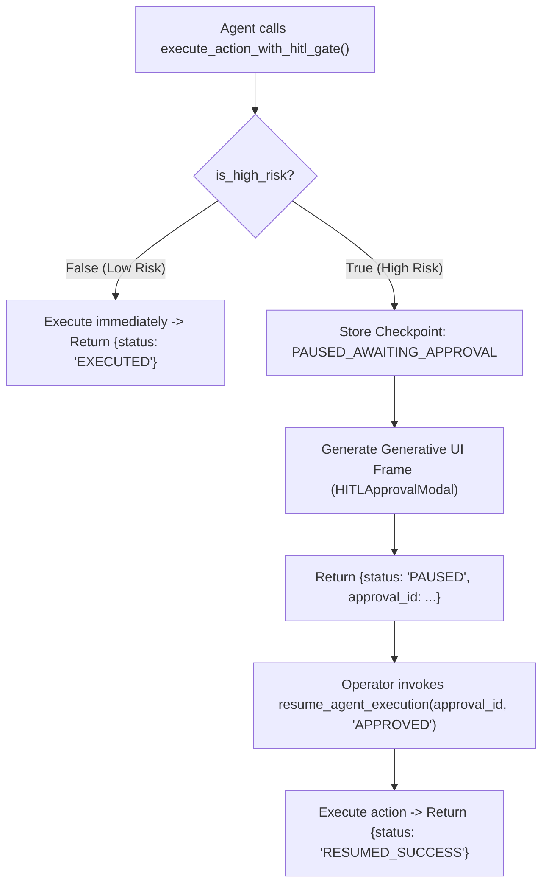

# Lab 1: Building Human-in-the-Loop (HITL) Approval Gates

In this lab, you will implement an interactive approval engine `AgentHITLEngine` that automatically permits low-risk actions, pauses execution on high-risk operations to generate a Generative UI payload (`HITLApprovalModal`), and resumes execution once approved by an operator.

---

## What you touch
- Script: `lab1_hitl_approval.py`
- Main Functions & Classes:
  - `render_sdui_component_frame(component_name: str, props: dict) -> dict`
  - `AgentHITLEngine.execute_action_with_hitl_gate(action_name: str, payload: dict, is_high_risk: bool) -> dict`
  - `AgentHITLEngine.resume_agent_execution(approval_id: str, decision: str) -> dict`
- Checkpoint Storage: In-memory checkpoint dictionary keyed by `approval_id`
- Status Codes: `EXECUTED`, `PAUSED`, `RESUMED_SUCCESS`, `ABORTED`
- Pure Python logic (no network calls required)

---

## Steps


1. Implement `render_sdui_component_frame(component_name, props)` to format structured UI payloads.
2. Implement `AgentHITLEngine`:
   - Initialize `self.checkpoints = {}`.
   - Implement `execute_action_with_hitl_gate(action_name, payload, is_high_risk)`:
     - If `is_high_risk` is False, return `{"status": "EXECUTED", "action": action_name}`.
     - If `is_high_risk` is True, generate an `approval_id` (`appr-timestamp`), record checkpoint status as `PAUSED_AWAITING_APPROVAL`, render an SDUI frame for `HITLApprovalModal`, and return `{"status": "PAUSED", "approval_id": approval_id, "sdui_frame": frame}`.
   - Implement `resume_agent_execution(approval_id, decision)`:
     - If `decision == "APPROVED"`, update checkpoint to `APPROVED_AND_EXECUTED` and return `{"status": "RESUMED_SUCCESS", "action": action, "execution_result": "..."}`.
     - If `decision == "REJECTED"`, update checkpoint to `REJECTED_BY_USER` and return `{"status": "ABORTED", "action": action, "reason": "Action rejected by user."}`.
3. In `__main__`:
   - Test low-risk action: `read_schema` (`is_high_risk=False`) $\rightarrow$ verify immediate `EXECUTED`.
   - Test high-risk action: `apply_db_migration` (`is_high_risk=True`) $\rightarrow$ verify `PAUSED` status and modal payload.
   - Resume high-risk action with `"APPROVED"` $\rightarrow$ verify `RESUMED_SUCCESS`.

---

## Data contract

**Low-Risk Immediate Execution**

```json
{
  "status": "EXECUTED",
  "action": "read_schema"
}
```

**High-Risk Paused Execution (SDUI Frame)**

```json
{
  "status": "PAUSED",
  "approval_id": "appr-1700000000000",
  "sdui_frame": {
    "type": "GENERATIVE_UI_FRAME",
    "component": "HITLApprovalModal",
    "props": {
      "approval_id": "appr-1700000000000",
      "action": "apply_db_migration",
      "proposed_changes": {
        "sql": "ALTER TABLE users DROP COLUMN legacy_auth_hash"
      }
    }
  }
}
```

**Resumed Execution Result**

```json
{
  "status": "RESUMED_SUCCESS",
  "action": "apply_db_migration",
  "execution_result": "Database migration script applied successfully."
}
```

---

## Run
From the repository root, run:

```bash
python education/17_hitl_and_park_resume/lab1_hitl_approval.py
```

```powershell
python education/17_hitl_and_park_resume/lab1_hitl_approval.py
```

---

## What you should see
- `[APPROVED] Low-risk action 'read_schema' approved automatically.`
- `[PAUSED] HIGH-RISK ACTION PAUSED! Rendered Generative UI frame for approval.`
- `[APPROVED] Action 'apply_db_migration' AUTHORIZED by user -> Status: RESUMED_SUCCESS`

---

## Stop here
You have successfully implemented a stateful HITL approval gate! In Lab 2, we will persist parked states to disk and resume them across process restarts.

Next up: [Lab 2: Park and Resume](./lab2_park_and_resume.md).

---

## Notes
*(Record your HITL gate executions and approval payloads here)*

- Chapter 19 is the socket that can stream the pause object to a browser.
