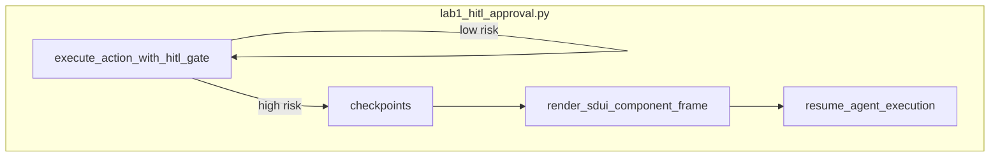

# Lab 1: HITL Approval

A write does not run until an approval flag is set.

## What you touch
- Script: `lab1_hitl_approval.py`
- Function: `render_sdui_component_frame(component_name, props)`
- Class: `AgentHITLEngine` with `execute_action_with_hitl_gate` and `resume_agent_execution`
- Store: `self.checkpoints` keyed by `approval_id` (`appr-{milliseconds}`)
- Checkpoint keys: `action`, `payload`, `status` (`PAUSED_AWAITING_APPROVAL`, `APPROVED_AND_EXECUTED`, `REJECTED_BY_USER`)
- Three calls in `__main__`: `read_schema` with `is_high_risk=False`, `apply_db_migration` with `is_high_risk=True`, then `resume_agent_execution(..., "APPROVED")`
- This script does not POST and does not open a browser. It does not read `OLLAMA_HOST` or `OLLAMA_MODEL`.

## Steps


1. Write `render_sdui_component_frame`. It returns `{ "type": "GENERATIVE_UI_FRAME", "component", "props", "timestamp" }`.
2. Write `AgentHITLEngine`. Keep `checkpoints` as a dict from `approval_id` to `{ action, payload, status }`.
3. Write `execute_action_with_hitl_gate(action_name, payload, is_high_risk)`. If `is_high_risk` is false, return `{ "status": "EXECUTED", "action": action_name }` and do not pause.
4. If `is_high_risk` is true, create `approval_id`, store the checkpoint with `status` `PAUSED_AWAITING_APPROVAL`, build an SDUI frame for `HITLApprovalModal`, and return `{ "status": "PAUSED", "approval_id", "sdui_frame" }`. Do not run the write.
5. Write `resume_agent_execution(approval_id, decision)`. If `decision` is `APPROVED`, set the checkpoint to `APPROVED_AND_EXECUTED` and return `{ "status": "RESUMED_SUCCESS", "action", "execution_result" }`. Otherwise set `REJECTED_BY_USER` and return `{ "status": "ABORTED", "action", "reason" }`.
6. In `__main__`, construct the engine. Call `read_schema` as low risk. Call `apply_db_migration` with `{ "sql": "ALTER TABLE users DROP COLUMN legacy_auth_hash" }` as high risk. Read `approval_id` from the pause object. Call `resume_agent_execution` with `APPROVED`.
7. Confirm a pause object prints, then a resume. Do not build a React UI. Do not open a WebSocket. Chapter 10 is the socket.

## Data contract
Intended keys this lab should return. The reference file differs (Notes).

**Intended pause**

```json
{
  "action": "approval_required",
  "payload": {}
}
```

**Reference script pause** (high risk)

```json
{
  "status": "PAUSED",
  "approval_id": "appr-1",
  "sdui_frame": {
    "type": "GENERATIVE_UI_FRAME",
    "component": "HITLApprovalModal",
    "props": {
      "approval_id": "appr-1",
      "action": "apply_db_migration",
      "proposed_changes": {}
    }
  }
}
```

**Reference script resume** (`APPROVED`)

```json
{
  "status": "RESUMED_SUCCESS",
  "action": "apply_db_migration",
  "execution_result": "Database migration script applied successfully."
}
```

Low risk returns `{ "status": "EXECUTED", "action": "read_schema" }`.

## Run
From the repo root:

```bash
python education/17_hitl_and_park_resume/lab1_hitl_approval.py
```

```powershell
python education/17_hitl_and_park_resume/lab1_hitl_approval.py
```

This script does not read `OLLAMA_HOST` or `OLLAMA_MODEL`. Do not set those vars for this lab.

## What you should see
`=== STARTING GENERATIVE UI & HITL APPROVAL GATE LAB ===`. `read_schema` prints `[APPROVED] Low-risk action approved automatically.` `apply_db_migration` prints `[PAUSED] HIGH-RISK ACTION PAUSED!` and a JSON `GENERATIVE_UI_FRAME` with `HITLApprovalModal`. Resume prints `[APPROVED] Action 'apply_db_migration' AUTHORIZED by user` and `RESUMED_SUCCESS`. If the migration runs before the resume call, the gate did not pause.

## Stop here
This is not a full React UI. Do not add RBAC or a sandbox in this file. Do not apply a real database migration. Next: [00_the_job.md](../18_the_job/00_the_job.md).

## Notes
- The reference script uses `is_high_risk`, not an `is_approved` flag on state. Approval is the `decision` string on `resume_agent_execution`.
- Contract drift vs `lab1_hitl_approval.py`: pause is `{ "status": "PAUSED", "approval_id", "sdui_frame" }`, not `{ "action": "approval_required", "payload": {} }`. Resume is a second function, not a flipped boolean. The printed `execution_result` is a constant string; no SQL runs. No POST. The intended teaching object is a pause that blocks the write until a human decision. Write that in your copy. Do not edit the `.py` in the repo.
- Chapter 19 is the socket that can stream the pause object to a browser.
