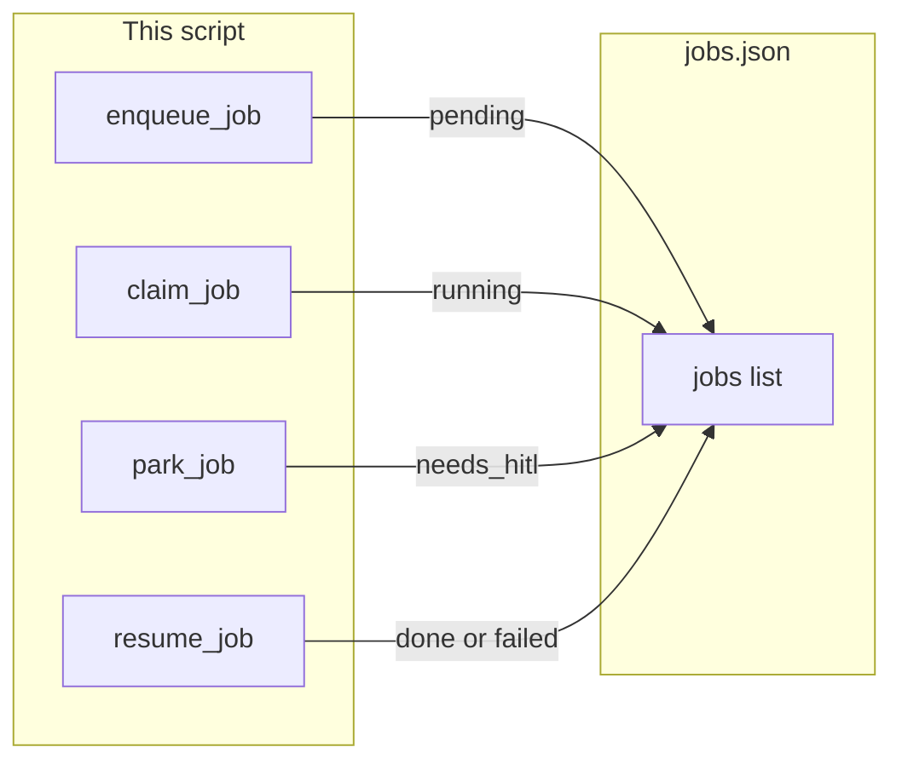

# Lab 2: Park and resume

A job row waits with `needs_hitl` and `proposed_action`. `resume_job` continues the same row after a later yes or no.

## What you touch
- Script: `lab2_park_and_resume.py` (write it next to this brief; there is no reference `.py` yet)
- Functions: `enqueue_job(prompt)`, `claim_job()`, `park_job(job_id, proposed_action)`, `resume_job(job_id, approved)`
- File: `jobs.json` beside the script (`os.path.join(os.path.dirname(__file__), "jobs.json")`)
- Row keys: `job_id`, `status`, `prompt`, `result`, `proposed_action`
- Status values: `pending`, `running`, `done`, `needs_hitl`, `failed`
- No HTTP. This script does not read `OLLAMA_HOST` or `OLLAMA_MODEL`.
- No UI. Do not call the real command.

## Steps


1. Reuse the `jobs.json` shape from chapter 16. Add `proposed_action` (string or null). Allow `status` `needs_hitl` and `failed`.
2. Write `enqueue_job` and `claim_job` as in chapter 16 lab 1.
3. Write `park_job(job_id, proposed_action)`. Set that row to `needs_hitl` and store the string.
4. Write `resume_job(job_id, approved)`. Set `status` to `running`. If `approved` is true, set `done`. If `approved` is false, set `failed`.
5. In `__main__`: enqueue one job, claim it, park with `proposed_action` `"rm -rf /tmp/demo"`, print `status` `needs_hitl`. Then `resume_job(..., True)` and print `done`.
6. Enqueue a second job, claim it, park with the same `proposed_action`, then `resume_job(..., False)` and print `failed`.
7. Do not run the command. Do not open a UI. Do not POST.

## Data contract
Only the keys this script writes and reads.

**jobs.json**

```json
[
  {
    "job_id": "job-1",
    "status": "needs_hitl",
    "prompt": "clean tmp",
    "result": null,
    "proposed_action": "rm -rf /tmp/demo"
  }
]
```

**park_job(job_id, proposed_action)** writes `status` `needs_hitl` and `proposed_action`.

**resume_job(job_id, approved)** writes `running`, then `done` if `approved` is true, or `failed` if `approved` is false.

## Run
From the repo root:

```bash
python education/17_hitl_and_park_resume/lab2_park_and_resume.py
```

```powershell
python education/17_hitl_and_park_resume/lab2_park_and_resume.py
```

This script does not read `OLLAMA_HOST` or `OLLAMA_MODEL`. Do not set those vars for this lab.

## What you should see
First job: `needs_hitl`, then `done`. Second job: `needs_hitl`, then `failed`. `jobs.json` has both rows. If a command actually ran, you executed the string. Do not.

## Stop here
This is the end of the required path. [optional_training](../optional_training/) is a side folder. Do not add a control-plane product.

## Notes
- Write `lab2_park_and_resume.py` next to this brief. There is no reference `.py` in the repo yet.
- `jobs.json` sits next to the script. Do not commit a huge dump.
- The proposed action is a string. Do not call it.
- Keys written and read match this brief. Do not edit other `.py` files in the repo.
