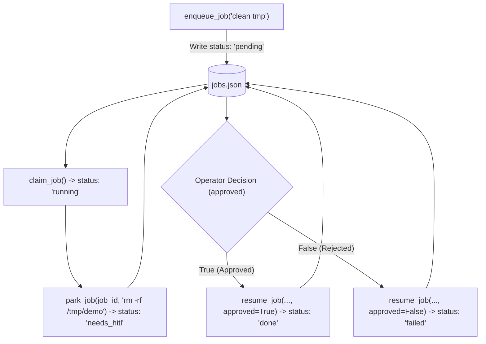

# Lab 2: Persistent State Parking and Asynchronous Resumption

In this lab, you will persist in-progress job execution records to disk (`jobs.json`), mark high-risk actions with `status: needs_hitl` and a `proposed_action`, and asynchronously resume them to `status: done` or `status: failed` based on operator approval.

---

## What you touch
- Script to create: `lab2_park_and_resume.py`
- Persistence File: `jobs.json` (next to the script)
- Main Functions:
  - `enqueue_job(prompt: str) -> dict`
  - `claim_job() -> dict`
  - `park_job(job_id: str, proposed_action: str) -> dict`
  - `resume_job(job_id: str, approved: bool) -> dict`
- Lifecycle Statuses: `pending`, `running`, `needs_hitl`, `done`, `failed`
- Pure Python logic (no network calls required)

---

## Steps


1. Maintain persistent state in `jobs.json` holding a list of job objects:
   `{"job_id": str, "status": str, "prompt": str, "result": str | None, "proposed_action": str | None}`.
2. Implement `enqueue_job(prompt)`:
   - Create a job record with `status: "pending"` and append to `jobs.json`.
3. Implement `claim_job()`:
   - Find the first `pending` job, update its status to `running`, and save.
4. Implement `park_job(job_id, proposed_action)`:
   - Update job status to `needs_hitl`, record `proposed_action`, and persist.
5. Implement `resume_job(job_id, approved: bool)`:
   - Load the job, update status to `done` if `approved` is True, or `failed` if False.
6. In `__main__`:
   - Test approval flow: Enqueue $\rightarrow$ Claim $\rightarrow$ Park (`"rm -rf /tmp/demo"`) $\rightarrow$ Resume (`approved=True`) $\rightarrow$ Assert `done`.
   - Test rejection flow: Enqueue $\rightarrow$ Claim $\rightarrow$ Park (`"rm -rf /tmp/demo"`) $\rightarrow$ Resume (`approved=False`) $\rightarrow$ Assert `failed`.

---

## Data contract

**`jobs.json` Record Schema**

```json
[
  {
    "job_id": "job-1",
    "status": "needs_hitl",
    "prompt": "clean tmp",
    "result": null,
    "proposed_action": "rm -rf /tmp/demo"
  }
]
```

**Completed Job Record**

```json
{
  "job_id": "job-1",
  "status": "done",
  "prompt": "clean tmp",
  "result": "Action 'rm -rf /tmp/demo' executed successfully.",
  "proposed_action": "rm -rf /tmp/demo"
}
```

---

## Run
From the repository root, run:

```bash
python education/17_hitl_and_park_resume/lab2_park_and_resume.py
```

```powershell
python education/17_hitl_and_park_resume/lab2_park_and_resume.py
```

---

## What you should see
- **Job 1 (Approved)**: Transition from `needs_hitl` $\rightarrow$ `done`.
- **Job 2 (Rejected)**: Transition from `needs_hitl` $\rightarrow$ `failed`.
- `jobs.json` saved on disk with both finalized records.

---

## Stop here
You have successfully implemented persistent state parking and resumption! In Chapter 18, we will scale background jobs across concurrent worker queues.

Next up: [Chapter 18: The Job](../18_the_job/00_the_job.md).

---

## Notes
*(Record your state parking persistence outputs here)*

