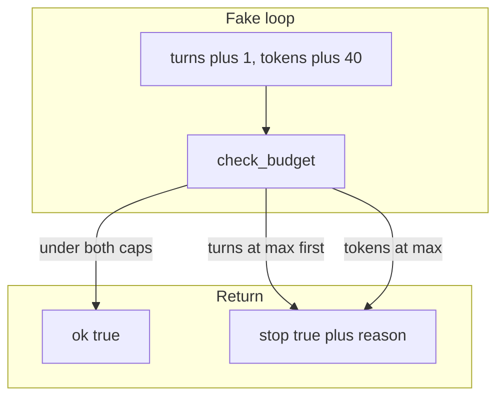

# 17: The budget

After this page a stop rule is a pair of dicts. `budget` has `max_turns` and `max_tokens` (integers). `spent` has `turns` and `tokens`. `check_budget(budget, spent)` returns `{ "ok": true }` or `{ "stop": true, "reason": "max_turns" }` or `{ "stop": true, "reason": "max_tokens" }`.

## Data
A **budget** is `{ "max_turns": int, "max_tokens": int }`.

A **spent** is `{ "turns": int, "tokens": int }`.

`check_budget(budget, spent)` checks `max_turns` first. If `spent["turns"] >= budget["max_turns"]`, return `{ "stop": true, "reason": "max_turns" }`. Then check `max_tokens`. If `spent["tokens"] >= budget["max_tokens"]`, return `{ "stop": true, "reason": "max_tokens" }`. Else return `{ "ok": true }`.

No HTTP. This chapter does not read `OLLAMA_HOST` or `OLLAMA_MODEL`. No dollars. No billing API.

## Information
Chapter 04 already caps a loop with `range` or a turn count. This chapter returns a reason object. The caller can print why the loop stopped.

A cycle halt (chapter 12) stops on a repeated hash. A budget stops on a count. They are different objects.

The budget can sit on a job row later. This chapter keeps `budget` and `spent` in memory.

## Knowledge
1. Build `budget` with integer `max_turns` and `max_tokens`.
2. Start `spent` at `{ "turns": 0, "tokens": 0 }`.
3. After each turn, increment `turns` and `tokens`.
4. Call `check_budget(budget, spent)`.
5. If `stop` is true, print `reason` and halt.

## Wisdom
Chapter 04 already has a turn cap in some labs. This chapter makes the reason a first-class return. Do not add dollars or a billing API. Autonomy without a budget is just a loop.

## The When and Why
- **When:** a job can run more than one turn and you must say why it stopped.
- **Why:** a silent cap hides whether you hit turns or tokens. A reason you can print is the stop rule.

## How it works



Walkthrough of one check:

1. Start `spent` at `{ "turns": 0, "tokens": 0 }`.
2. Each step: `turns += 1`, then `tokens += 40`, then `check_budget`.
3. `check_budget` tests `max_turns` first, then `max_tokens`.
4. The return is `{ "ok": true }` or `{ "stop": true, "reason": "max_turns" }` or `{ "stop": true, "reason": "max_tokens" }`.

## Data contract

**budget**

```json
{
  "max_turns": 3,
  "max_tokens": 100
}
```

**spent**

```json
{
  "turns": 0,
  "tokens": 0
}
```

**check_budget ok**

```json
{
  "ok": true
}
```

**check_budget stop**

```json
{
  "stop": true,
  "reason": "max_turns"
}
```

`reason` is `max_turns` or `max_tokens`. Check `max_turns` first.

## Lab
Done when two fixtures print a deterministic stop reason: `max_turns` on the first, `max_tokens` on the second.

- Module: [this file](./00_the_budget.md)
- Lab: [lab1_stop_rules.md](./lab1_stop_rules.md)

## Related
- **Chapter 04 range / while:** a turn cap in the loop. No reason object.
- **Chapter 12 cycle halt:** stops on a repeat hash, not a budget.
- **Chapter 16 job row:** the budget can sit on the job later. Not required in this lab.

## Notes
- Write the lab `.py` next to the brief. There is no reference `.py` in the repo yet.
- Do not add USD or a billing API.
- Do not POST. Do not read `OLLAMA_HOST` or `OLLAMA_MODEL`.
