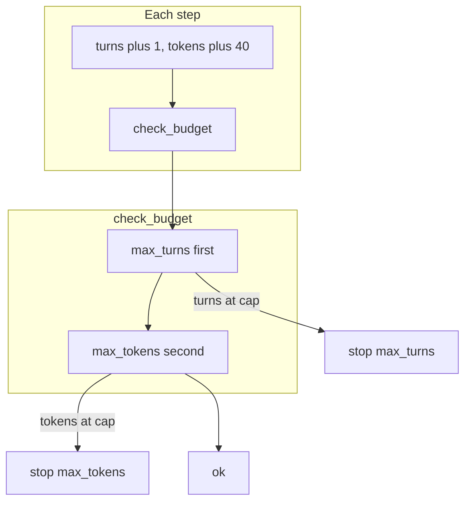

# Lab 1: Stop rules

`check_budget` returns `ok` or `stop` plus a reason. Two fixtures print `max_turns` then `max_tokens`.

## What you touch
- Script: `lab1_stop_rules.py` (write it next to this brief; there is no reference `.py` yet)
- Functions: `check_budget(budget, spent)`
- Dicts: `budget` (`max_turns`, `max_tokens`), `spent` (`turns`, `tokens`)
- No HTTP. This script does not read `OLLAMA_HOST` or `OLLAMA_MODEL`.
- No jobs file. In-memory `spent` is enough.
- No USD.

## Steps


1. Write `check_budget(budget, spent)`. If `spent["turns"] >= budget["max_turns"]`, return `{ "stop": true, "reason": "max_turns" }`. Else if `spent["tokens"] >= budget["max_tokens"]`, return `{ "stop": true, "reason": "max_tokens" }`. Else return `{ "ok": true }`. Check `max_turns` first. Then `max_tokens`.
2. Write a helper that starts `spent` at `{ "turns": 0, "tokens": 0 }`. Loop up to 5 steps. Each step: `turns += 1`, then `tokens += 40`, then call `check_budget`. Print `ok` or `stop` plus `reason`. Halt on `stop`.
3. Fixture 1: `budget` `{ "max_turns": 3, "max_tokens": 100 }`. After step 1: turns 1, tokens 40, `ok`. After step 2: turns 2, tokens 80, `ok`. After step 3: turns 3, tokens 120. `turns == max_turns`, so `reason` is `max_turns`.
4. Fixture 2: `budget` `{ "max_turns": 10, "max_tokens": 50 }`. Same increment. After step 2: turns 2, tokens 80. `tokens >= max_tokens` and turns are under the cap, so `reason` is `max_tokens`.
5. In `__main__`, run both fixtures. Print both reasons. Do not POST. Do not write `jobs.json`.

## Data contract
Only the keys this script uses.

**budget**

```json
{
  "max_turns": 3,
  "max_tokens": 100
}
```

**spent** (start)

```json
{
  "turns": 0,
  "tokens": 0
}
```

**ok**

```json
{
  "ok": true
}
```

**stop**

```json
{
  "stop": true,
  "reason": "max_turns"
}
```

`reason` is `max_turns` or `max_tokens`. Check order is `max_turns` first, then `max_tokens`.

## Run
From the repo root:

```bash
python education/17_the_budget/lab1_stop_rules.py
```

```powershell
python education/17_the_budget/lab1_stop_rules.py
```

This script does not read `OLLAMA_HOST` or `OLLAMA_MODEL`. Do not set those vars for this lab.

## What you should see
Fixture 1 prints `ok` twice, then `stop` with `reason` `max_turns`. Fixture 2 prints `ok` once, then `stop` with `reason` `max_tokens`. If fixture 1 prints `max_tokens`, you checked tokens first. If a fixture runs all 5 steps, you did not halt on `stop`.

## Stop here
This is not a billing API. Do not add USD. Do not add a jobs file. Next: [../18_park_and_resume/00_park_and_resume.md](../18_park_and_resume/00_park_and_resume.md).

## Notes
- Write `lab1_stop_rules.py` next to this brief. There is no reference `.py` in the repo yet.
- In-memory `spent` is enough. Do not edit other `.py` files in the repo.
- Check `max_turns` first so fixture 1 is deterministic.
