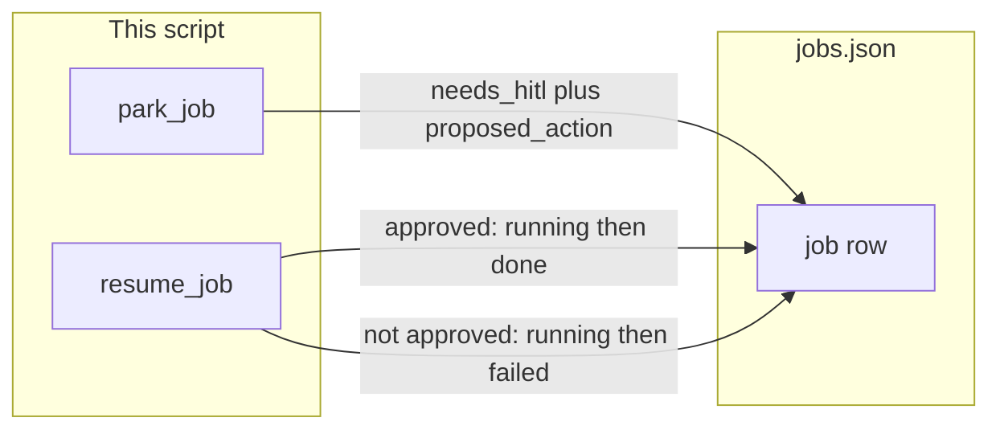

# 18: Park and resume

After this page a job can wait for a later yes or no, then continue. Status `needs_hitl` plus `proposed_action` is written to the job file. `park_job(job_id, proposed_action)` sets `needs_hitl`. `resume_job(job_id, approved)` sets `running`, then `done` if approved, or `failed` if not.

## Data
Reuse the chapter 16 job row. Add `proposed_action` (string or null). Add status values `needs_hitl` and `failed`.

`park_job(job_id, proposed_action)` loads `jobs.json`, finds the row, sets `status` to `needs_hitl` and `proposed_action` to the string, and dumps the list.

`resume_job(job_id, approved)` loads the list, finds the row, sets `status` to `running`, then sets `done` if `approved` is true, or `failed` if `approved` is false.

Chapter 09 HITL is a print in the same process. This chapter writes the wait to the file.

No HTTP. This chapter does not read `OLLAMA_HOST` or `OLLAMA_MODEL`.

## Information
The process can exit while the row says `needs_hitl`. A later call to `resume_job` reads the same row and continues.

If the person is at the same stdin, chapter 09 is enough. Use this when the answer comes later, or from a second process.

Chapter 10 interrupt cancels a run. This chapter resumes the same row.

## Knowledge
1. Enqueue a job. Claim it.
2. Call `park_job(job_id, proposed_action)` so the row is `needs_hitl`.
3. Exit if you want. The file still has the row.
4. Call `resume_job(job_id, approved=True)` to set `running` then `done`.
5. Call `resume_job(job_id, approved=False)` to set `running` then `failed`.

## Wisdom
If the person is at the same stdin, chapter 09 is enough. Use this when the process may exit before the answer.

## The When and Why
- **When:** approval happens later, or a second process records the answer.
- **Why:** a print in the same process dies with the process. A `needs_hitl` row does not.

## How it works



Walkthrough of one park and resume:

1. `enqueue_job` writes a `pending` row. `claim_job` sets `running`.
2. `park_job(job_id, "rm -rf /tmp/demo")` sets `status` to `needs_hitl` and stores `proposed_action`.
3. The process can exit. The file still has the row.
4. `resume_job(job_id, True)` sets `running`, then `done`.
5. A second job parked and resumed with `False` ends as `failed`.

Do not run the proposed command.

## Data contract

**jobs.json row**

```json
{
  "job_id": "string",
  "status": "needs_hitl",
  "prompt": "string",
  "result": null,
  "proposed_action": "rm -rf /tmp/demo"
}
```

`status` includes `pending`, `running`, `done`, `needs_hitl`, and `failed`. `proposed_action` is a string or `null`.

**park_job(job_id, proposed_action)** writes `needs_hitl` and the string.

**resume_job(job_id, approved)** writes `running`, then `done` if `approved` is true, or `failed` if `approved` is false.

## Lab
Done when one job parks, resumes as approved, and prints `done`, and a second job parks, resumes as not approved, and prints `failed`.

- Module: [this file](./00_park_and_resume.md)
- Lab: [lab1_park_and_resume.md](./lab1_park_and_resume.md)

## Related
- **Chapter 09 HITL:** a print in the same process. Enough when stdin is still there.
- **Chapter 16 job row:** the file this chapter writes `needs_hitl` into.
- **Chapter 10 interrupt:** cancel, not resume.

## Notes
- Write the lab `.py` next to the brief. There is no reference `.py` in the repo yet.
- Do not call the real command. The string is data.
- Do not POST. Do not read `OLLAMA_HOST` or `OLLAMA_MODEL`.
- Do not add a control-plane product.
