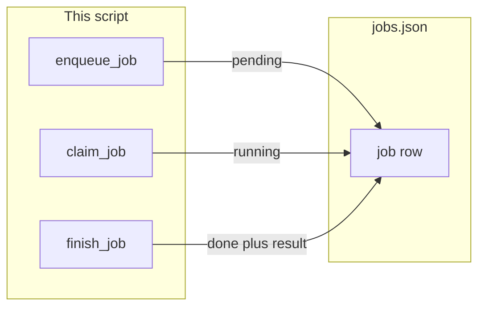

# 18: The Job: Decoupling Tasks with Asynchronous Job Queues

By the end of this chapter, you will understand how to decouple user requests from agent execution loops using a durable, file-based job queue (`jobs.json`) with atomic job claiming, concurrency controls, and state transitions.

In interactive sessions, closing the terminal or dropping a network connection kills in-flight agent tasks. In this chapter, we convert agent runs into persistent job records that survive process restarts.

## Data
A **Job Record** represents an asynchronous unit of work stored in `jobs.json`:
- **`job_id`**: A unique string identifier (e.g. `job-101`).
- **`status`**: Lifecycle state (`pending` $\rightarrow$ `running` $\rightarrow$ `done` or `failed`).
- **`prompt`**: The user request or instruction payload.
- **`result`**: The finalized agent deliverable (or `None` while pending/running).
- **`claimed_by`**: The identifier of the worker currently processing the record.

## Information
In production architectures, user requests should not run synchronously on web server threads:
- **Resilience**: If a worker crashes or restarts, uncompleted jobs remain safely persisted in the queue.
- **Concurrency**: Multiple worker processes (`worker_a`, `worker_b`) can poll and claim jobs concurrently without duplicate execution.
- **Decoupling**: The front-end API can return an immediate `202 Accepted` response with a `job_id`, allowing clients to poll or listen for completion asynchronously.

## Knowledge
Here is the step-by-step procedure:
1. Initialize the persistent jobs store (`jobs.json`).
2. Implement `enqueue_job(prompt)`: Write a new record with `status: "pending"`.
3. Implement `claim_job(worker_id)`: Find the first unclaimed `pending` job, set `status: "running"`, assign `claimed_by: worker_id`, and save.
4. Worker executes the task in its own lifecycle loop.
5. Implement `finish_job(job_id, result)`: Set `status: "done"` and persist the resulting output.

## Wisdom
A simple, durable file-based or database-backed queue provides 90% of the reliability benefits of complex message brokers without the operational overhead.

## The When and Why
- **When**: Multi-step batch tasks, background tasks that outlive single HTTP requests, or systems scaling across multiple worker processes.
- **Why**: Synchronous in-memory execution loses state on crashes. Persistent queues guarantee durable task execution and clean worker separation.

## How it works



Walkthrough of one job:

1. `enqueue_job("Add 2 and 3")` appends `{ "job_id": "...", "status": "pending", "prompt": "Add 2 and 3", "result": null }`.
2. `claim_job()` finds that row, sets `status` to `running`, and returns the dict.
3. The worker runs the prompt (lab 1 uses a mock that returns a fixed string).
4. `finish_job(job_id, result)` sets `status` to `done` and writes `result`.
5. The process can exit. `jobs.json` still has the row.

## Data contract

**jobs.json** (list of rows)

```json
[
  {
    "job_id": "string",
    "status": "pending",
    "prompt": "string",
    "result": null
  }
]
```

`status` is `pending`, `running`, `done`, or `failed`. `result` is a string after `finish_job`, or `null` before that.

**enqueue_job(prompt)** returns the new row with `status` `pending`.

**claim_job()** returns the first `pending` row (now `running`) or `None`.

**finish_job(job_id, result)** writes `status` `done` and `result`.

## Lab
Done when a worker claims a row, writes a result, and the file still has that row after the process exits.

- Module: [this file](./00_the_job.md)
- Lab 1: [lab1_jobs_table.md](./lab1_jobs_table.md) - one list, enqueue, claim, finish.
- Lab 2: [lab2_two_workers.md](./lab2_two_workers.md) - two worker names, `claimed_by`, no double claim.

## Related
- **Chapter 05 `messages.json`:** a conversation list. A job row is one unit of work, not a chat.
- **Chapter 07 session:** one process, one conversation file. The loop starts from stdin.
- **Chapter 10 `job_id`:** in-memory id for a request. It dies with the process.
- **Chapter 08 two agents:** two job titles in one process. Not a fleet of workers on a table.

## Notes
- Write the lab `.py` files next to the briefs. There is no reference `.py` in the repo yet.
- Do not add Redis, Kafka, or a queue product.
- Do not POST. Do not read `OLLAMA_HOST` or `OLLAMA_MODEL`.
