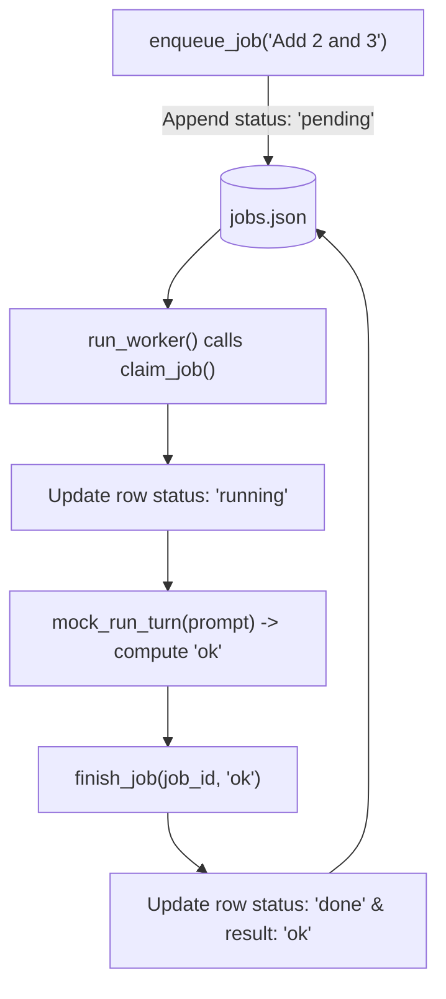

# Lab 1: Persistent Jobs Table and State Transitions

In this lab, you will implement a file-backed jobs table `jobs.json` and a worker routine `run_worker()` that atomically claims `pending` jobs, executes mock turns, and transitions job statuses to `done` with recorded results.

---

## What you touch
- Script to create: `lab1_jobs_table.py`
- Persistence File: `jobs.json` (next to the script)
- Main Functions:
  - `enqueue_job(prompt: str) -> dict`
  - `claim_job() -> dict | None`
  - `finish_job(job_id: str, result: str) -> dict`
  - `mock_run_turn(prompt: str) -> str`
  - `run_worker() -> None`
- Lifecycle States: `pending`, `running`, `done`
- Pure Python logic (no network calls required)

---

## Steps


1. Maintain `jobs.json` holding a list of job dictionaries.
2. Implement `enqueue_job(prompt)`:
   - Generate a unique `job_id`, create a record with `status: "pending"` and `result: None`, append to `jobs.json`, and return the record.
3. Implement `claim_job()`:
   - Find the first record with `status: "pending"`, set `status: "running"`, save to disk, and return the record (or `None` if queue is empty).
4. Implement `finish_job(job_id, result)`:
   - Find the matching record in `jobs.json`, update `status: "done"` and `result: result`, and save.
5. Implement `mock_run_turn(prompt)`:
   - Return a dummy response string (e.g. `"ok"`).
6. Implement `run_worker()`:
   - Claim a job; if found, execute `mock_run_turn()`, and call `finish_job()`.
7. In `__main__`:
   - Enqueue two test jobs.
   - Run the worker twice, logging transitions from `pending` $\rightarrow$ `running` $\rightarrow$ `done`.

---

## Data contract

**Pending Job Record (`jobs.json`)**

```json
[
  {
    "job_id": "job-1",
    "status": "pending",
    "prompt": "Add 2 and 3",
    "result": null
  }
]
```

**Completed Job Record**

```json
{
  "job_id": "job-1",
  "status": "done",
  "prompt": "Add 2 and 3",
  "result": "ok"
}
```

---

## Run
From the repository root, run:

```bash
python education/18_the_job/lab1_jobs_table.py
```

```powershell
python education/18_the_job/lab1_jobs_table.py
```

---

## What you should see
- `[ENQUEUE] Created job-1 (pending)`
- `[ENQUEUE] Created job-2 (pending)`
- `[WORKER] Claimed job-1 (running) -> Finished job-1 (done)`
- `[WORKER] Claimed job-2 (running) -> Finished job-2 (done)`
- Final `jobs.json` on disk containing two completed rows.

---

## Stop here
You have successfully implemented a durable background jobs table! In Lab 2, we will add worker identifiers and prevent race conditions across concurrent workers.

Next up: [Lab 2: Two Workers](./lab2_two_workers.md).

---

## Notes
*(Record your jobs table transitions and saved state here)*

