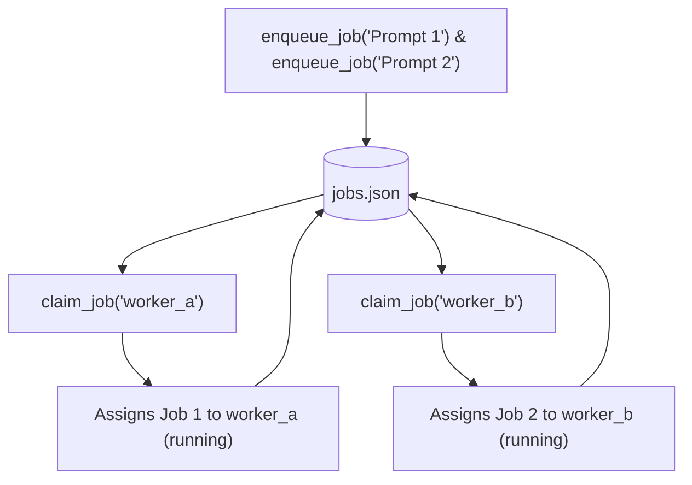

# Lab 2: Multi-Worker Coordination and Concurrency Safety

In this lab, you will expand the file-based jobs table to support multiple named workers (`worker_a`, `worker_b`) using a `claimed_by` attribution field to prevent duplicate task claims across concurrent worker processes.

---

## What you touch
- Script to create: `lab2_two_workers.py`
- Persistence File: `jobs.json` (next to the script)
- Main Functions:
  - `enqueue_job(prompt: str) -> dict`
  - `claim_job(worker_name: str) -> dict | None`
- Row Keys: `job_id`, `status`, `prompt`, `result`, `claimed_by`
- Worker Identifiers: `"worker_a"`, `"worker_b"`
- Pure Python logic (no network calls required)

---

## Steps


1. Expand the `jobs.json` row schema to include `claimed_by` (string or `None`).
2. Implement `enqueue_job(prompt)`:
   - Create new record with `status: "pending"` and `claimed_by: None`.
3. Implement `claim_job(worker_name)`:
   - Find the first record where `status == "pending"` and `claimed_by is None`.
   - Atomically assign `status: "running"` and `claimed_by: worker_name`, save to disk, and return the record.
   - If no unclaimed jobs exist, return `None`.
4. In `__main__`:
   - Enqueue two distinct prompts.
   - Invoke `claim_job("worker_a")` $\rightarrow$ verify it claims Job 1.
   - Invoke `claim_job("worker_b")` $\rightarrow$ verify it claims Job 2 (and does not re-claim Job 1).

---

## Data contract

**Claimed Job Record (`jobs.json`)**

```json
[
  {
    "job_id": "job-1",
    "status": "running",
    "prompt": "Add 2 and 3",
    "result": null,
    "claimed_by": "worker_a"
  },
  {
    "job_id": "job-2",
    "status": "running",
    "prompt": "Summarize logs",
    "result": null,
    "claimed_by": "worker_b"
  }
]
```

---

## Run
From the repository root, run:

```bash
python education/18_the_job/lab2_two_workers.py
```

```powershell
python education/18_the_job/lab2_two_workers.py
```

---

## What you should see
- `[WORKER A] Claimed job-1 (claimed_by: worker_a, status: running)`
- `[WORKER B] Claimed job-2 (claimed_by: worker_b, status: running)`
- Verification that each worker received a distinct task without collisions.

---

## Stop here
You have successfully implemented multi-worker queue concurrency! In Chapter 19, we will build the HTTP/SSE streaming front door for agent systems.

Next up: [Chapter 19: The Front Door](../19_the_front_door/00_fastapi_sse.md).

---

## Notes
*(Record your multi-worker concurrency logs here)*

