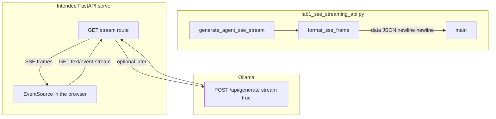

# 19: FastAPI and SSE

After this page the UI is a client of the script. The script is a server. The lab is `lab1_sse_streaming_api.py`.

## Data
**SSE** (Server-Sent Events) is an HTTP response with `Content-Type: text/event-stream`. The server keeps the connection open and writes lines. Each event is one or more lines, then a blank line. The payload line starts with `data: ` and ends with `\n\n`.

A **FastAPI route** is a function that FastAPI calls when a client hits a path. The intended server is a FastAPI app. A browser opens that path with `EventSource`. `EventSource` is the browser API that reads `text/event-stream` and fires a message for each `data:` line.

The lab file is `lab1_sse_streaming_api.py`. The functions are `format_sse_frame(event_type, data, event_id)` and `generate_agent_sse_stream(prompt)`. The first function returns the string `data: {json}\n\n`. The second function is an async generator that yields those strings.

This lab does not start FastAPI and does not POST to Ollama. `OLLAMA_HOST` should still default to `http://192.168.1.29:11434` and `OLLAMA_MODEL` to `qwen3.6:35b-a3b-65k` when a later route streams from the model. Port `11434` is the Ollama listener. The intended FastAPI listener is port `8000` (uvicorn default). The reference script opens neither port.

## Information
Chapter 01 streamed tokens to stdout. Stdout is a terminal. A browser cannot read your terminal. The browser needs an HTTP response it can keep open.

SSE is one-way: server to client. The client cannot send a second message on the same connection. Lab 2 uses a WebSocket for that.

If you `print` tokens in the FastAPI process, the browser sees nothing. The browser only sees bytes on the HTTP connection.

## Knowledge
1. Write `format_sse_frame`. It builds a JSON object and returns `data: {json}\n\n`.
2. Write `generate_agent_sse_stream(prompt)`. Yield one frame at a time. The reference order is `session_started`, then `token_delta` frames, then `tool_call_start`, `tool_call_result`, `turn_complete`.
3. Intended next step (not in the reference file): expose a FastAPI route that yields those lines with `Content-Type: text/event-stream`.
4. Intended client: `EventSource` on that route. Append each `data` payload to the page.
5. Do not build a Next.js app in this lab. Do not open a WebSocket.

## Wisdom
Stop when a client has received framed lines. Do not add React, a job queue, or a WebSocket yet. Those are the next pages and lab 2. If you add them now, a missing token could come from the UI, the socket, or the frame format.

## The When and Why
- **When:** a person is watching tokens appear one by one.
- **Why:** stdout is not a UI. The browser needs `text/event-stream` on an HTTP connection.

## How it works



Walkthrough of one run of the reference script:

1. `main` calls `generate_agent_sse_stream("Read config and summarize environment")`.
2. The generator yields `session_started` with `data.status` `ACTIVE` and `data.prompt` set.
3. It yields six `token_delta` frames. Each `data.delta` is one chunk: `Analyzing `, `user `, `query... `, `Formulating `, `action `, `plan.`.
4. It yields `tool_call_start` with `tool_name` `read_file` and `args.path` `config.json`.
5. It yields `tool_call_result` with `output` `{'env': 'prod'}`.
6. It yields `turn_complete` with `status` `SUCCESS` and `total_events` equal to the last `event_id`.
7. `main` prints each frame as `[CLIENT READ] data: {...}`.

Nothing in that walkthrough opens port `8000` or calls Ollama. The frames are the new fact.

## Data contract

**Intended SSE line** (what a FastAPI route should write):

```
data: {"token": "string"}\n\n
```

`Content-Type` is `text/event-stream`. One JSON object per `data:` line. A blank line ends the event.

**What the reference script actually yields**

Each yield is:

```
data: {"event_id": 1, "event_type": "session_started", "timestamp": 0.0, "data": {}}\n\n
```

`event_type` values in order: `session_started`, `token_delta` (six times), `tool_call_start`, `tool_call_result`, `turn_complete`.

`token_delta` puts the chunk in `data.delta`, not `token`. See Notes.

## Lab
Done when you can name the frame format and the client has printed every `event_type`.

- Module: [this file](./00_fastapi_sse.md)
- Lab 1: [lab1_sse_streaming_api.py](./lab1_sse_streaming_api.py) / [lab1_sse_streaming_api.md](./lab1_sse_streaming_api.md) - yield SSE frames, print them. Done when you see `session_started` through `turn_complete`.
- Lab 2: [lab2_websocket_interrupt.py](./lab2_websocket_interrupt.py) / [lab2_websocket_interrupt.md](./lab2_websocket_interrupt.md) - inbound interrupt. Not this page.

## Related
- **WebSocket:** lab 2. Same tokens, plus a client-to-server message.
- **01_frontend.md:** the browser as a client of these frames.
- **EventSource:** the browser API for `text/event-stream`. Not in the reference script.

## Notes
- Keep the existing lab facts: `format_sse_frame`, `generate_agent_sse_stream`, the five `event_type` values, the six token strings, `read_file` / `config.json`.
- Contract drift vs `lab1_sse_streaming_api.py`: no FastAPI app, no uvicorn, no port `8000`, no `EventSource`, no POST to Ollama. The intended line is `data: {"token": "..."}\n\n`. The script wraps every event as `{event_id, event_type, timestamp, data}` and puts the chunk in `data.delta`. There is no `[DONE]` line. Write the intended FastAPI route in your copy if you want a browser. Leave the reference file as-is.
