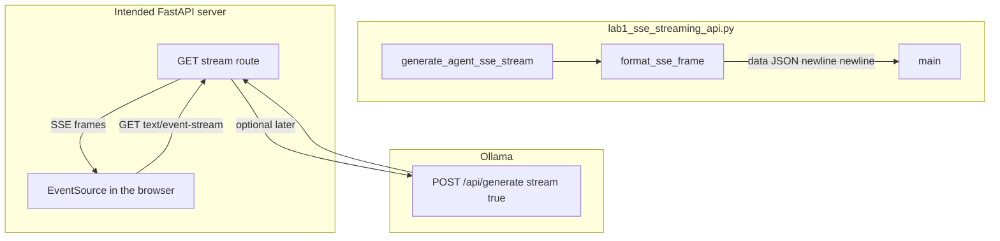

# 19: FastAPI and Server-Sent Events (SSE) Streaming

By the end of this chapter, you will understand how to serve real-time streaming agent outputs to client user interfaces using Server-Sent Events (SSE) and structured frame formatting (`format_sse_frame`).

In earlier chapters, we streamed tokens to stdout in the terminal. In web architectures, browsers and web clients consume live token streams through persistent HTTP connections using `Content-Type: text/event-stream`.

## Data
An **SSE Stream** transmits newline-delimited event frames across an open HTTP connection:
- **Frame Format**: `data: {json_payload}\n\n`
- **Envelope Structure**:
  - `event_id`: Monotonically increasing integer ID.
  - `event_type`: Lifecycle event name (`session_started`, `token_delta`, `tool_call_start`, `tool_call_result`, `turn_complete`).
  - `timestamp`: Epoch timestamp in seconds.
  - `data`: Event-specific payload (e.g. `{"delta": "word"}` or `{"tool_name": "read_file"}`).

## Information
Standard HTTP request-response cycles require waiting for the entire LLM generation to complete before sending a response.

SSE streaming provides significant improvements:
- **Low Latency**: The browser renders the very first generated token in milliseconds.
- **Rich Telemetry**: Transmits reasoning tokens, tool invocations, and completion signals over the same continuous stream.
- **Client Native**: Standard browser JavaScript consumes SSE directly via the native `EventSource` API.

## Knowledge
Here is the step-by-step procedure:
1. Implement `format_sse_frame(event_type, data, event_id)` to serialize event payloads into standard `data: <json>\n\n` strings.
2. Build an asynchronous generator (`generate_agent_sse_stream(prompt)`) yielding event frames.
3. Emit `session_started` on stream initialization.
4. Yield `token_delta` frames as LLM chunks arrive.
5. Emit `tool_call_start` and `tool_call_result` when actuators execute.
6. Emit `turn_complete` on final turn conclusion.

## Wisdom
SSE is unidirectional (server to client) and ideal for streaming output. If you need bidirectional interactivity or mid-flight cancellations, pair SSE with WebSockets.

## The When and Why
- **When**: Streaming real-time agent thinking, token generation, and tool status updates to web dashboards or chatbots.
- **Why**: Output buffering degrades user experience. SSE delivers snappy, immediate visual feedback over standard HTTP.

## How it works



Walkthrough of one run of the reference script:

1. `main` calls `generate_agent_sse_stream("Read config and summarize environment")`.
2. The generator yields `session_started` with `data.status` `ACTIVE` and `data.prompt` set.
3. It yields six `token_delta` frames. Each `data.delta` is one chunk: `Analyzing `, `user `, `query... `, `Formulating `, `action `, `plan.`.
4. It yields `tool_call_start` with `tool_name` `read_file` and `args.path` `config.json`.
5. It yields `tool_call_result` with `output` `{'env': 'prod'}`.
6. It yields `turn_complete` with `status` `SUCCESS` and `total_events` equal to the last `event_id`.
7. `main` prints each frame as `[CLIENT READ] data: {...}`.

Nothing in that walkthrough opens port `8000` or calls Ollama. The frames are the new fact.

## Data contract

**Intended SSE line** (what a FastAPI route should write):

```
data: {"token": "string"}\n\n
```

`Content-Type` is `text/event-stream`. One JSON object per `data:` line. A blank line ends the event.

**What the reference script actually yields**

Each yield is:

```
data: {"event_id": 1, "event_type": "session_started", "timestamp": 0.0, "data": {}}\n\n
```

`event_type` values in order: `session_started`, `token_delta` (six times), `tool_call_start`, `tool_call_result`, `turn_complete`.

`token_delta` puts the chunk in `data.delta`, not `token`. See Notes.

## Lab
Done when you can name the frame format and the client has printed every `event_type`.

- Module: [this file](./00_fastapi_sse.md)
- Lab 1: [lab1_sse_streaming_api.py](./lab1_sse_streaming_api.py) / [lab1_sse_streaming_api.md](./lab1_sse_streaming_api.md) - yield SSE frames, print them. Done when you see `session_started` through `turn_complete`.
- Lab 2: [lab2_websocket_interrupt.py](./lab2_websocket_interrupt.py) / [lab2_websocket_interrupt.md](./lab2_websocket_interrupt.md) - inbound interrupt. Not this page.

## Related
- **WebSocket:** lab 2. Same tokens, plus a client-to-server message.
- **01_frontend.md:** the browser as a client of these frames.
- **EventSource:** the browser API for `text/event-stream`. Not in the reference script.

## Notes
- Keep the existing lab facts: `format_sse_frame`, `generate_agent_sse_stream`, the five `event_type` values, the six token strings, `read_file` / `config.json`.
- Contract drift vs `lab1_sse_streaming_api.py`: no FastAPI app, no uvicorn, no port `8000`, no `EventSource`, no POST to Ollama. The intended line is `data: {"token": "..."}\n\n`. The script wraps every event as `{event_id, event_type, timestamp, data}` and puts the chunk in `data.delta`. There is no `[DONE]` line. Write the intended FastAPI route in your copy if you want a browser. Leave the reference file as-is.
