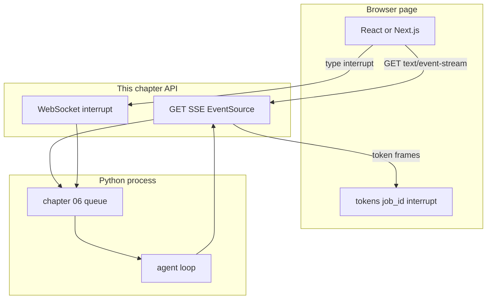

# 19: Frontend as a Client: Decoupling UI Rendering from Agent Execution

By the end of this chapter, you will understand how to construct a lightweight web frontend (`lab3_frontend_client.html`) that connects to streaming agent endpoints via `EventSource`, manages UI state (`tokens`, `job_id`), and issues interrupt signals over WebSockets.

In production architectures, agent loops must remain securely in Python processes rather than being embedded inside frontend client state.

## Data
A **Frontend Client** consumes server events and renders visual UI state:
- **`tokens`**: Accumulating string of generated response text.
- **`job_id`**: Active task tracking identifier to multiplex concurrent streams.
- **`interrupt`**: Bidirectional stop signal sent over WebSockets (`{"type": "interrupt"}`).
- **Client Protocols**:
  - Outbound Streaming: Consumes `GET /jobs/{job_id}/stream` via `EventSource`.
  - Inbound Control: Connects `ws://host/jobs/{job_id}/ws` to dispatch interrupts.

## Information
Never embed core agent logic (planning, tool dispatch, prompt templates) inside browser JavaScript frameworks:
- **Separation of Concerns**: The Python backend owns the execution loop, tools, state stores, and retries.
- **Resilience**: If the user refreshes or closes the browser tab, the background agent job continues uninterrupted.
- **Security**: Database keys and environment secrets remain protected on the server rather than exposed to the client.

## Knowledge
Here is the step-by-step procedure:
1. Initiate tasks by sending a `POST /jobs` request and storing the returned `job_id`.
2. Open an `EventSource` connection to `/jobs/{job_id}/stream`.
3. Parse incoming event JSON payloads and append token deltas to `tokens`.
4. Render response text dynamically in the browser DOM.
5. On user cancellation, send an `{"type": "interrupt"}` control frame over the WebSocket.

## Wisdom
The browser is purely a presentation layer. Keep the agent loop on the server and use standard streaming contracts to communicate.

## The When and Why
- **When**: Building web dashboards, chat interfaces, or monitoring tools for autonomous agents.
- **Why**: Separating frontend rendering from agent execution prevents tab crashes from killing in-flight tasks and preserves system security.

## How it works



Walkthrough of one turn on the page:

1. The page stores a `job_id` (from a start POST or from the first frame).
2. It opens `EventSource` on the stream route for that id.
3. Each `data:` line is JSON. The intended token key is `token`. Lab 1 uses `data.delta` inside a wrapper. Append the text to `tokens` and draw it.
4. If the person hits stop, the page cannot talk back on SSE. It sends `{ "type": "interrupt" }` on the WebSocket from lab 2.
5. The Python loop stops. The page shows the last tokens it already has.

The new fact is the page as a client. The loop did not move.

## Data contract

**Start POST**

```json
{ "prompt": "string" }
```

**Start response**

```json
{ "job_id": "string" }
```

**Intended token event** (what the page should read):

```json
{ "token": "string" }
```

**Intended interrupt** (what the stop button should send on the WebSocket):

```json
{ "type": "interrupt" }
```

Lab 1 wraps tokens as `{ "event_id", "event_type": "token_delta", "timestamp", "data": { "delta": "string" } }`. Lab 2 uses an `asyncio.Event`, not a real WebSocket frame. See Notes.

## Lab
Done when the proof script prints HAS EventSource, HAS tokens, HAS job_id, HAS interrupt, and NO for the generator, the graph, and `tool_calls`.

- Module: [this file](./01_frontend.md)
- Lab 1: [lab1_sse_streaming_api.md](./lab1_sse_streaming_api.md) - the outbound frames the page would read.
- Lab 2: [lab2_websocket_interrupt.md](./lab2_websocket_interrupt.md) - the inbound stop the button would send.
- Lab 3: [lab3_frontend_client.md](./lab3_frontend_client.md) - write `lab3_frontend_client.html` and `lab3_frontend_client.py`. EventSource, `tokens`, `job_id`, WebSocket `{ "type": "interrupt" }`. Done when the proof lines are HAS / HAS / HAS / HAS / NO / NO / NO.

## Related
- **Next.js:** same client job as React. The page still does not own the loop. Lab 3 does not use Next.js.
- **00_fastapi_sse.md:** the frames.
- **02_mx_vs_ux.md:** which frames the page should draw.

## Notes
- Keep the existing ideas: UI state is `tokens`, `job_id`, and an interrupt flag. The loop stays in Python. Do not put ReAct in `useEffect`.
- Lab 3 has no reference `.html` or `.py` yet. Contract drift lives on labs 1 and 2: lab 1 has no FastAPI route and uses `data.delta`; lab 2 has no WebSocket server. The intended page reads `{ "token": "string" }` and sends `{ "type": "interrupt" }`. Write the page in your copy. Do not edit the `.py` files in the repo.
- Moved from modules/05/01.
