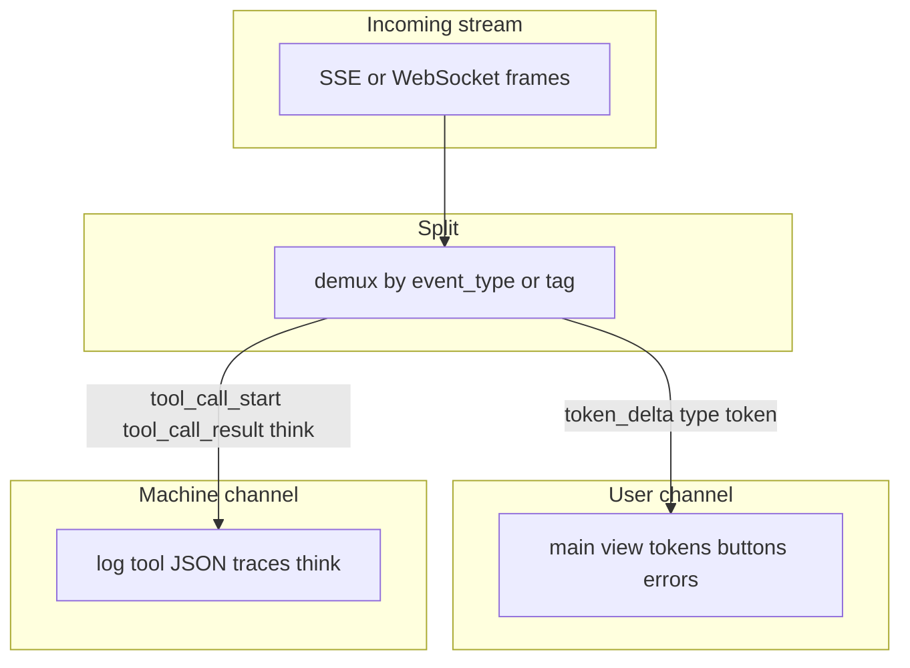

# 19: Machine Experience (MX) vs User Experience (UX)

By the end of this chapter, you will understand how to separate internal Machine Experience (MX) payloads (tool JSON, execution traces, `<think>` tags) from visible User Experience (UX) tokens using channel tagging and stream demultiplexing (`split_streams`).

When autonomous agents think and invoke tools, raw telemetry mixed directly into user chat windows results in cluttered, confusing interfaces.

## Data
We separate communication into two distinct channels:
1. **User Experience (UX)**: The human-facing conversation channel containing readable text tokens, Markdown formatting, and user action buttons.
2. **Machine Experience (MX)**: The technical telemetry channel containing raw tool JSON arguments, AST execution traces, and internal `<think>` reasoning chains.
3. **Channel Tagging**: Classifying streaming frames via `tag_frame(frame)` into `{"channel": "ux"}` or `{"channel": "mx"}`.

## Information
Dumping raw tool JSON and scratchpad reasoning directly into user text boxes creates poor user experiences and leaks internal system prompts.

Channel separation solves this:
- **Clean Chat Interfaces**: The primary conversation view renders only polished natural language responses.
- **Dedicated Telemetry Panels**: Collapsible developer trays or logs display tool calls and execution metrics separately.
- **Model Cleanliness**: Stripping internal `<think>` reasoning tags before final display ensures responses are concise and human-friendly.

## Knowledge
Here is the step-by-step procedure:
1. Evaluate streaming frames using `tag_frame(frame)`.
2. Map `token_delta` and `type: "token"` frames to the `ux` channel.
3. Map `tool_call_start`, `tool_call_result`, and session metadata to the `mx` channel.
4. Use `split_think_fence(text)` to extract `<think>` blocks into `mx` while retaining conversational text in `ux`.
5. Direct `ux` text to the main user view and route `mx` data to telemetry logs or collapsible debug panels.

## Wisdom
Never let machine-facing scratchpad tokens pollute human-facing UI text. Maintain strict channel separation across the stream.

## The When and Why
- **When**: Building chat interfaces for tool-calling or reasoning agents.
- **Why**: Users need concise answers, not JSON dumps. Channel demuxing delivers clean conversational responses while preserving debugging telemetry.

## How it works



Walkthrough of the frames lab 1 already yields:

1. `session_started` is MX (session status). Log it. Do not draw it as chat text.
2. `token_delta` with `data.delta` is UX. Append it to the visible string.
3. `tool_call_start` with `tool_name` `read_file` and `args.path` `config.json` is MX. Log it. A debug panel may show the name. The main view should not dump the args JSON.
4. `tool_call_result` with `output` `{'env': 'prod'}` is MX. Same rule.
5. `turn_complete` is MX status. The UX side can show "done" in one sentence. It should not dump `total_events`.

Walkthrough of lab 4:

1. `tag_frame` reads `type` or `event_type` and returns `{ "channel": "ux" }` or `{ "channel": "mx" }`.
2. `split_streams` puts token text on the ux list and dumps tool / session frames on the mx list.
3. `split_think_fence` cuts `<think>plan the answer</think>The env is prod.` into `mx` `plan the answer` and `ux` `The env is prod.`.
4. The joined ux string must not contain `config.json` or `<think>`.

The new fact is two channels. The splitter is chapter 06.

## Data contract

**Channel tag**

```json
{ "channel": "ux" }
```

or

```json
{ "channel": "mx" }
```

**Intended UX frame**

```json
{ "type": "token", "text": "string" }
```

**Intended MX frame** (not drawn on the main view)

```json
{ "type": "tool", "tool_name": "string", "args": {} }
```

**Fence result** (lab 4)

```json
{ "ux": "The env is prod.", "mx": "plan the answer" }
```

Lab 1 does not use `type` / `text`. It uses `event_type` and `data.delta`. See Notes.

## Lab
Done when two streams print and the joined ux string has no tool args and no `<think>`.

- Module: [this file](./02_mx_vs_ux.md)
- Lab 1: [lab1_sse_streaming_api.md](./lab1_sse_streaming_api.md) - mixed frames. Point at each `event_type`.
- Lab 4: [lab4_mx_vs_ux.md](./lab4_mx_vs_ux.md) - write `lab4_mx_vs_ux.py`. `tag_frame`, `split_think_fence`, `split_streams`. Done when UX prints `Hello ` / `world` / `The env is prod.` and MX holds the tool frames plus `plan the answer`.
- Chapter 06: [lab1_cot_demuxer.md](../06_the_reliability/lab1_cot_demuxer.md) - the CoT demuxer. Not this page.

## Related
- **Chapter 06 CoT demux:** the splitter for `<think>` vs visible text.
- **01_frontend.md:** the page that must draw only UX on the main view.
- **00_fastapi_sse.md:** the frames that arrive mixed.

## Notes
- Keep the existing ideas: MX is tool JSON, traces, and `<think>`. UX is visible tokens, buttons, and one-sentence errors. A debug panel can show MX. The main view should not.
- Lab 4 has no reference `.py` yet. Lab 1 already mixes MX and UX in one generator. The intended UX key is `{ "type": "token", "text": "string" }`. The script uses `event_type` `token_delta` and `data.delta`. Lab 4 accepts both. Do not copy `CoTStreamDemuxer`. Do not edit the `.py` files in the repo.
- Moved from modules/05/03.
