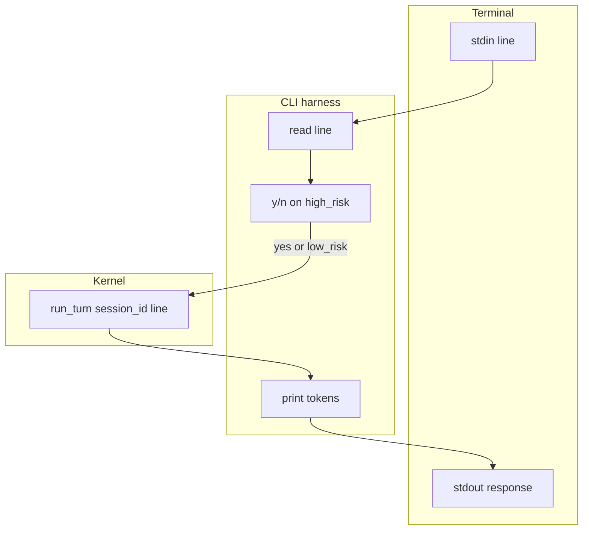

# 19: Command Line Interface (CLI) Harness

By the end of this chapter, you will understand how to construct a lightweight terminal CLI harness (`run_cli`) that wraps the agent kernel, supports multi-turn conversations via standard I/O (stdin/stdout), and incorporates interactive [y/n] Human-in-the-Loop checkpoints for high-risk tool execution.

A graphical web browser is not mandatory for running agent loops. A terminal CLI interface provides a fast, developer-friendly client to interact with the exact same agent engine.

## Data
A **CLI Harness** manages interactive stdin/stdout communication:
- **`run_cli(lines, run_turn)`**: Main interaction loop reading input prompts, invoking the kernel turn, and printing responses.
- **`mock_run_turn(session_id, user_prompt)`**: Kernel turn simulator returning response text, `high_risk` flags, and tool targets.
- **`apply_hitl(turn, answer)`**: Evaluator that queries `[y/n]` operator confirmation before executing destructive tools.
- **Session Persistence**: Backed by the standard JSON session files (`state_store/{session_id}.json`) developed in Chapter 13.

## Information
The core agent engine is completely client-agnostic:
- **Unified Engine**: The same underlying kernel powers Web SSE streams, Slack webhooks, and terminal CLIs without code modifications.
- **Interactive Checkpoints**: Sensitive operations prompt the terminal user with `Apply write to config.json? [y/n]`, cleanly intercepting high-risk side effects before they execute.
- **Automated Testing**: Passing pre-populated fixture lists of input lines allows automated CLI testing without hanging on interactive `input()` prompts.

## Knowledge
Here is the step-by-step procedure:
1. Read user input lines from stdin or a test fixture array.
2. Call `run_turn(session_id, user_prompt)` against the agent kernel.
3. Print the assistant's natural language response.
4. If `turn["high_risk"]` is True, prompt the user for confirmation (`[y/n]`).
5. If confirmed (`"y"`), invoke the actuator; if declined (`"n"`), skip the tool execution and log the cancellation.

## Wisdom
A robust agent kernel does not care whether inputs originate from a Web browser, a cron daemon, or a terminal TTY. Design clean client boundaries.

## The When and Why
- **When**: Local developer testing, headless automation scripts, SSH server environments, or CI/CD pipelines.
- **Why**: Developing and debugging agent logic in a fast CLI loop is significantly faster and simpler than maintaining a full web stack.

## How it works



Walkthrough of lab 5 (mock calls, no model):

1. Start with an empty list of turns.
2. User asks `What is 2 + 2?`. Mock returns `response` `4`, `high_risk` false. Print `4`.
3. User asks `Write config.json`. Mock returns `high_risk` true, `tool` `write_file`.
4. Run 1 supplies answer `n`. `apply_hitl` prints `SKIP: write_file`. `write_file` is not run.
5. Run 2 supplies answer `y`. `apply_hitl` prints `APPLY: write_file`.
6. Output has one normal turn, one skipped write, one applied write.

The new fact is stdin/stdout as the client. The session JSON is the same as chapter 13.

## Data contract

Same session JSON as chapter 13.

**Session file** `state_store/{session_id}.json`

```json
{
  "session_id": "session_9001",
  "messages": [],
  "turn_count": 0
}
```

**`run_turn` return** (what the CLI prints from)

```json
{
  "session_id": "session_9001",
  "turn_count": 1,
  "thinking": "string",
  "response": "string"
}
```

**Lab 5 mock return** (adds the HITL flag)

```json
{
  "session_id": "cli-1",
  "turn_count": 1,
  "thinking": "will write config",
  "response": "Apply write to config.json?",
  "high_risk": true,
  "tool": "write_file"
}
```

**HITL prompt** (stdin, not JSON): a y/n line before a write. Lab 5 reads that line from the fixture list. See Notes.

## Lab
Done when the mock CLI prints `4`, then `SKIP: write_file`, then `APPLY: write_file`.

- Module: [this file](./03_cli_harness.md)
- Lab 5: [lab5_cli_harness.md](./lab5_cli_harness.md) - write `lab5_cli_harness.py`. `mock_run_turn`, `apply_hitl`, `run_cli`. Done when `n` skips `write_file` and `y` prints `APPLY`.
- Chapter 13: [lab1_core_harness_kernel.md](../13_one_agent/lab1_core_harness_kernel.md) - real `run_turn` and the session file. Not copied here.

## Related
- **Chapter 13 kernel:** the process the CLI calls.
- **01_frontend.md:** the same loop, HTTP client instead of stdin.
- **Chapter 17 HITL:** the gate object. Here the UI is a y/n line.

## Notes
- Keep the existing ideas: stdin / stdout / TTY, HITL as a y/n prompt, same kernel, no browser. A TUI is optional.
- Lab 5 has no reference `.py` yet. Chapter 13 `lab1_core_harness_kernel.py` is two hardcoded `run_turn` calls, not an `input()` loop, and it POSTs `/api/generate` instead of `/api/chat`. The intended CLI reads a line, calls `run_turn`, prints `response`, and prompts y/n before writes. Lab 5 mocks that call. Do not edit the `.py` files in the repo.
- Moved from modules/17.
