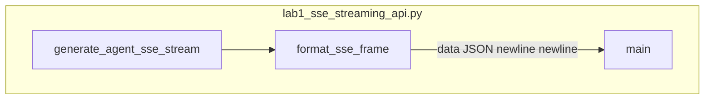

# Lab 1: SSE streaming API

A client received framed lines in `data: {json}` form.

## What you touch
- Script: `lab1_sse_streaming_api.py`
- Function: `format_sse_frame(event_type, data, event_id)` returns `data: {json}\n\n`
- Wrapper keys on every frame: `event_id`, `event_type`, `timestamp`, `data`
- Generator: `generate_agent_sse_stream(prompt)` yields those strings
- `event_type` order: `session_started`, six `token_delta`, `tool_call_start`, `tool_call_result`, `turn_complete`
- Token chunks in `data.delta`: `Analyzing `, `user `, `query... `, `Formulating `, `action `, `plan.`
- Tool frames: `tool_name` `read_file`, `args.path` `config.json`, `output` `{'env': 'prod'}`
- Prompt in `__main__`: `Read config and summarize environment`
- This script does not start FastAPI and does not POST. Env defaults still apply to the rest of the chapter: `OLLAMA_HOST` `http://192.168.1.29:11434`, `OLLAMA_MODEL` `qwen3.6:35b-a3b-65k`

## Steps


1. Write `format_sse_frame`. Build `{ event_id, event_type, timestamp, data }` and return `data: ` plus `json.dumps` plus `\n\n`.
2. Write `generate_agent_sse_stream(prompt)`. Yield `session_started` with `data.status` `ACTIVE` and `data.prompt` set.
3. Yield six `token_delta` frames. Each `data.delta` is one of the chunks listed above.
4. Yield `tool_call_start` (`read_file`, `config.json`) then `tool_call_result` (`{'env': 'prod'}`) then `turn_complete` with `status` `SUCCESS` and `total_events` equal to the last `event_id`.
5. In `main`, iterate the generator and print each frame as `[CLIENT READ] ` plus the stripped line.
6. Confirm you see every `event_type`. Do not start uvicorn. Do not open a WebSocket.

## Data contract
Intended SSE line a FastAPI route should write. The reference script wraps more keys (Notes).

**Intended line**

```
data: {"token": "string"}\n\n
```

`Content-Type` is `text/event-stream` when this is served over HTTP.

**Reference script yield**

```
data: {"event_id": 1, "event_type": "session_started", "timestamp": 0.0, "data": {"status": "ACTIVE", "prompt": "string"}}\n\n
```

`token_delta` puts the chunk in `data.delta`, not `token`. There is no `[DONE]` line.

## Run
From the repo root:

```bash
python education/19_the_front_door/lab1_sse_streaming_api.py
```

```powershell
$env:OLLAMA_HOST="http://192.168.1.29:11434"
$env:OLLAMA_MODEL="qwen3.6:35b-a3b-65k"
python education/19_the_front_door/lab1_sse_streaming_api.py
```

The reference script does not read those env vars and does not POST. They are listed so the Run block matches the other chapters.

## What you should see
`=== STARTING SERVER-SENT EVENTS (SSE) STREAMING API LAB ===`. Then `[SSE STREAM] Starting agent stream for prompt: 'Read config and summarize environment'...`. Then `=== RECEIVING SSE STREAM FRAMES FROM AGENT ===`. Then ten `[CLIENT READ] data: {...}` lines: `session_started`, six `token_delta`, `tool_call_start`, `tool_call_result`, `turn_complete`. If you see `[DONE]` or a browser page, you added something this script does not do.

## Stop here
Do not add FastAPI, uvicorn, `EventSource`, or a Next.js app. Do not open a WebSocket. Lab 2 is the inbound interrupt. Chapter 12 splits `<think>` from visible text.

## Notes
- Keep the five `event_type` values, the six token strings, and `read_file` / `config.json`.
- Contract drift vs `lab1_sse_streaming_api.py`: no FastAPI app, no port `8000`, no `EventSource`, no POST to Ollama, no `[DONE]`. The intended line is `data: {"token": "..."}\n\n`. The script wraps `{event_id, event_type, timestamp, data}` and puts the chunk in `data.delta`. Write a FastAPI route in your copy if you want a browser. Do not edit the `.py` in the repo.
