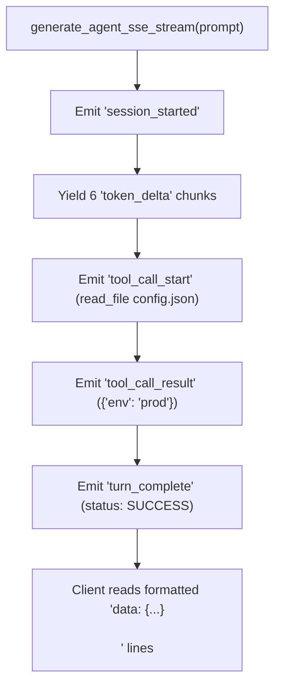

# Lab 1: Server-Sent Events (SSE) Streaming API

In this lab, you will implement an asynchronous SSE event generator `generate_agent_sse_stream()` that formats and streams structured agent lifecycle frames (`format_sse_frame`) in `data: {json}\n\n` syntax.

---

## What you touch
- Script: `lab1_sse_streaming_api.py`
- Main Functions:
  - `format_sse_frame(event_type: str, data: dict, event_id: int) -> str`
  - `generate_agent_sse_stream(prompt: str)` (Async Generator)
- Event Types Emitted: `session_started`, `token_delta`, `tool_call_start`, `tool_call_result`, `turn_complete`
- Stream Tokens: `"Analyzing "`, `"user "`, `"query... "`, `"Formulating "`, `"action "`, `"plan."`
- Pure Python logic (no network calls required)

---

## Steps


1. Implement `format_sse_frame(event_type, data, event_id)`:
   - Construct a dictionary: `{"event_id": event_id, "event_type": event_type, "timestamp": time.time(), "data": data}`.
   - Return formatted SSE line: `f"data: {json.dumps(payload)}\n\n"`.
2. Implement `generate_agent_sse_stream(prompt)` as an async generator:
   - Yield `session_started` with `{"status": "ACTIVE", "prompt": prompt}`.
   - Yield 6 `token_delta` frames with sequential text chunks.
   - Yield `tool_call_start` with `{"tool_name": "read_file", "args": {"path": "config.json"}}`.
   - Yield `tool_call_result` with `{"tool_name": "read_file", "output": {"env": "prod"}}`.
   - Yield `turn_complete` with `{"status": "SUCCESS", "total_events": current_event_id}`.
3. In `__main__`:
   - Consume the async generator and print each frame to verify complete event sequencing.

---

## Data contract

**Formatted SSE Line Output**

```text
data: {"event_id": 1, "event_type": "session_started", "timestamp": 1700000000.0, "data": {"status": "ACTIVE", "prompt": "Read config and summarize environment"}}

data: {"event_id": 2, "event_type": "token_delta", "timestamp": 1700000000.1, "data": {"delta": "Analyzing "}}

data: {"event_id": 8, "event_type": "tool_call_start", "timestamp": 1700000000.7, "data": {"tool_name": "read_file", "args": {"path": "config.json"}}}

data: {"event_id": 10, "event_type": "turn_complete", "timestamp": 1700000000.9, "data": {"status": "SUCCESS", "total_events": 10}}
```

---

## Run
From the repository root, run:

```bash
python education/19_the_front_door/lab1_sse_streaming_api.py
```

```powershell
python education/19_the_front_door/lab1_sse_streaming_api.py
```

---

## What you should see
- `=== STARTING SERVER-SENT EVENTS (SSE) STREAMING API LAB ===`
- Sequential `[CLIENT READ] data: {...}` output lines spanning `session_started` through `turn_complete`.

---

## Stop here
You have successfully generated structured SSE frames! In Lab 2, we will implement interactive WebSocket cancellation interrupts.

Next up: [Lab 2: WebSocket Interrupt](./lab2_websocket_interrupt.md).

---

## Notes
*(Record your SSE streaming output frames here)*

