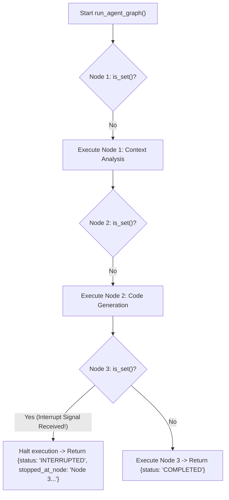

# Lab 2: WebSocket Interactive Interrupts and Mid-Flight Cancellation

In this lab, you will implement an interruptible execution graph `run_agent_graph()` that evaluates an `asyncio.Event` cancellation flag before each node execution, halting immediately when an inbound WebSocket control signal (`INTERRUPT_TURN`) is received.

---

## What you touch
- Script: `lab2_websocket_interrupt.py`
- Main Functions:
  - `run_agent_graph(interrupt_event: asyncio.Event) -> dict`
  - `simulate_client_interrupt_receiver(interrupt_event: asyncio.Event, delay_seconds: float) -> None`
- Execution Pipeline Nodes:
  - `Node 1: Context Analysis`
  - `Node 2: Code Generation`
  - `Node 3: Security Verification`
- Pure Python logic (no network calls required)

---

## Steps


1. Implement `run_agent_graph(interrupt_event)`:
   - Iterate over nodes: `Node 1: Context Analysis`, `Node 2: Code Generation`, and `Node 3: Security Verification`.
   - Before executing each node, check `if interrupt_event.is_set():`.
   - If set, halt immediately and return `{"status": "INTERRUPTED", "stopped_at_node": node_name, "completed_nodes": count}`.
   - If clear, sleep `0.1s` and proceed to the next node.
   - If all nodes finish, return `{"status": "COMPLETED", "completed_nodes": 3}`.
2. Implement `simulate_client_interrupt_receiver(interrupt_event, delay_seconds)`:
   - Sleep for `delay_seconds`, log `INTERRUPT_TURN`, and invoke `interrupt_event.set()`.
3. In `__main__`:
   - Run Scenario 1 (Normal run without interrupt) $\rightarrow$ assert `COMPLETED` (3 nodes).
   - Run Scenario 2 (Interrupt dispatched at 0.15s) $\rightarrow$ assert `INTERRUPTED` before `Node 3: Security Verification` (2 nodes completed).

---

## Data contract

**Full Execution Result**

```json
{
  "status": "COMPLETED",
  "completed_nodes": 3
}
```

**Interrupted Execution Result**

```json
{
  "status": "INTERRUPTED",
  "stopped_at_node": "Node 3: Security Verification",
  "completed_nodes": 2
}
```

---

## Run
From the repository root, run:

```bash
python education/19_the_front_door/lab2_websocket_interrupt.py
```

```powershell
python education/19_the_front_door/lab2_websocket_interrupt.py
```

---

## What you should see
- **Scenario 1**: All 3 nodes run to completion $\rightarrow$ `status: COMPLETED`.
- **Scenario 2**: Inbound interrupt received at 0.15s $\rightarrow$ execution halts before Node 3 $\rightarrow$ `status: INTERRUPTED`.

---

## Stop here
You have successfully implemented mid-flight interrupt handling! In Lab 3, we will build a minimal browser frontend to consume these streams.

Next up: [Lab 3: Frontend Client](./lab3_frontend_client.md).

---

## Notes
*(Record your interruption timings and node traces here)*

