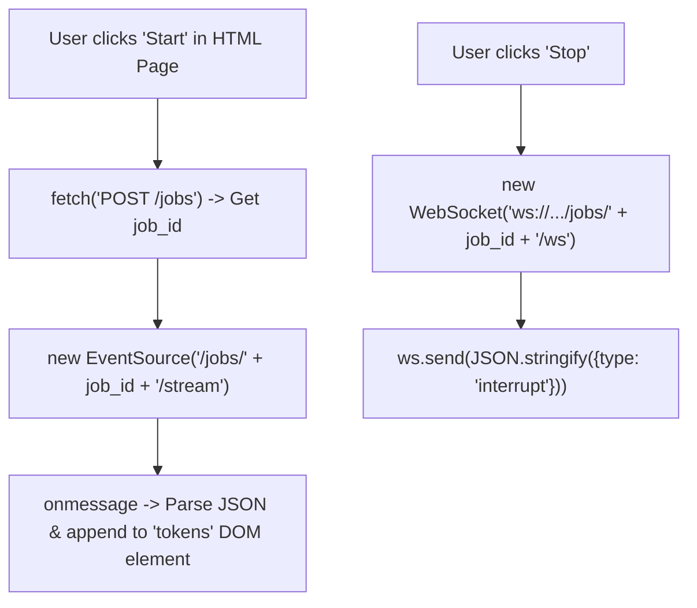

# Lab 3: Building a Lightweight Browser Frontend Client

In this lab, you will create a single-page HTML client `lab3_frontend_client.html` that manages UI state (`tokens`, `job_id`), subscribes to SSE streaming output via `EventSource`, and sends an interactive interrupt frame over a WebSocket upon clicking a Stop button.

---

## What you touch
- HTML File: `lab3_frontend_client.html`
- Validation Script: `lab3_frontend_client.py`
- Client UI State: `tokens` (accumulated response string), `job_id` (active task ID)
- Streaming API Endpoints:
  - Start Task: `POST /jobs` $\rightarrow$ returns `{"job_id": "job-101"}`
  - Stream Output: `GET /jobs/{job_id}/stream` (consumed via browser `EventSource`)
  - Interrupt Channel: `ws://{host}/jobs/{job_id}/ws` $\rightarrow$ sends `{"type": "interrupt"}`
- Validation: Proof script asserts presence of required client constructs without embedding backend execution loops in the browser

---

## Steps


1. Create `lab3_frontend_client.html`:
   - Include a `<div>` or `<pre id="tokens">` to display streaming text.
   - Include a display element for `job_id`.
   - Add a "Start" button: Dispatches `POST /jobs`, receives `job_id`, and initiates `new EventSource("/jobs/" + job_id + "/stream")`.
   - On SSE message: Parse JSON and append `obj.token` or `obj.data.delta` to `#tokens`.
   - Add a "Stop" button: Connects to `ws://{location.host}/jobs/{job_id}/ws` and dispatches `{"type": "interrupt"}`.
2. Implement `lab3_frontend_client.py` to inspect the HTML file and verify:
   - Contains: `EventSource`, `tokens`, `job_id`, `"interrupt"`.
   - Excludes (does NOT embed): `generate_agent_sse_stream`, `run_agent_graph`, `tool_calls`.
3. Run the validation script and verify all checks pass.

---

## Data contract

**Start Request & Response**

```json
// POST /jobs Body
{ "prompt": "Read config and summarize environment" }

// POST /jobs Response
{ "job_id": "job-1" }
```

**Incoming SSE Stream Frame**

```json
{
  "event_id": 2,
  "event_type": "token_delta",
  "data": { "delta": "Analyzing " }
}
```

**Outbound WebSocket Interrupt Frame**

```json
{
  "type": "interrupt"
}
```

---

## Run
From the repository root, run:

```bash
python education/19_the_front_door/lab3_frontend_client.py
```

```powershell
python education/19_the_front_door/lab3_frontend_client.py
```

---

## What you should see
- `HAS EventSource`
- `HAS tokens`
- `HAS job_id`
- `HAS interrupt`
- `NO generate_agent_sse_stream`
- `NO run_agent_graph`
- `NO tool_calls`

---

## Stop here
You have successfully built and verified a decoupled streaming frontend client! In Lab 4, we will separate internal machine telemetry (MX) from human-facing conversational text (UX).

Next up: [Lab 4: MX vs UX](./lab4_mx_vs_ux.md).

---

## Notes
*(Record your frontend client validation output here)*

- Keys written and read match this brief. Do not edit other `.py` files in the repo.
