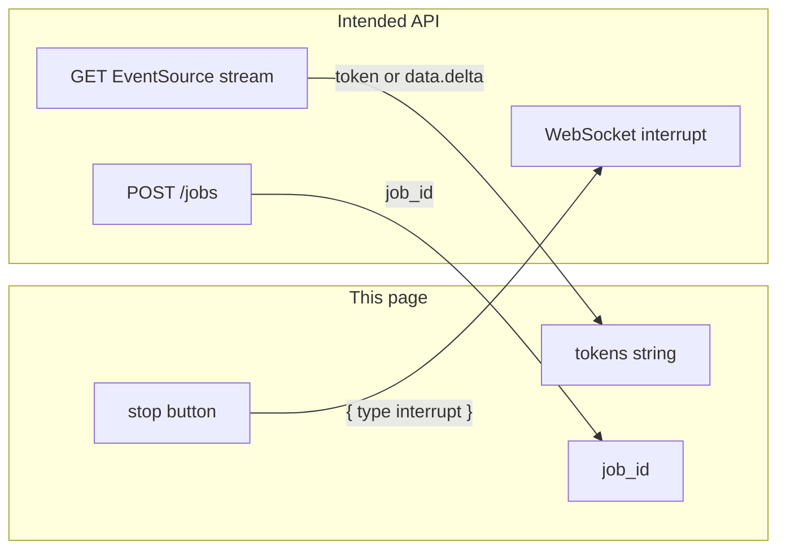

# Lab 3: Frontend page as a client

A single HTML file opens EventSource, appends the token field to `tokens`, stores `job_id`, and sends `{ "type": "interrupt" }` on a WebSocket. The page does not run ReAct.

## What you touch
- Page: `lab3_frontend_client.html` (write it next to this brief; there is no reference `.html` yet)
- Script: `lab3_frontend_client.py` (write it next to this brief; there is no reference `.py` yet)
- UI state: `tokens` (string), `job_id` (string)
- Start: POST `/jobs` with `{ "prompt": "string" }`. Store `job_id` from the JSON body. If the body has no `job_id`, store it from the first SSE frame.
- Stream: `new EventSource("/jobs/" + job_id + "/stream")`. On each message, parse JSON. Append `token` if present, else `data.delta`, to `tokens`.
- Stop: `new WebSocket("ws://" + location.host + "/jobs/" + job_id + "/ws")`. Send `{ "type": "interrupt" }`.
- Proof script reads the HTML and prints HAS / NO lines. It does not start FastAPI.
- No Next.js. No CSS kit. No second copy of `generate_agent_sse_stream`. No ReAct. No tool pick.
- No HTTP from the proof script. This script does not read `OLLAMA_HOST` or `OLLAMA_MODEL`.

## Steps


1. Write `lab3_frontend_client.html` as one file. A `pre` or `div` shows `tokens`. A text node or input shows `job_id`. A Start button and a Stop button. No stylesheet link. No React. No Next.js.
2. On Start, `fetch("/jobs", { method: "POST", headers: { "Content-Type": "application/json" }, body: JSON.stringify({ prompt: "Read config and summarize environment" }) })`. Parse the JSON. If `job_id` is present, store it. Then open `EventSource("/jobs/" + job_id + "/stream")`.
3. On each `message`, `JSON.parse` the `data` field. If the object has `job_id` and your stored `job_id` is empty, store it. Append `obj.token` if it is a string. Else if `obj.data` has `delta`, append that. Draw `tokens`.
4. On Stop, open a WebSocket to `ws://` plus `location.host` plus `/jobs/` plus `job_id` plus `/ws`. On `open`, send `JSON.stringify({ type: "interrupt" })`. Do not send that object on EventSource.
5. `DOMContentLoaded` (or the Start click) only opens the POST and the socket. It must not call a model, pick a tool, or copy `generate_agent_sse_stream`.
6. Write `lab3_frontend_client.py`. Read `lab3_frontend_client.html` from `os.path.join(os.path.dirname(__file__), "lab3_frontend_client.html")`. Print one HAS or NO line for each of: `EventSource`, `tokens`, `job_id`, the string `"interrupt"`, `generate_agent_sse_stream`, `run_agent_graph`, `tool_calls`. HAS for the first four. NO for the last three.
7. Confirm the proof lines. Do not start uvicorn. Do not copy lab 1's generator into the page.

## Data contract
Only the keys this page writes and reads.

**Start POST body**

```json
{ "prompt": "Read config and summarize environment" }
```

**Start POST response** (store `job_id`)

```json
{ "job_id": "job-1" }
```

**Intended SSE payload** (append `token`)

```json
{ "token": "string" }
```

**Lab 1 SSE payload** (append `data.delta` when `token` is missing)

```json
{ "event_id": 1, "event_type": "token_delta", "timestamp": 0.0, "data": { "delta": "string" } }
```

**Stop send on the WebSocket**

```json
{ "type": "interrupt" }
```

The page does not yield SSE frames. The page does not run a node graph.

## Run
From the repo root:

```bash
python education/19_the_front_door/lab3_frontend_client.py
```

```powershell
$env:OLLAMA_HOST="http://192.168.1.29:11434"
$env:OLLAMA_MODEL="qwen3.6:35b-a3b-65k"
python education/19_the_front_door/lab3_frontend_client.py
```

This script ignores `OLLAMA_HOST` and `OLLAMA_MODEL`. They are listed so the lab Run block matches the other chapters. There is no HTTP call.

## What you should see
The proof script prints `HAS EventSource`, `HAS tokens`, `HAS job_id`, `HAS interrupt`, `NO generate_agent_sse_stream`, `NO run_agent_graph`, `NO tool_calls`. If a HAS is NO, that string is missing from the HTML. If a NO is HAS, the page copied the loop or the generator. Opening the HTML without a server on port `8000` will not stream tokens. That is expected. Labs 1 and 2 do not serve these routes.

## Stop here
This is a client. Do not add Next.js. Do not add a CSS kit. Do not copy `generate_agent_sse_stream` or `run_agent_graph` into the page. Do not put ReAct or tool dispatch in `DOMContentLoaded`. Lab 1 is the outbound frames. Lab 2 is the inbound stop. Lab 4 tags ux vs mx.

## Notes
- Write `lab3_frontend_client.html` and `lab3_frontend_client.py` next to this brief. There is no reference file in the repo yet.
- Intended listener is port `8000`. Labs 1 and 2 do not start it. The proof script only reads the HTML.
- Keys written and read match this brief. Do not edit other `.py` files in the repo.
