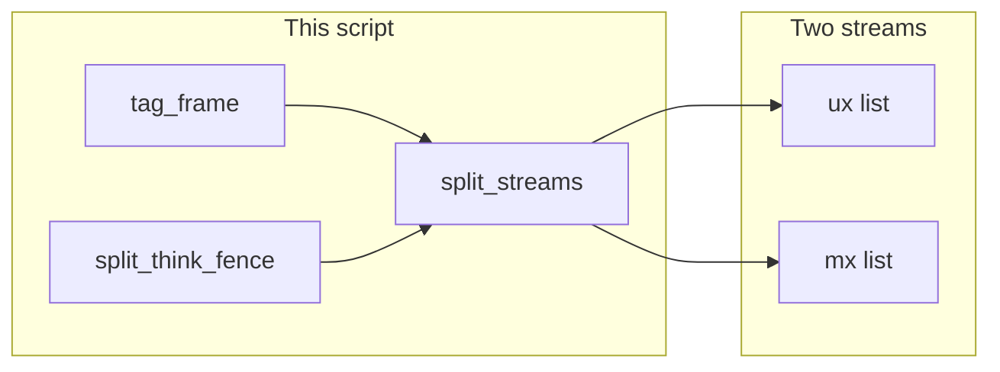

# Lab 4: Tag MX vs UX frames

A fixture list of frames is tagged `ux` or `mx`. Two streams print. A `<think>` fence is a simple split, not the chapter 12 demuxer.

## What you touch
- Script: `lab4_mx_vs_ux.py` (write it next to this brief; there is no reference `.py` yet)
- Function: `tag_frame(frame)` returns `{ "channel": "ux" }` or `{ "channel": "mx" }`
- Function: `split_think_fence(text)` returns `{ "ux": "string", "mx": "string" }`
- Function: `split_streams(frames)` returns `{ "ux": [strings], "mx": [strings] }`
- Fixture frames in `__main__` (exact list in Steps)
- Fence fixture: `<think>plan the answer</think>The env is prod.`
- No HTTP. This script does not read `OLLAMA_HOST` or `OLLAMA_MODEL`.
- Do not import or copy `CoTStreamDemuxer`. Do not copy `generate_agent_sse_stream`.

## Steps


1. Write `tag_frame(frame)`. If `frame` is a dict, read `type` or `event_type`. `token` and `token_delta` return `{ "channel": "ux" }`. `tool`, `tool_call_start`, `tool_call_result`, `session_started`, and `turn_complete` return `{ "channel": "mx" }`. Any other name returns `{ "channel": "mx" }`.
2. Write `split_think_fence(text)`. If `<think>` and `</think>` are present, the slice between them is `mx`. The text before `<think>` plus the text after `</think>` is `ux`. If the tags are missing, return `{ "ux": text, "mx": "" }`. Do not keep a state machine. Do not stream chunks.
3. Write `split_streams(frames)`. For each dict, call `tag_frame`. If `ux`, append `frame["text"]` or `frame["data"]["delta"]` (whichever exists) to the ux list. If `mx`, append `json.dumps(frame)` to the mx list. Do not put mx text into the ux list.
4. In `__main__`, build this list:
   - `{ "type": "token", "text": "Hello " }`
   - `{ "event_type": "token_delta", "data": { "delta": "world" } }`
   - `{ "type": "tool", "tool_name": "read_file", "args": { "path": "config.json" } }`
   - `{ "event_type": "tool_call_start", "data": { "tool_name": "read_file", "args": { "path": "config.json" } } }`
   - `{ "event_type": "session_started", "data": { "status": "ACTIVE" } }`
5. Call `split_streams` on that list. Call `split_think_fence` on `<think>plan the answer</think>The env is prod.`. Extend the ux list with the fence `ux`. Extend the mx list with the fence `mx` if it is not empty.
6. Print each ux item as `UX: ` plus the string. Print each mx item as `MX: ` plus the string. Print `ux_joined` (the ux items concatenated) and confirm it does not contain `config.json`, `plan the answer`, or `<think>`.
7. Do not POST. Do not open EventSource. Do not copy `CoTStreamDemuxer`.

## Data contract
Only the keys this script writes and reads.

**UX tag**

```json
{ "channel": "ux" }
```

**MX tag**

```json
{ "channel": "mx" }
```

**Intended UX frame**

```json
{ "type": "token", "text": "Hello " }
```

**Lab 1 UX frame**

```json
{ "event_type": "token_delta", "data": { "delta": "world" } }
```

**Intended MX frame**

```json
{ "type": "tool", "tool_name": "read_file", "args": { "path": "config.json" } }
```

**Fence result**

```json
{ "ux": "The env is prod.", "mx": "plan the answer" }
```

**split_streams return**

```json
{ "ux": ["Hello ", "world"], "mx": ["string", "string"] }
```

The script does not return `{ "thinking", "response" }`. That is chapter 12.

## Run
From the repo root:

```bash
python education/19_the_front_door/lab4_mx_vs_ux.py
```

```powershell
$env:OLLAMA_HOST="http://192.168.1.29:11434"
$env:OLLAMA_MODEL="qwen3.6:35b-a3b-65k"
python education/19_the_front_door/lab4_mx_vs_ux.py
```

This script ignores `OLLAMA_HOST` and `OLLAMA_MODEL`. They are listed so the lab Run block matches the other chapters. There is no HTTP call.

## What you should see
`UX: Hello ` then `UX: world` then `UX: The env is prod.`. Then `MX:` lines for the tool frame, the `tool_call_start` frame, the `session_started` frame, and `plan the answer`. `ux_joined` is `Hello worldThe env is prod.` and does not contain `config.json` or `<think>`. If UX prints `config.json`, `tag_frame` put a tool frame on the person channel. If you see `[THINKING LOG]` or a POST, you opened chapter 12.

## Stop here
This is a tag, not a demuxer. Do not copy `CoTStreamDemuxer`. Do not add IDLE / THINKING / RESPONSE states. Do not POST to Ollama. Do not build a React debug panel. Chapter 12 lab 1 splits a live token stream. Lab 1 of this chapter yields the mixed frames. Lab 3 draws only UX on the page.

## Notes
- Write `lab4_mx_vs_ux.py` next to this brief. There is no reference `.py` in the repo yet.
- A missing or unknown `event_type` is `mx` so a new frame does not land in the person string.
- Keys written and read match this brief. Do not edit other `.py` files in the repo.
