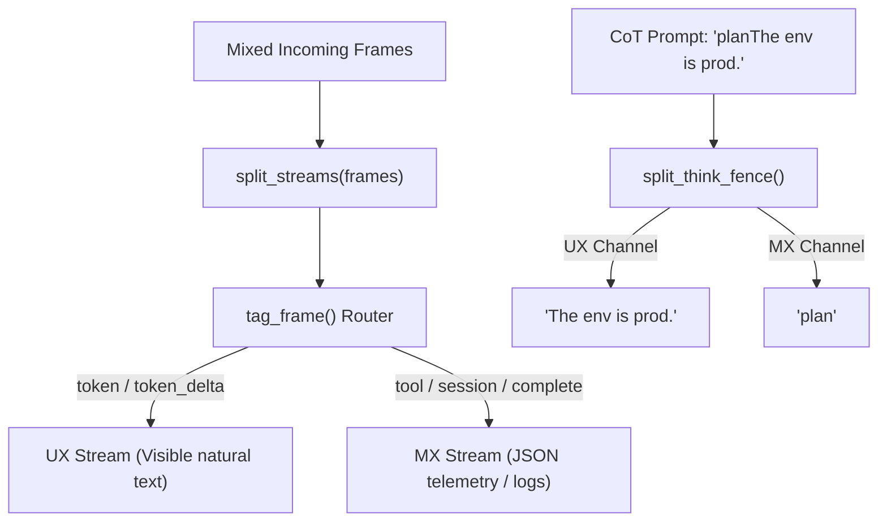

# Lab 4: Separating Machine Experience (MX) from User Experience (UX)

In this lab, you will write stream filtering utilities (`tag_frame`, `split_think_fence`, `split_streams`) to separate human-facing conversational text (UX) from internal reasoning chains (`<think>`) and raw tool telemetry (MX).

---

## What you touch
- Script to create: `lab4_mx_vs_ux.py`
- Main Functions:
  - `tag_frame(frame: dict) -> dict` $\rightarrow$ returns `{"channel": "ux"}` or `{"channel": "mx"}`
  - `split_think_fence(text: str) -> dict` $\rightarrow$ returns `{"ux": str, "mx": str}`
  - `split_streams(frames: list[dict]) -> dict` $\rightarrow$ returns `{"ux": list[str], "mx": list[str]}`
- Channel Rules:
  - UX Frames: `token`, `token_delta` (visible text deltas)
  - MX Frames: `tool`, `tool_call_start`, `tool_call_result`, `session_started`, `turn_complete`
- Pure Python logic (no network calls required)

---

## Steps


1. Implement `tag_frame(frame)`:
   - Check `type` or `event_type`.
   - Return `{"channel": "ux"}` for `token` or `token_delta`.
   - Return `{"channel": "mx"}` for all other frames (`tool`, `tool_call_start`, `tool_call_result`, `session_started`, `turn_complete`).
2. Implement `split_think_fence(text)`:
   - If `<think>` and `</think>` tags exist, extract the enclosed text into `mx` and remaining text into `ux`.
   - If tags are absent, return `{"ux": text, "mx": ""}`.
3. Implement `split_streams(frames)`:
   - Iterate over frames, calling `tag_frame()`.
   - Extract string text deltas into `ux` list and serialized JSON into `mx` list.
4. In `__main__`:
   - Run `split_streams` over mixed test fixtures.
   - Run `split_think_fence` on `<think>plan the answer</think>The env is prod.`.
   - Verify that concatenated UX text contains no leaked tool arguments or `<think>` tags.

---

## Data contract

**Channel Classification**

```json
{ "channel": "ux" }
// or
{ "channel": "mx" }
```

**Demultiplexed Stream Result**

```json
{
  "ux": ["Hello ", "world", "The env is prod."],
  "mx": [
    "{\"type\": \"tool\", \"tool_name\": \"read_file\", \"args\": {\"path\": \"config.json\"}}",
    "{\"event_type\": \"session_started\", \"data\": {\"status\": \"ACTIVE\"}}",
    "plan the answer"
  ]
}
```

---

## Run
From the repository root, run:

```bash
python education/19_the_front_door/lab4_mx_vs_ux.py
```

```powershell
python education/19_the_front_door/lab4_mx_vs_ux.py
```

---

## What you should see
- Clear separation of UX messages: `UX: Hello `, `UX: world`, `UX: The env is prod.`
- MX telemetry captured separately in logs.
- `Joined UX text: Hello world The env is prod.` (completely free of JSON or `<think>` tags).

---

## Stop here
You have successfully separated MX telemetry from UX chat streams! In Lab 5, we will build a terminal CLI harness with interactive Human-in-the-Loop gates.

Next up: [Lab 5: CLI Harness](./lab5_cli_harness.md).

---

## Notes
- A missing or unknown `event_type` is `mx` so a new frame does not land in the person string.
- Keys written and read match this brief. Do not edit other `.py` files in the repo.
