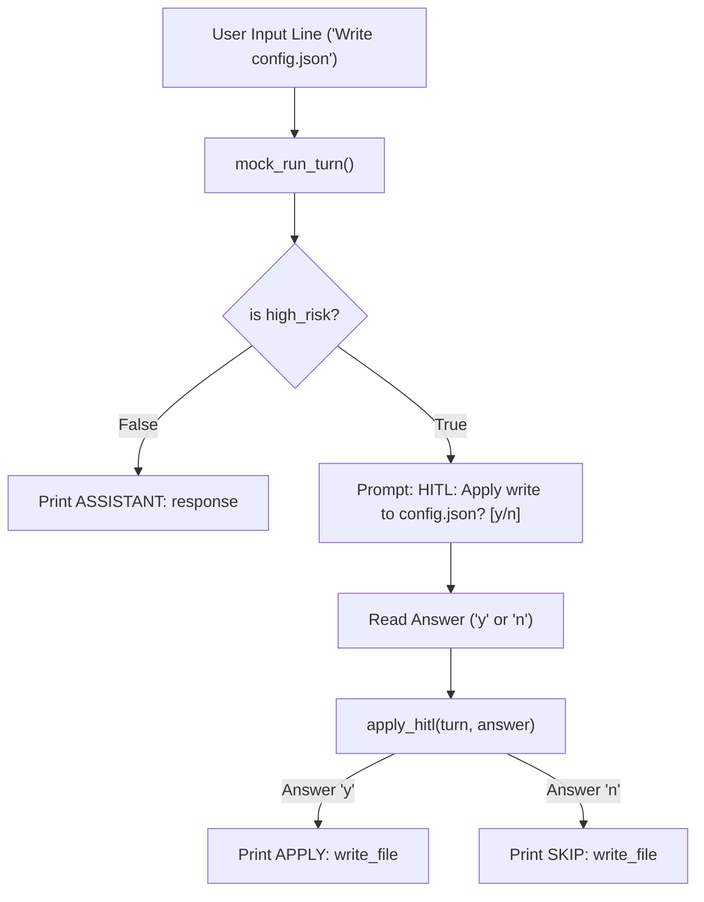

# Lab 5: Building a Command Line Interface (CLI) Harness

In this lab, you will implement a terminal CLI harness `run_cli()` that wraps an agent kernel, processes multi-turn conversations via simulated or interactive standard I/O, and enforces interactive `[y/n]` Human-in-the-Loop gates before high-risk tool actions.

---

## What you touch
- Script to create: `lab5_cli_harness.py`
- Main Functions:
  - `mock_run_turn(session_id: str, user_prompt: str) -> dict`
  - `apply_hitl(turn: dict, answer: str) -> dict`
  - `run_cli(lines: list[str], run_turn)`
- Test Inputs:
  - Run 1: `["What is 2+2?", "Write config.json", "n"]` $\rightarrow$ verify skipped write
  - Run 2: `["Write config.json", "y"]` $\rightarrow$ verify applied write
- Pure Python logic (no network calls required)

---

## Steps


1. Implement `mock_run_turn(session_id, user_prompt)`:
   - If prompt contains `"write"` or `"Write"`, return `{"session_id": session_id, "turn_count": 1, "thinking": "will write config", "response": "Apply write to config.json?", "high_risk": True, "tool": "write_file"}`.
   - Otherwise, return `{"session_id": session_id, "turn_count": 1, "thinking": "add the numbers", "response": "4", "high_risk": False}`.
2. Implement `apply_hitl(turn, answer)`:
   - If not high risk, return `{"applied": False, "reason": "not_high_risk"}`.
   - If `answer.strip().lower() == "y"`, return `{"applied": True, "tool": turn["tool"]}`.
   - Otherwise, return `{"applied": False, "tool": turn["tool"]}`.
3. Implement `run_cli(lines, run_turn)`:
   - Iterate through lines, printing `USER: <line>`, invoking `run_turn()`, and printing `ASSISTANT: <response>`.
   - On high-risk turns, consume the next input line as the HITL response and invoke `apply_hitl()`.
4. In `__main__`:
   - Execute Run 1 (declining write) $\rightarrow$ verify `SKIP: write_file`.
   - Execute Run 2 (accepting write) $\rightarrow$ verify `APPLY: write_file`.

---

## Data contract

**Kernel Turn Response Payload**

```json
{
  "session_id": "cli-1",
  "turn_count": 1,
  "thinking": "will write config",
  "response": "Apply write to config.json?",
  "high_risk": true,
  "tool": "write_file"
}
```

**HITL Authorization Evaluation**

```json
{
  "applied": true,
  "tool": "write_file"
}
```

---

## Run
From the repository root, run:

```bash
python education/19_the_front_door/lab5_cli_harness.py
```

```powershell
python education/19_the_front_door/lab5_cli_harness.py
```

---

## What you should see
- **Run 1**:
  - `USER: What is 2+2?` $\rightarrow$ `ASSISTANT: 4`
  - `USER: Write config.json` $\rightarrow$ `HITL: Apply write to config.json? [y/n]` $\rightarrow$ `USER: n` $\rightarrow$ `SKIP: write_file`
- **Run 2**:
  - `USER: Write config.json` $\rightarrow$ `HITL: Apply write to config.json? [y/n]` $\rightarrow$ `USER: y` $\rightarrow$ `APPLY: write_file`

---

## Stop here
You have successfully implemented a client-agnostic CLI harness! In Chapter 20, we will synthesize all course concepts into an end-to-end autonomous coding agent harness.

Next up: [Chapter 20: Synthesis](../20_synthesis/00_synthesis.md).

---

## Notes
*(Record your CLI test executions and HITL outputs here)*

