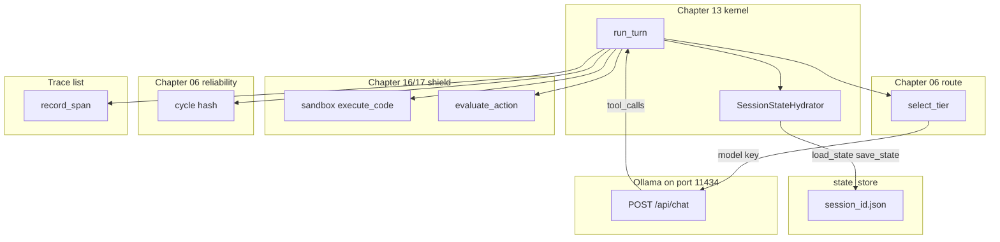

# 20: Comprehensive Agent Harness Synthesis

By the end of this chapter, you will understand how all core primitives developed across Chapters 00 through 19 unite into a unified, production-grade agent execution harness.

Throughout this course, you built individual modular components: state hydration, model tier routing, subprocess sandboxing, loop oscillation detection, Human-in-the-Loop safety approval gates, and OpenTelemetry distributed tracing. Now, we compose these building blocks into a unified runtime engine.

## Data
A complete **Agent Harness** integrates all runtime subsystems:
- **State Hydration**: Restores and persists conversation histories (`state_store/{session_id}.json`) via `SessionStateHydrator` (Chapter 13).
- **Adaptive Gateway Routing**: Classifies task intent and dynamically chooses model tiers (`FAST_TIER` vs `DEEP_TIER`) via `select_tier` (Chapter 06).
- **Subprocess Code Sandbox**: Safely isolates code execution inside timeout-bounded subprocesses via `execute_sandboxed_python` (Chapter 16).
- **Loop Oscillation Detection**: Halts repetitive agent thrashing via `CycleOscillationDetector` step hashing (Chapter 06).
- **Human-in-the-Loop (HITL) Safety Gates**: Intercepts destructive or high-risk actions (`PAUSED_FOR_HITL_APPROVAL`) before execution (Chapter 17).
- **Telemetry & Tracing**: Records structured lifecycle spans (`llm.inference`, `tool.dispatch`) via `OTelEvalTracer` (Chapter 12).

## Information
Scattered standalone scripts are helpful learning exercises, but production applications require a unified runtime:
- **Shared Session Context**: All subsystems—routing, memory, sandboxing, and security—operate seamlessly across a single `session_id`.
- **Defense in Depth**: Sandboxes protect the OS, cycle detectors protect token budgets, and HITL gates protect critical data.
- **Architectural Composition**: We do not invent new abstractions; we compose our proven primitives into a cohesive host engine.

## Knowledge
Here is the step-by-step procedure:
1. Hydrate session history from disk storage (`load_state(session_id)`).
2. Route the incoming prompt to appropriate model tiers (`select_tier`).
3. Call the inference endpoint (`/api/chat` or `/api/generate`) with structured schemas.
4. Execute requested tool actions inside isolated sandboxes while evaluating HITL safety gates.
5. Hash execution steps to detect and prevent infinite loops.
6. Record execution telemetry spans and persist updated session states (`save_state`).

## Wisdom
Composition is the true secret of reliable agent architecture. Rather than relying on monolithic frameworks, modular primitives composed together create clean, resilient systems.

## The When and Why
- **When**: Assembling end-to-end enterprise autonomous systems, coding assistants, or multi-turn agent platforms.
- **Why**: Production reliability demands that security, memory, routing, and observability work together in harmony.

## How it works



Walkthrough of one composed turn:

1. `run_turn` loads `state_store/{session_id}.json` (or starts `{ session_id, messages: [], turn_count: 0 }`).
2. `select_tier` (or `triage_prompt_intent`) picks `FAST_TIER` or `DEEP_TIER` and sets `model`.
3. The script POSTs `model`, `messages`, `tools`, `stream: false` to `{OLLAMA_HOST}/api/chat`.
4. If `message.tool_calls` asks to run code, `execute_code` starts a child process. If the command is mutative, `evaluate_action` returns `PAUSED_FOR_HITL_APPROVAL`.
5. `check_call_signature` or `compute_step_hash` records the tool name and args. A repeat aborts.
6. `record_span` appends `{ session_id, span_name, duration_ms, attributes }`. `save_state` writes the file.

Nothing in that walkthrough is a new class of object. The new fact is that those calls share one process and one `session_id`.

## Data contract

**Intended session JSON** (`state_store/{session_id}.json`)

```json
{
  "session_id": "string",
  "messages": [],
  "turn_count": 0
}
```

**Intended model request** `POST /api/chat`

```json
{
  "model": "qwen3.6:35b-a3b-65k",
  "messages": [],
  "tools": [],
  "stream": false,
  "options": { "temperature": 0.0 }
}
```

The assistant message may include `tool_calls`. That is the same key as chapter 03.

**Intended `run_turn` return**

```json
{
  "session_id": "string",
  "turn_count": 0,
  "thinking": "string",
  "response": "string"
}
```

**What `lab1_resilient_executor.py` actually returns** (no HTTP)

```json
{
  "status": "SUCCESS",
  "attempts": 2,
  "stdout": "5",
  "final_code": "string"
}
```

**What `lab2_enterprise_harness_app.py` actually returns**

```json
{
  "status": "PAUSED_FOR_HITL_APPROVAL",
  "session_id": "ent_session_701",
  "selected_tier": "DEEP_TIER",
  "llm_response": "string",
  "safety_eval": {},
  "total_duration_ms": 0.0,
  "telemetry_spans": []
}
```

See Notes.

## Lab
Done when one process has reused hydrate, route, sandbox, cycle, HITL, and trace. Do not add a new primitive. This synthesis completes the 20-Stage Progressive Hierarchy. Blueprints stay optional.

- Module: [this file](./00_harness_overview.md)
- Lab 1: already in chapter 13, [lab1_core_harness_kernel.py](../13_one_agent/lab1_core_harness_kernel.py) / [lab1_core_harness_kernel.md](../13_one_agent/lab1_core_harness_kernel.md) - hydrate. Done when turn 2 remembers the name.
- Lab 2: [lab1_resilient_executor.py](./lab1_resilient_executor.py) / [lab1_resilient_executor.md](./lab1_resilient_executor.md) - sandbox plus cycle plus a mock fix. Done when a ZeroDivisionError run returns `SUCCESS` after a second attempt.
- Lab 3: [lab2_enterprise_harness_app.py](./lab2_enterprise_harness_app.py) / [lab2_enterprise_harness_app.md](./lab2_enterprise_harness_app.md) - route plus HITL plus spans. Done when `ent_session_701` prints `DEEP_TIER` and `PAUSED_FOR_HITL_APPROVAL`.
- Next: [01_project_blueprints.md](./01_project_blueprints.md) and [../optional_training/00_pretrain_tiny.md](../optional_training/00_pretrain_tiny.md).
- Other projects in this folder (workbench, SQL, SRE, spec TDD, serving) are optional: [01_project_blueprints.md](./01_project_blueprints.md) and [02_spec_tdd.md](./02_spec_tdd.md).

## Related
- **Chapter 13:** the kernel this wraps (`run_turn`, `SessionStateHydrator`).
- **Chapter 16:** sandbox and RBAC.
- **Chapter 17:** HITL approval gates and parked states.
- **Chapter 06:** resilient gateway routing, cycle hash, logit steering.
- **Chapter 12:** agent evals and telemetry spans.
- **Chapter 18:** background jobs and worker pools.
- **Chapter 19:** SSE and frontend streaming.
- **01_project_blueprints.md:** extra vertical slices. Optional.

## Notes
- Moved from the old `modules/11` tree. Lab 1 stayed in chapter 13 on purpose.
- A demo UI is optional and is not added in this PR.
- Do not commit `state_store` dumps.
- Contract drift vs `lab1_resilient_executor.py`: no `OLLAMA_HOST` / `OLLAMA_MODEL`, no POST, no session file, no `tool_calls`. Cycle key is `execute_code` plus `code_len`. Error halt is an MD5 of `stderr`. The fixer is `mock_llm_fixer`, not a model. Return keys are `status`, `attempts`, `stdout`, `final_code` (or `reason` on abort).
- Contract drift vs `lab2_enterprise_harness_app.py`: host and models are literals (`http://192.168.1.29:11434/api/generate`, `qwen3.6:35b-a3b-65k`, `qwen2.5:7b`). Route is `/api/generate`, not `/api/chat`. No `messages`, no `tools`, no session file write. `process_request` takes `proposed_action` from the caller, not from `tool_calls`. Spans live only in the return dict.
- The intended contract on this page is the chapter 13 session JSON plus `tool_calls` on `/api/chat`, with the old pieces called from one host. Write that in your copy. Leave the reference files as-is.
