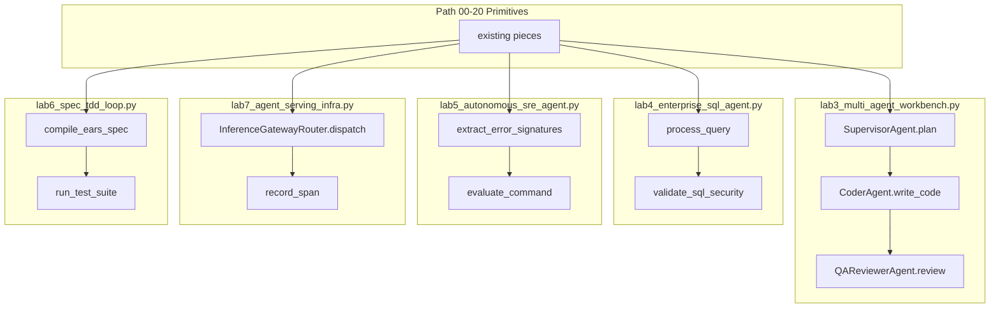

# 20: Specialized Project Blueprints

By the end of this chapter, you will understand how to apply the core 20-Stage hierarchy to build specialized vertical domain solutions: Multi-Agent Workbenches, Enterprise Text-to-SQL Agents, Autonomous SRE Remediation Agents, Spec-Driven TDD Loops, and Scalable Inference Serving Infrastructure.

Once you master foundational agent primitives, applying them to specific real-world domains is simply a matter of selecting the appropriate toolchains and safety guardrails.

## Data
Our specialized domain blueprints demonstrate end-to-end applications:
1. **Multi-Agent Workbench (`lab3_multi_agent_workbench.py`)**: Multi-role collaboration (Supervisor, Coder, QA Reviewer) working inside isolated scratch directories to implement and verify software packages.
2. **Enterprise SQL Agent (`lab4_enterprise_sql_agent.py`)**: Natural-language-to-SQL translator featuring strict AST security validation (preventing `DROP`, `DELETE`, `TRUNCATE`) and reflection-driven query repair against SQLite databases.
3. **Autonomous SRE Agent (`lab5_autonomous_sre_agent.py`)**: Production log triage engine that parses stack traces, identifies root causes, and gates high-risk remediation commands (`reboot`, `rm`) behind HITL approvals.
4. **Spec-Driven TDD Loop (`lab6_spec_tdd_loop.py`)**: Acceptance-criteria compiler converting goals into EARS specifications, executing failing test suites, and iteratively generating passing code.
5. **Production Serving Infrastructure (`lab7_agent_serving_infra.py`)**: Low-latency multi-tenant runtime routing requests across dynamic inference gateways and collecting OpenTelemetry span traces.

## Information
Domain-specific agent applications do not require inventing novel agent loops:
- **Consistent Topologies**: Every specialized agent is a composition of our established primitives (ReAct loops, sandboxing, HITL gates, structured schemas).
- **Domain Specialization**: Domain differences emerge in tools, safety boundaries, and prompt specifications, not in the core loop architecture.

## Knowledge
Here is the step-by-step procedure:
1. Identify the core domain requirements and necessary tool capabilities.
2. Define safety and authorization boundaries (e.g. read-only vs destructive operations).
3. Select appropriate role topologies (single agent vs supervisor-worker teams).
4. Implement self-correction and validation mechanisms (test execution, SQL syntax validation, log parsing).
5. Instrument end-to-end telemetry and observability spans across all tool executions.

## Wisdom
Build specialized agents by configuring tools, prompts, and safety constraints on top of proven generic foundations—not by rewriting the core engine from scratch.

## The When and Why
- **When**: Designing real-world domain solutions such as database assistants, developer workbenches, automated incident response bots, or enterprise serving runtimes.
- **Why**: Standardized architectures accelerate development, reduce operational complexity, and ensure consistent safety guarantees across all company agents.

## How it works



Walkthrough of picking one blueprint:

1. Finish the 00-20 synthesis. These are extra vertical slices.
2. Pick one script. Example: workbench. `SupervisorAgent.plan` returns two task strings. `CoderAgent.write_code` POSTs `/api/generate` and writes `calculator.py` then `test_calculator.py` in a `workbench_` temp dir. `QAReviewerAgent.review` runs `test_calculator.py` with `subprocess.Popen`.
3. The other four scripts are the same idea with different old pieces. SQL uses `validate_sql_security` and `sqlite3`. SRE uses `extract_error_signatures` and `evaluate_command`. Serving uses `dispatch` and `record_span`. Spec TDD uses `compile_ears_spec` then a red test then a green fix.
4. Self-evolution has no lab. Generative UI is already in chapter 17.

Nothing in that walkthrough is a new class of object.

## Data contract

Use each lab's own contract. Intended shared shape is still the chapter 13 session JSON plus `tool_calls` on `POST /api/chat`. Intended host is env / localhost. Intended model is `OLLAMA_MODEL`.

**What the reference scripts actually send** (when they POST)

```json
{
  "model": "qwen3.6:35b-a3b-65k",
  "prompt": "string",
  "stream": false,
  "options": { "temperature": 0.0 }
}
```

They read `response`. Host and model are literals. Route is `/api/generate`. See Notes and each lab brief.

## Lab
Done when you have run one blueprint and can name the old pieces it called. Do not add a new primitive. These labs stay. They are optional.

- Module: [this file](./01_project_blueprints.md)
- [lab3_multi_agent_workbench.py](./lab3_multi_agent_workbench.py) / [lab3_multi_agent_workbench.md](./lab3_multi_agent_workbench.md) - supervisor, coder, QA. Done when `test_calculator.py` prints a pass or a traceback.
- [lab4_enterprise_sql_agent.py](./lab4_enterprise_sql_agent.py) / [lab4_enterprise_sql_agent.md](./lab4_enterprise_sql_agent.md) - text to SQL plus a keyword block. Done when scenario 1 returns rows and scenario 2 returns `SECURITY_REJECTED`.
- [lab5_autonomous_sre_agent.py](./lab5_autonomous_sre_agent.py) / [lab5_autonomous_sre_agent.md](./lab5_autonomous_sre_agent.md) - log filter plus HITL. Done when you see `READ_ONLY`, `REQUIRES_HITL_APPROVAL`, and `FORBIDDEN`.
- [lab7_agent_serving_infra.py](./lab7_agent_serving_infra.py) / [lab7_agent_serving_infra.md](./lab7_agent_serving_infra.md) - POST plus spans. Done when `tenant_session_9921` prints `llm.inference` and `sandbox.execution`.
- [lab6_spec_tdd_loop.py](./lab6_spec_tdd_loop.py) / [lab6_spec_tdd_loop.md](./lab6_spec_tdd_loop.md) - EARS spec, red test, green fix. Also [02_spec_tdd.md](./02_spec_tdd.md).
- Self-evolution: [03_self_evolution.md](./03_self_evolution.md). Module only. No lab.
- Next: [../optional_training/00_pretrain_tiny.md](../optional_training/00_pretrain_tiny.md).

## Related
- **PATH.md:** the required line is 00-20 progressive hierarchy. These names stay optional.
- **Chapter 14:** workbench roles & supervisor-worker topologies.
- **Chapter 16:** sandbox and security filters.
- **Chapter 17:** HITL approval gates.
- **00_harness_overview.md:** the host those pieces sit in.

## Notes
- Moved from old `modules/09` and `labs/09`. Spec TDD also from old `modules/04/02`. Self-evolution is module-only; no fake lab.
- Generative UI is already in chapter 17 (`lab1_hitl_approval.py`). Do not add a second copy here.
- Harness pairs stay lab2 / lab3. Blueprints are lab4 workbench, lab5 SQL, lab6 SRE, lab7 spec TDD, lab8 serving.
- Contract drift is per script: most hardcode a host and `qwen3.6:35b-a3b-65k`, send `prompt` not `messages`, and skip session JSON. Workbench and spec TDD use a temp dir, not `state_store`. Serving simulates sandbox with `time.sleep(0.05)` and does not start a child. Spec TDD calls the model only for the EARS spec; the red and green files are literals. The intended contract is each lab's own brief, composed from old pieces. Write that in your copy. Leave the reference files as-is.
