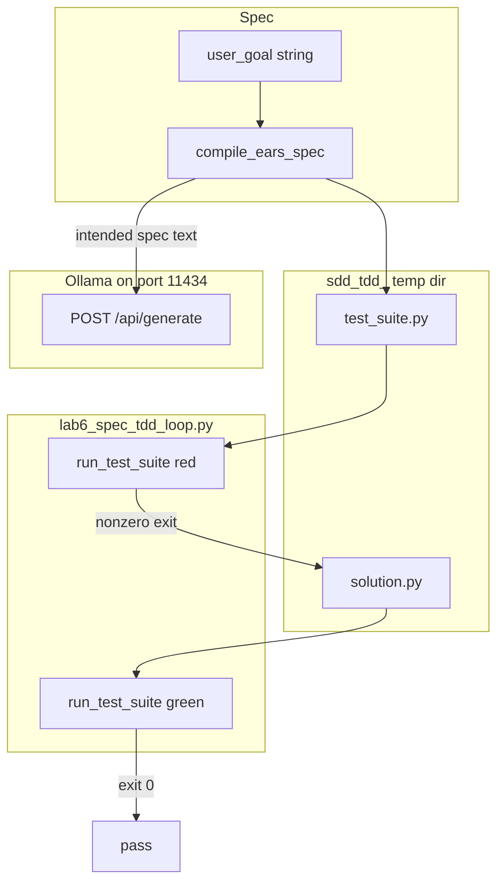

# 20: Specification-Driven Test-Driven Development (Spec TDD)

By the end of this chapter, you will understand how to drive automated agent development workflows using rigorous specifications (such as Easy Approach to Requirements Syntax / EARS) and strict Red-Green-Refactor test cycles.

Allowing an LLM to generate code without independent automated test verification frequently results in undetected regressions and subtle logical bugs.

## Data
A **Spec-Driven TDD Loop** couples natural-language requirements with automated test harnesses:
- **Formal Specification**: Structured requirements represented in EARS format (`WHEN [trigger], the system SHALL [action]`).
- **Red Test Phase**: Generating and executing a test suite before implementing code $\rightarrow$ verifying test failure (non-zero exit code).
- **Green Code Phase**: Generating the target implementation and executing the test suite $\rightarrow$ verifying test pass (exit code `0`).
- **Sandbox Execution**: Running test suites inside isolated temporary directories via subprocess workers (`run_test_suite`).

## Information
Spec TDD provides critical quality guarantees:
- **Contract Enforcement**: Writing acceptance tests prior to code prevents "lucky passes" and hallmarked hallucinated logic.
- **Measurable Evals**: The pass/fail status of unit tests provides a deterministic, zero-cost evaluation metric for agent code generation.
- **Iterative Refinement**: If a test fails, the agent feeds the stack trace back into context to iteratively repair the implementation until all tests turn green.

## Knowledge
Here is the step-by-step procedure:
1. Compile user goals into formal EARS requirements using `compile_ears_spec(user_goal)`.
2. Generate an automated test suite (`test_suite.py`) encoding the specification assertions.
3. Run the test suite against a stubbed solution to confirm failure (Red Phase).
4. Prompt the agent to generate the actual implementation (`solution.py`).
5. Re-run the test suite inside the subprocess sandbox to confirm passing execution (Green Phase).

## Wisdom
Never trust an agent's code without an independent test suite. Define the contract, watch the test fail, and only accept the code once the test turns green.

## The When and Why
- **When**: Building automated code generators, software refactoring agents, or complex algorithmic solutions.
- **Why**: Test-first development provides a deterministic feedback loop that prevents hallucinations and ensures software correctness.

## How it works



Walkthrough of the reference pipeline:

1. `run_spec_tdd_pipeline` calls `compile_ears_spec` with the multiply goal. That function POSTs `model`, `prompt`, `stream: false`, `options.temperature: 0.0` to `{host}/api/generate` and prints the EARS text.
2. The script writes a hardcoded `test_suite.py` (`TestMultiply.test_positive` asserts `multiply(4, 5) == 20`) and a dummy `solution.py` (`def multiply(a, b): return 0`).
3. `run_test_suite` runs `test_suite.py`. Exit is nonzero. That is red.
4. The script overwrites `solution.py` with `def multiply(a, b): return a * b`.
5. `run_test_suite` runs again. Exit is 0. That is green.

The new fact is the order: spec, fail, code, pass. The model is optional after the spec.

## Data contract

**Intended spec** (markdown or JSON assertions, or EARS lines)

```text
WHEN two numbers are passed, the system SHALL return their product.
```

**Intended model request** (if the model writes spec, test, or code) `POST /api/chat`

```json
{
  "model": "qwen3.6:35b-a3b-65k",
  "messages": [],
  "stream": false,
  "options": { "temperature": 0.0 }
}
```

**What `compile_ears_spec` actually sends** `POST /api/generate`

```json
{
  "model": "qwen3.6:35b-a3b-65k",
  "prompt": "string",
  "stream": false,
  "options": { "temperature": 0.0 }
}
```

It reads `response`. Host and model are literals. The red and green files are literals in the script, not model output. See Notes.

**Test process return**

```json
{
  "red_exit_code": 1,
  "green_exit_code": 0
}
```

`run_test_suite` returns one int. The pipeline prints both.

## Lab
Done when a spec produced a failing test and then a passing test. Do not add a new primitive.

- Module: [this file](./02_spec_tdd.md)
- Lab 7: [lab6_spec_tdd_loop.py](./lab6_spec_tdd_loop.py) / [lab6_spec_tdd_loop.md](./lab6_spec_tdd_loop.md) - EARS spec, red `test_suite.py`, green `solution.py`. Done when you see a nonzero exit then exit 0.
- Also listed as a blueprint on [01_project_blueprints.md](./01_project_blueprints.md).

## Related
- **Chapter 12 evals:** the score. Here the score is the test exit code.
- **Chapter 02:** structured text you can check.
- **Chapter 09 sandbox:** the child that runs `test_suite.py`.

## Notes
- Moved from old `modules/04/02` and `labs/04/lab3_spec_tdd_loop` as specified.
- Contract drift vs `lab6_spec_tdd_loop.py`: no `OLLAMA_HOST` / `OLLAMA_MODEL` read (URL and model are literals). Route is `/api/generate`, not `/api/chat`. Only the EARS spec is model output. `test_suite.py` and both versions of `solution.py` are hardcoded. No session JSON. No `tool_calls`. Temp dir prefix is `sdd_tdd_`. The intended contract is a spec (markdown or JSON assertions) that drives a failing test then a fix. Write that in your copy. Leave the reference file as-is.
