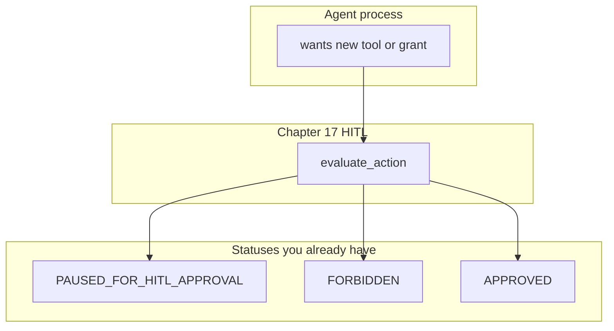

# 20: Self-Evolution and Safe Autonomous Tool Modification

By the end of this chapter, you will understand the critical safety considerations, architectural boundaries, and Human-in-the-Loop guardrails required when designing agents capable of modifying their own code, tool registries, or permission grants.

Self-modifying code is a powerful concept, but allowing an autonomous agent to rewrite its own tools or widen permissions without strict human governance is a dangerous failure mode.

## Data
**Agent Self-Evolution** refers to an agent dynamically modifying its runtime capabilities:
- **Registry Mutation**: Adding, modifying, or removing tools from `TOOL_REGISTRY` dynamically.
- **Permission Widening**: Requesting expanded filesystem access, network egress, or elevated OS roles.
- **Safety Interception**: Mandatory routing of all capability mutation requests through Human-in-the-Loop gates (`evaluate_action`) returning `PAUSED_FOR_HITL_APPROVAL`.

## Information
Self-evolution must be governed by strict architectural constraints:
- **Never Auto-Grant Privileges**: An agent must never be permitted to unilaterally grant itself elevated security privileges.
- **Explicit Approval Checkpoints**: When an agent writes a new tool script or requests broader access, it must yield an approval modal and wait for explicit human review.
- **Immutable Core Guardrails**: Security filters, sandbox boundaries, and HITL interceptors must remain immutable and outside the agent's write scope.

## Knowledge
Here is the step-by-step procedure:
1. When an agent generates a new tool implementation or proposes permission expansion, capture the action as a high-risk mutation.
2. Route the proposed changes to the Chapter 17 safety evaluator (`evaluate_action`).
3. Return `PAUSED_FOR_HITL_APPROVAL` to halt execution and present the proposed diff to the human operator.
4. If approved by the human operator, register the validated tool into `TOOL_REGISTRY`.
5. If rejected, log the refusal and continue with existing capabilities.

## Wisdom
Autonomous capability expansion requires strict human oversight. An agent may propose new tools, but only a human operator may grant permissions.

## The When and Why
- **When**: Designing long-horizon self-improving agents, autonomous research assistants, or extensible plugin ecosystems.
- **Why**: Unconstrained self-modification risks security compromise, privilege escalation, and unintended system destruction.

## How it works



Walkthrough of the judgment call:

1. The model (or a script) proposes a new tool name or a wider grant.
2. You do not write that into `TOOL_REGISTRY` in the same turn.
3. You send the proposal through the chapter 17 gate. A mutative change returns `PAUSED_FOR_HITL_APPROVAL`. A forbidden change returns `FORBIDDEN`.
4. A person approves or rejects. Only then does the registry change.

Nothing in that walkthrough is a new class of object. There is no lab to run.

## Data contract

No extra contract. Reuse the chapter 17 HITL payload.

```json
{
  "status": "PAUSED_FOR_HITL_APPROVAL",
  "approval_modal": {
    "type": "HITLApprovalModal",
    "proposed_command": "string",
    "risk_level": "HIGH",
    "requires_token": true
  }
}
```

There is no reference `.py` in this folder for this page.

## Lab
Module only. No lab. Do not add a new primitive.

- Module: [this file](./03_self_evolution.md)
- Gate: chapter 17 [lab1_hitl_approval.py](../17_hitl_and_park_resume/lab1_hitl_approval.py) / [lab1_hitl_approval.md](../17_hitl_and_park_resume/lab1_hitl_approval.md) and the HITL class in [lab2_enterprise_harness_app.py](./lab2_enterprise_harness_app.py).

## Related
- **Chapter 17:** the gate.
- **01_project_blueprints.md:** optional slices. This page is not one of them.

## Notes
- No Future Lab Blueprint.
- No new lab was added. Do not invent one.
- Moved from old `modules/04/03` if useful. Read-only on purpose.
