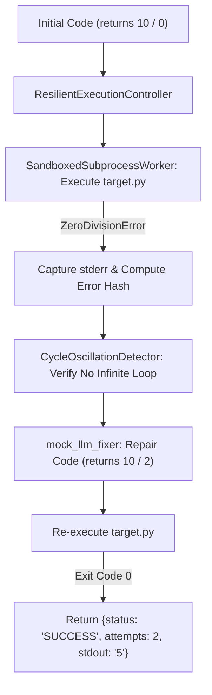

# Lab 1: Resilient Sandbox Execution with Automated Self-Healing and Cycle Detection

In this lab, you will implement a resilient code execution controller `run_resilient_code()` that executes Python snippets inside isolated subprocesses, catches runtime failures (such as `ZeroDivisionError`), and safely retries execution using reflection without infinite loops.

---

## What you touch
- Script: `lab1_resilient_executor.py`
- Main Classes & Functions:
  - `CycleOscillationDetector`: Detects identical repeated execution attempts via MD5 hashing.
  - `SandboxedSubprocessWorker`: Executes scripts in isolated temporary directories (`harness_sandbox_`) with strict timeouts.
  - `ResilientExecutionController`: Orchestrates execution, reflexions, and automated repairs.
  - `mock_llm_fixer(code: str, error: str) -> str`: Simulates code repair.
- Pure Python logic (no network calls required)

---

## Steps


1. Instantiate `ResilientExecutionController` with `CycleOscillationDetector(max_repeats=2)` and `SandboxedSubprocessWorker`.
2. Call `run_resilient_code()` with an intentionally failing snippet:
   ```python
   def divide():
       return 10 / 0
   print(divide())
   ```
3. Attempt 1: The worker writes `target.py`, executes it, and catches `ZeroDivisionError`.
4. The error hash is computed and recorded in the cycle detector.
5. The controller invokes `mock_llm_fixer`, which repairs the snippet to `return 10 / 2`.
6. Attempt 2: Re-execution succeeds with exit code `0`, returning stdout `"5"`.

---

## Data contract

**Successful Self-Healing Result**

```json
{
  "status": "SUCCESS",
  "attempts": 2,
  "stdout": "5",
  "final_code": "def divide():\n    return 10 / 2\nprint(divide())"
}
```

**Loop Oscillation Abort Result**

```json
{
  "status": "ABORTED",
  "reason": "Repeated identical error hash detected."
}
```

---

## Run
From the repository root, run:

```bash
python education/20_synthesis/lab1_resilient_executor.py
```

```powershell
python education/20_synthesis/lab1_resilient_executor.py
```

---

## What you should see
- `=== STARTING RESILIENT EXECUTION CONTROLLER ===`
- `[ATTEMPT 1] Execution Failed: ZeroDivisionError`
- `[REFLEXION] Error signature logged`
- `[SELF-HEALING] Applying automated patch...`
- `[ATTEMPT 2] Execution Passed [SUCCESS]`
- Return payload showing `status: SUCCESS`, `attempts: 2`, and `stdout: 5`.

---

## Stop here
You have successfully implemented resilient, self-healing sandbox execution! In Lab 2, we will assemble the complete enterprise agent application harness.

Next up: [Lab 2: Enterprise Harness App](./lab2_enterprise_harness_app.md).

---

## Notes
*(Record your execution attempts and error traces here)*

