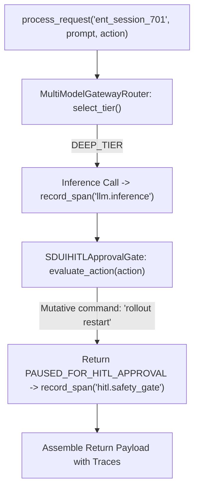

# Lab 2: Comprehensive Enterprise Agent Application Harness

In this lab, you will synthesize model tier routing (`select_tier`), Human-in-the-Loop safety checks (`SDUIHITLApprovalGate`), and OpenTelemetry distributed tracing (`OTelEvalTracer`) into a unified enterprise agent runner (`EnterpriseAgentAppHarness`).

---

## What you touch
- Script: `lab2_enterprise_harness_app.py`
- Main Classes & Functions:
  - `MultiModelGatewayRouter`: Routes prompts to `FAST_TIER` or `DEEP_TIER`.
  - `SDUIHITLApprovalGate`: Intercepts dangerous operations, returning `PAUSED_FOR_HITL_APPROVAL`.
  - `OTelEvalTracer`: Collects structured telemetry spans (`llm.inference`, `hitl.safety_gate`).
  - `EnterpriseAgentAppHarness.process_request(session_id, prompt, proposed_action)`
- Environment Configuration: Reads `OLLAMA_HOST` (default: `http://192.168.1.29:11434`) and `OLLAMA_MODEL` (default: `qwen3.6:35b-a3b-65k`) from `.env`

---

## Steps


1. Load environment variables via `load_env.py` (or fallback defaults).
2. Call `process_request("ent_session_701", "Analyze system logs and refactor database connection pool.", "kubectl rollout restart deployment/api-gateway")`.
3. Verify `select_tier()` detects `"analyze"`/`"refactor"` keywords and selects `DEEP_TIER`.
4. Perform inference call and record the `llm.inference` span.
5. Pass the proposed command through `evaluate_action()`, triggering a `PAUSED_FOR_HITL_APPROVAL` status.
6. Record the `hitl.safety_gate` telemetry span.
7. Return the composite response containing status, safety evaluation, and telemetry traces.

---

## Data contract

**Enterprise Harness Response Payload**

```json
{
  "status": "PAUSED_FOR_HITL_APPROVAL",
  "session_id": "ent_session_701",
  "selected_tier": "DEEP_TIER",
  "llm_response": "Analysis complete: Recommended actions identified...",
  "safety_eval": {
    "status": "PAUSED_FOR_HITL_APPROVAL",
    "risk_level": "MEDIUM",
    "approval_modal": {
      "type": "HITLApprovalModal",
      "proposed_command": "kubectl rollout restart deployment/api-gateway"
    }
  },
  "total_duration_ms": 142.5,
  "telemetry_spans": [
    { "span_name": "llm.inference", "duration_ms": 120.2 },
    { "span_name": "hitl.safety_gate", "duration_ms": 1.1 }
  ]
}
```

---

## Run
From the repository root, run:

```bash
python education/20_synthesis/lab2_enterprise_harness_app.py
```

```powershell
python education/20_synthesis/lab2_enterprise_harness_app.py
```

---

## What you should see
- `=== STARTING ENTERPRISE AGENT APP HARNESS: 'ent_session_701' ===`
- `[ROUTER] Prompt Triage -> Selected Tier: DEEP_TIER (qwen3.6:35b-a3b-65k)`
- `[SAFETY GATE] Intercepted Action -> Status: PAUSED_FOR_HITL_APPROVAL`
- Structured response payload containing `llm_response`, `safety_eval`, and telemetry spans.

---

## Stop here
You have successfully synthesized an enterprise agent application harness! You have completed the core 20-Stage progressive hierarchy.

Explore optional domain blueprints next: [Project Blueprints](./01_project_blueprints.md).

---

## Notes
*(Record your synthesized harness execution output and telemetry spans here)*

