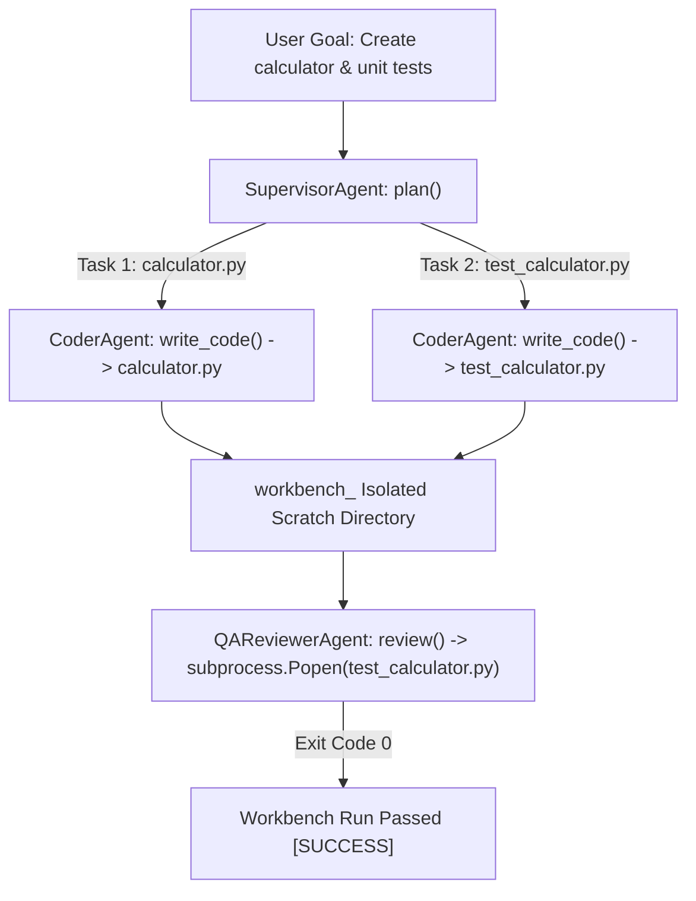

# Lab 3: Multi-Agent Software Development Workbench

In this lab, you will orchestrate a collaborative multi-agent software engineering team (Supervisor, Coder, and QA Reviewer) working inside isolated temporary workbenches to generate and verify automated unit test suites.

---

## What you touch
- Script: `lab3_multi_agent_workbench.py`
- Main Classes & Roles:
  - `SupervisorAgent.plan(goal)`: Decomposes product goals into implementation tasks.
  - `CoderAgent.write_code(task, work_dir)`: Generates Python modules and test files.
  - `QAReviewerAgent.review(work_dir, test_file)`: Executes tests inside an isolated sandbox subprocess.
  - `run_local_multi_agent_workbench(goal)`: Top-level orchestrator.
- Files Produced: `calculator.py` and `test_calculator.py` inside temporary workspace `workbench_`
- Environment Configuration: Reads `OLLAMA_HOST` (default: `http://192.168.1.29:11434`) and `OLLAMA_MODEL` (default: `qwen3.6:35b-a3b-65k`) from `.env`

---

## Steps


1. Load environment variables via `load_env.py` (or fallback defaults).
2. Invoke `run_local_multi_agent_workbench()` with the goal: `"Create a calculator module and automated unit test suite."`.
3. The `SupervisorAgent` plans two sequential tasks.
4. The `CoderAgent` calls the model to write `calculator.py` and `test_calculator.py` into a clean temporary directory.
5. The `QAReviewerAgent` runs `test_calculator.py` inside the isolated sandbox.
6. Verify test results and clean up workspace.

---

## Data contract

**Supervisor Task Plan**

```json
[
  "Write calculator.py containing add(a, b) and multiply(a, b) functions.",
  "Write test_calculator.py importing calculator and running unittest test cases."
]
```

**QA Verification Result**

```json
{
  "exit_code": 0,
  "stderr": ""
}
```

---

## Run
From the repository root, run:

```bash
python education/20_synthesis/lab3_multi_agent_workbench.py
```

```powershell
python education/20_synthesis/lab3_multi_agent_workbench.py
```

---

## What you should see
- `[SUPERVISOR AGENT] Decomposing goal into tasks...`
- `[CODER AGENT] Generating calculator.py...`
- `[CODER AGENT] Generating test_calculator.py...`
- `[QA REVIEWER] Executing 'test_calculator.py' in sandbox...`
- `[WORKBENCH COMPLETE] [PASSED] QA verification succeeded.`

---

## Stop here
You have successfully orchestrated a multi-agent engineering workbench! In Lab 4, we will build an enterprise Text-to-SQL data assistant.

Next up: [Lab 4: Enterprise SQL Agent](./lab4_enterprise_sql_agent.md).

---

## Notes
*(Record your workbench generated code and QA execution traces here)*
