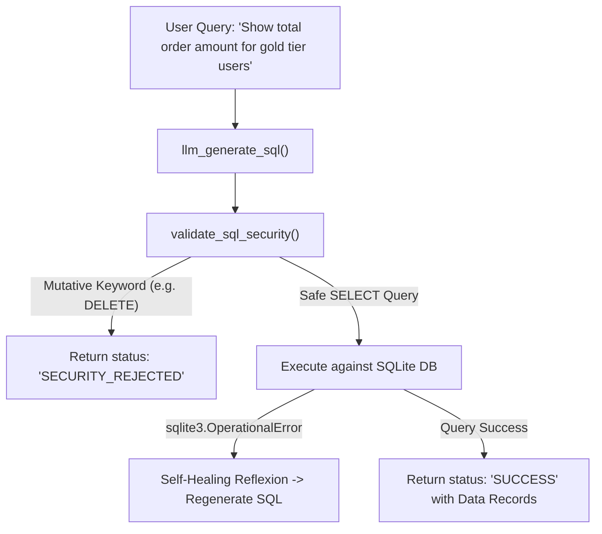

# Lab 4: Enterprise Text-to-SQL Agent with Security Guardrails

In this lab, you will build an enterprise Text-to-SQL assistant `EnterpriseSQLAgent` that converts natural language queries into SQL, validates statements against AST security policies (blocking destructive `DROP`/`DELETE` mutations), and queries an in-memory SQLite database with self-healing reflexion.

---

## What you touch
- Script: `lab4_enterprise_sql_agent.py`
- Main Classes & Functions:
  - `llm_generate_sql(prompt, schema)`: Prompts model to generate SQL.
  - `validate_sql_security(sql_query)`: AST security validator blocking mutative SQL keywords (`DROP`, `DELETE`, `TRUNCATE`, `ALTER`, `UPDATE`, `INSERT`).
  - `init_sample_database()`: Creates in-memory SQLite tables (`users`, `orders`).
  - `EnterpriseSQLAgent.process_query(user_query)`: Orchestrates generation, validation, execution, and error repair.
- Environment Configuration: Reads `OLLAMA_HOST` (default: `http://192.168.1.29:11434`) and `OLLAMA_MODEL` (default: `qwen3.6:35b-a3b-65k`) from `.env`

---

## Steps


1. Load environment variables via `load_env.py` (or fallback defaults).
2. Initialize the sample in-memory SQLite database with users and orders.
3. Scenario 1 (Safe Analytical Query):
   - Query: `"Show total order amount for gold tier users"`.
   - Generates SQL $\rightarrow$ Passes validation $\rightarrow$ Executes query $\rightarrow$ Returns result rows (`status: SUCCESS`).
4. Scenario 2 (Malicious Mutation Attempt):
   - Query: `"Delete all orders from database"`.
   - Generates SQL containing `DELETE` $\rightarrow$ Intercepted by `validate_sql_security()` $\rightarrow$ Returns `status: SECURITY_REJECTED`.

---

## Data contract

**Successful Query Execution**

```json
{
  "status": "SUCCESS",
  "sql_used": "SELECT users.name, SUM(orders.amount) as total FROM users JOIN orders ON users.id = orders.user_id WHERE users.tier = 'gold' GROUP BY users.name LIMIT 1000",
  "data": [
    ["Alice", 250.0]
  ]
}
```

**Security Interception Result**

```json
{
  "status": "SECURITY_REJECTED",
  "error": "Mutative command 'DELETE' violates read-only query policy."
}
```

---

## Run
From the repository root, run:

```bash
python education/20_synthesis/lab4_enterprise_sql_agent.py
```

```powershell
python education/20_synthesis/lab4_enterprise_sql_agent.py
```

---

## What you should see
- `=== STARTING ENTERPRISE DATA & SQL AGENT LAB ===`
- Scenario 1: `[PASSED] Result: {'status': 'SUCCESS', 'data': ...}`
- Scenario 2: `[REJECTED] Result: {'status': 'SECURITY_REJECTED', ...}`

---

## Stop here
You have successfully implemented a secure Text-to-SQL data assistant! In Lab 5, we will build an autonomous Site Reliability Engineering (SRE) agent.

Next up: [Lab 5: Autonomous SRE Agent](./lab5_autonomous_sre_agent.md).

---

## Notes
*(Record your SQL query generations and security validation logs here)*
