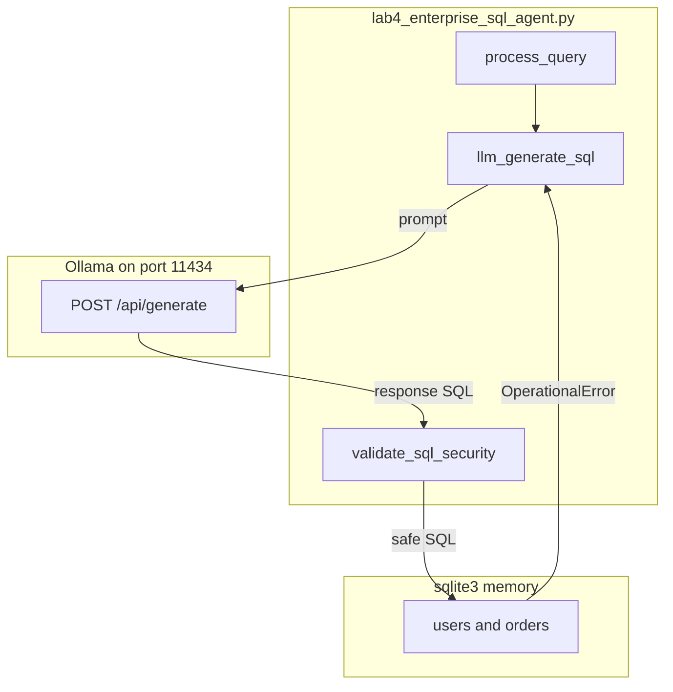

# Lab 4: Enterprise SQL agent

Natural language becomes a SQL string, a keyword check runs, then SQLite returns rows. This reuses chapter 02 structured text, chapter 09 keyword block, and chapter 12 reflexion. Not a new database product.

## What you touch
- Script: `lab4_enterprise_sql_agent.py`
- Functions: `llm_generate_sql`, `validate_sql_security`, `init_sample_database`, `EnterpriseSQLAgent.process_query`
- URL / path: `{OLLAMA_HOST}/api/generate` (default `http://192.168.1.29:11434/api/generate`)
- Keys sent: `model`, `prompt`, `stream` (`false`), `options.temperature` (`0.0`)
- Keys read: `response`
- Tables: in-memory SQLite `users` (`id`, `name`, `email`, `tier`) and `orders` (`id`, `user_id`, `amount`, `status`)

## Steps


1. Read `OLLAMA_HOST` and `OLLAMA_MODEL` from the environment. If they are unset, use `http://192.168.1.29:11434` and `qwen3.6:35b-a3b-65k`.
2. Call `init_sample_database`. It creates an in-memory SQLite connection and inserts Alice (gold) and Bob (silver) plus two orders.
3. Scenario 1: `process_query("Show total order amount for gold tier users")`. `llm_generate_sql` POSTs the schema plus the intent and reads `response`. Strip a leading ` ```sql ` fence if present.
4. `validate_sql_security` rejects `DROP`, `DELETE`, `INSERT`, `UPDATE`, `ALTER`, `TRUNCATE`, `CREATE`. If `LIMIT` is missing, it appends `LIMIT 1000`.
5. `cursor.execute` the safe SQL. On `sqlite3.OperationalError`, feed the error back into the prompt (max 3 attempts). That is chapter 12 reflexion.
6. Scenario 2: `process_query("Delete all orders from database")`. The generated SQL should hit the keyword block and return `SECURITY_REJECTED`.

## Data contract

**Request** `POST /api/generate`

```json
{
  "model": "qwen3.6:35b-a3b-65k",
  "prompt": "string",
  "stream": false,
  "options": { "temperature": 0.0 }
}
```

**Response**

```json
{
  "response": "SELECT ..."
}
```

**`process_query` success**

```json
{
  "status": "SUCCESS",
  "sql_used": "string",
  "data": []
}
```

**Reject / heal fail**

```json
{
  "status": "SECURITY_REJECTED",
  "error": "string"
}
```

`status` can also be `HEALING_FAILED_MAX_TURNS` with no extra keys. Intended contract is a SQL string you can check (chapter 02). See Notes.

## Run
Copy `.env.example` to `.env` in the repo root and uncomment the Ollama lines. The script loads that file (it does not override vars already set in the shell).

From the repo root:

```bash
python education/20_synthesis/lab4_enterprise_sql_agent.py
```

```powershell
python education/20_synthesis/lab4_enterprise_sql_agent.py
```

## What you should see
`=== STARTING ENTERPRISE DATA & SQL AGENT LAB ===`, scenario 1 with generated SQL and `[PASSED]` plus a `SUCCESS` dict that includes `sql_used` and `data`, then scenario 2 with `[REJECTED]` and `SECURITY_REJECTED`. If you see `URLError` or `Connection refused`, the provider is not reachable. If you see HTTP 404, the model name is wrong. If scenario 1 returns `HEALING_FAILED_MAX_TURNS`, the model never produced executable SQL.

## Stop here
Do not add a new primitive; compose what you already have. A POST plus a keyword check plus SQLite is enough. Do not add an ORM, a warehouse, or a new query planner. Those would hide whether the miss came from the SQL string, the block, or the extra.

## Notes
- Reference blueprint. Structured SQL out. Reuse chapter 02, chapter 09 keyword block, chapter 12 reflexion.
- Contract drift vs `lab4_enterprise_sql_agent.py`: no `OLLAMA_HOST` / `OLLAMA_MODEL` read (URL and model are literals). Route is `/api/generate`. `llm_generate_sql` strips ` ```sql ` or ` ``` ` fences. Security is a keyword scan, not a real AST. `CREATE` is forbidden even though `init_sample_database` uses it before the agent runs. Healing loop max is 3. In-memory DB only. The intended contract is a SQL string you can validate. Write that in your copy. Leave the reference file as-is.
