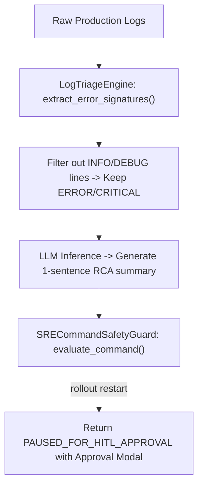

# Lab 5: Autonomous Site Reliability Engineering (SRE) Agent

In this lab, you will build an autonomous SRE incident response agent `AutonomousSREAgent` that extracts error signatures from raw system logs, generates root cause analysis (RCA) summaries, and enforces Human-in-the-Loop safety boundaries on remediation commands.

---

## What you touch
- Script: `lab5_autonomous_sre_agent.py`
- Main Classes & Functions:
  - `LogTriageEngine.extract_error_signatures(logs)`: Filters logs for `ERROR`, `CRITICAL`, and `FATAL` lines.
  - `SRECommandSafetyGuard.evaluate_command(command)`: Classifies commands into `READ_ONLY`, `REQUIRES_HITL_APPROVAL`, or `FORBIDDEN`.
  - `AutonomousSREAgent.investigate_and_remediate(logs)`: Orchestrates log triage, RCA generation, and safety gate evaluations.
- Command Safety Rules:
  - `READ_ONLY`: Informational diagnostics (e.g. `kubectl get pods`)
  - `REQUIRES_HITL_APPROVAL`: Mutative restarts (e.g. `kubectl rollout restart deployment/...`)
  - `FORBIDDEN`: Destructive mutations (e.g. `kubectl delete namespace ...`)
- Environment Configuration: Reads `OLLAMA_HOST` (default: `http://192.168.1.29:11434`) and `OLLAMA_MODEL` (default: `qwen3.6:35b-a3b-65k`) from `.env`

---

## Steps


1. Load environment variables via `load_env.py` (or fallback defaults).
2. Pass sample production logs into `investigate_and_remediate()`.
3. Filter logs to retain only critical error lines (`ConnectionPoolExhausted`, `HTTP 502`).
4. Generate a 1-sentence Root Cause Analysis (RCA) summary via model inference.
5. Evaluate three candidate remediation commands against `SRECommandSafetyGuard`:
   - `kubectl get pods -n production` $\rightarrow$ `READ_ONLY`
   - `kubectl rollout restart deployment/api-gateway -n production` $\rightarrow$ `REQUIRES_HITL_APPROVAL`
   - `kubectl delete namespace production` $\rightarrow$ `FORBIDDEN`
6. Return structured incident response payload with HITL approval modal.

---

## Data contract

**Autonomous SRE Incident Response Payload**

```json
{
  "status": "SUCCESS",
  "rca": "Database connection pool exhaustion caused downstream API gateway 502 outages.",
  "remediation_status": "PAUSED_FOR_HITL_APPROVAL",
  "approval_modal": {
    "type": "HITLApprovalModal",
    "proposed_command": "kubectl rollout restart deployment/api-gateway -n production",
    "risk_level": "MEDIUM"
  }
}
```

---

## Run
From the repository root, run:

```bash
python education/20_synthesis/lab5_autonomous_sre_agent.py
```

```powershell
python education/20_synthesis/lab5_autonomous_sre_agent.py
```

---

## What you should see
- `=== STARTING AUTONOMOUS SRE INCIDENT RESPONSE AGENT ===`
- `[LOG TRIAGE] Extracted error signatures: [...]`
- `[RCA] Generated Root Cause Analysis summary`
- `[COMMAND SAFETY GATE] 'kubectl get pods...' -> READ_ONLY`
- `[COMMAND SAFETY GATE] 'kubectl rollout restart...' -> REQUIRES_HITL_APPROVAL`
- `[COMMAND SAFETY GATE] 'kubectl delete namespace...' -> FORBIDDEN`
- Final response payload with `PAUSED_FOR_HITL_APPROVAL`.

---

## Stop here
You have successfully implemented an autonomous SRE incident response agent! In Lab 6, we will build a Spec-Driven TDD development engine.

Next up: [Lab 6: Spec TDD Loop](./lab6_spec_tdd_loop.md).

---

## Notes
*(Record your SRE log triage, RCA summaries, and safety classifications here)*
