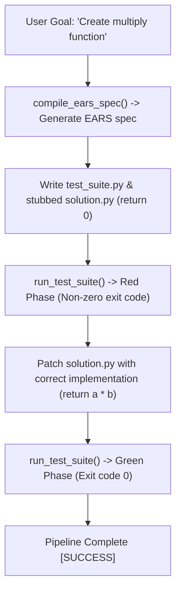

# Lab 6: Specification-Driven Development (SDD) & Test-Driven Development (TDD) Loop

In this lab, you will implement an automated Spec TDD pipeline `run_spec_tdd_pipeline()` that compiles requirements into structured EARS specifications, generates and executes failing unit tests (Red phase), and validates code corrections inside an isolated sandbox (Green phase).

---

## What you touch
- Script: `lab6_spec_tdd_loop.py`
- Main Functions:
  - `compile_ears_spec(user_goal)`: Prompts model to generate requirements in EARS format (`WHEN ..., the system SHALL ...`).
  - `run_test_suite(temp_dir)`: Executes `test_suite.py` inside an isolated temporary directory (`sdd_tdd_`).
  - `run_spec_tdd_pipeline(user_goal)`: Orchestrates spec compilation, initial test failure, code patching, and passing test verification.
- Files Produced: `test_suite.py` and `solution.py` in `sdd_tdd_` temporary directory
- Environment Configuration: Reads `OLLAMA_HOST` (default: `http://192.168.1.29:11434`) and `OLLAMA_MODEL` (default: `qwen3.6:35b-a3b-65k`) from `.env`

---

## Steps


1. Load environment variables via `load_env.py` (or fallback defaults).
2. Call `run_spec_tdd_pipeline()` with goal: `"Create a multiply function that takes two numbers and returns their product."`.
3. Generate formal EARS acceptance requirements via `compile_ears_spec()`.
4. Write `test_suite.py` asserting `multiply(4, 5) == 20` alongside a stubbed `solution.py` returning `0`.
5. Execute `run_test_suite()` to confirm initial failure (Red Phase: exit code `1`).
6. Overwrite `solution.py` with `def multiply(a, b): return a * b`.
7. Re-run `run_test_suite()` to confirm passing execution (Green Phase: exit code `0`).

---

## Data contract

**Generated EARS Specification**

```text
WHEN two numbers are provided, the system SHALL compute and return their mathematical product.
```

**Test Execution Lifecycle Result**

```json
{
  "red_exit_code": 1,
  "green_exit_code": 0
}
```

---

## Run
From the repository root, run:

```bash
python education/20_synthesis/lab6_spec_tdd_loop.py
```

```powershell
python education/20_synthesis/lab6_spec_tdd_loop.py
```

---

## What you should see
- `=== STARTING SPEC-DRIVEN DEVELOPMENT (SDD) & TDD ENGINE ===`
- `[EARS SPEC GENERATED]` with formal requirements
- `[TDD RED STEP] Unit Test Execution Failed (Exit Code 1)`
- `[TDD GREEN STEP] Unit Test Execution Passed (Exit Code 0)`
- `=== SDD & TDD EXECUTION SUCCESSFUL ===`

---

## Stop here
You have successfully implemented a Spec-Driven TDD development engine! In Lab 7, we will build a scalable agent serving runtime with telemetry instrumentation.

Next up: [Lab 7: Agent Serving Infra](./lab7_agent_serving_infra.md).

---

## Notes
*(Record your EARS specifications and Red/Green test executions here)*
