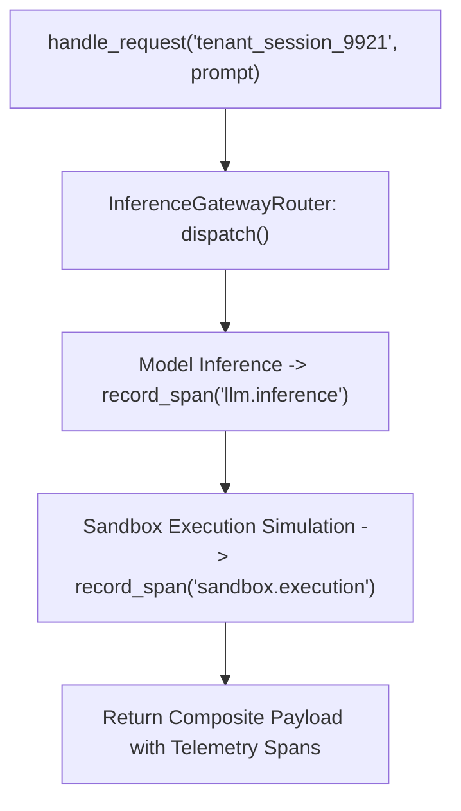

# Lab 7: Multi-Tenant Agent Serving Infrastructure & Telemetry Tracing

In this lab, you will build a multi-tenant agent serving runtime `ProductionAgentServingRuntime` that dispatches requests through an inference gateway router (`InferenceGatewayRouter`) and instruments distributed OpenTelemetry execution spans (`OTelSpanCollector`).

---

## What you touch
- Script: `lab7_agent_serving_infra.py`
- Main Classes & Functions:
  - `OTelSpanCollector.record_span(span_name, duration_ms, attributes)`: Records structured trace spans.
  - `InferenceGatewayRouter.dispatch(model, prompt)`: Routes and executes model inference.
  - `ProductionAgentServingRuntime.handle_request(tenant_session_id, user_prompt)`: Orchestrates serving request lifecycle and telemetry collection.
- Telemetry Spans Emitted: `llm.inference`, `sandbox.execution`
- Environment Configuration: Reads `OLLAMA_HOST` (default: `http://192.168.1.29:11434`) and `OLLAMA_MODEL` (default: `qwen3.6:35b-a3b-65k`) from `.env`

---

## Steps


1. Load environment variables via `load_env.py` (or fallback defaults).
2. Call `handle_request("tenant_session_9921", "Summarize 3 production serving best practices.")`.
3. The gateway router dispatches the request to the configured inference endpoint.
4. Record an OpenTelemetry span for `llm.inference` capturing token metrics and latency.
5. Record an OpenTelemetry span for `sandbox.execution` capturing execution isolation parameters.
6. Assemble and return the complete serving response with output text and telemetry spans.

---

## Data contract

**Production Serving Response Payload**

```json
{
  "status": "SUCCESS",
  "session_id": "tenant_session_9921",
  "output": "1. Implement adaptive gateway routing\n2. Enforce strict subprocess sandboxing\n3. Instrument end-to-end distributed telemetry.",
  "telemetry_spans": [
    {
      "span_name": "llm.inference",
      "duration_ms": 118.4,
      "attributes": {
        "model": "qwen3.6:35b-a3b-65k",
        "prompt_tokens": 14,
        "completion_tokens": 32
      }
    },
    {
      "span_name": "sandbox.execution",
      "duration_ms": 50.0,
      "attributes": {
        "isolation_type": "SubprocessSandbox",
        "exit_code": 0,
        "memory_limit_mb": 512
      }
    }
  ]
}
```

---

## Run
From the repository root, run:

```bash
python education/20_synthesis/lab7_agent_serving_infra.py
```

```powershell
python education/20_synthesis/lab7_agent_serving_infra.py
```

---

## What you should see
- `=== STARTING PRODUCTION AGENT SERVING INFRASTRUCTURE LAB ===`
- `[SERVING RUNTIME] Handling Session: 'tenant_session_9921'`
- `[OTel SPAN] 'llm.inference' recorded`
- `[OTel SPAN] 'sandbox.execution' recorded`
- Final response payload showing `status: SUCCESS` and detailed `telemetry_spans`.

---

## Stop here
You have successfully implemented a production serving runtime with distributed tracing! Proceed to Optional Training when ready.

Next up: [Optional Training: Pretrain Tiny](../../education/optional_training/00_pretrain_tiny.md).

---

## Notes
*(Record your serving metrics and OpenTelemetry trace spans here)*

