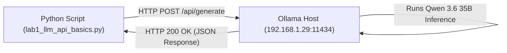

# Lab 1: Raw LLM API Basics & Baseline Profiling
## 1. Concept & Data Flow
An LLM API call is a stateless HTTP `POST` Remote Procedure Call (RPC) to a neural network inference engine (e.g., local Ollama instance running at `http://192.168.1.29:11434`).

---
## 2. Rosetta Stone Jargon Mapping
| AI Buzzword | Actual Software Component / Standard Primitive |
| :--- | :--- |
| **Inference Call** | HTTP `POST` request to `http://192.168.1.29:11434/api/generate` |
| **Prompt** | Text input field passed in JSON request body |
| **Temperature** | Softmax division scalar (`0.0` = deterministic, `1.0` = random) |
| **TPS (Tokens Per Second)** | Generation throughput rate (Generated Tokens / Decode Duration) |
| **Total Latency** | Wall-clock time elapsed from sending request to receiving full response |
> *"Btw, this is WHEN and WHY we need this framing concept (Data Contract):"*  
> **WHEN**: Before writing client-side API code to talk to a backend service.  
> **WHY**: A Data Contract guarantees the exact JSON keys and data types expected (`model`, `prompt`, `stream`). This prevents runtime `KeyError` crashes.
---

---

## 3. Code Implementation & Execution Results

- **Script File**: [lab1_llm_api_basics.py](file:///labs/00_foundations/lab1_llm_api_basics.py)

python
import json
import time
import urllib.request

# 1. Configuration (Local Ollama LAN Endpoint & Model)
OLLAMA_URL = "http://192.168.1.29:11434/api/generate"
MODEL_NAME = "qwen3.6:35b-a3b-65k"

# 2. Data Contract: JSON Payload required by Ollama API
payload = {
    "model": MODEL_NAME,
    "prompt": "In 2 sentences, explain what an HTTP POST request is.",
    "stream": False,  # Non-streaming call for baseline lab
    "options": {
        "temperature": 0.0  # Deterministic decoding
    }
}

print(f"Connecting to Ollama at {OLLAMA_URL}...")
print(f"Model: {MODEL_NAME}")
print("Sending HTTP POST request...\n")

# 3. Record start time for latency measurement
start_time = time.time()

# 4. Prepare and execute the raw HTTP POST request
json_data = json.dumps(payload).encode("utf-8")
req = urllib.request.Request(
    OLLAMA_URL, 
    data=json_data, 
    headers={"Content-Type": "application/json"}
)

try:
    with urllib.request.urlopen(req) as response:
        response_bytes = response.read()
        end_time = time.time()
        
        # 5. Parse the JSON response
        result = json.loads(response_bytes.decode("utf-8"))
        
        # 6. Extract response text and metrics from Ollama response schema
        response_text = result.get("response", "").strip()
        eval_count = result.get("eval_count", 0)         # Total generated tokens
        eval_duration = result.get("eval_duration", 1)  # Duration in nanoseconds
        
        # Calculate Tokens Per Second (TPS)
        tps = (eval_count / (eval_duration / 1e9)) if eval_duration > 0 else 0
        total_latency = end_time - start_time

        print("=== RESPONSE FROM MODEL ===")
        print(response_text)
        print("\n=== PERFORMANCE METRICS ===")
        print(f"Total Wall-Clock Latency : {total_latency:.2f} seconds")
        print(f"Generated Tokens          : {eval_count} tokens")
        print(f"Generation Throughput (TPS): {tps:.2f} tokens/sec")

except Exception as e:
    print(f"Error connecting to Ollama: {e}")

---

## 4.Living Discussion & Q&A Notes
- **Question / Observation**: Why did the model report 766 tokens for a 2-sentence output?
- **Explanation**: Modern reasoning models (like Qwen 3.6 MoE) generate internal reasoning/thinking tokens before outputting the final user-facing text. The hardware throughput remained fast at 61.29 tokens/sec.
- **Limitation**: `"stream": false` required the user to wait 13.01 seconds before seeing any text on screen. This led directly to Lab 2 (Streaming).
