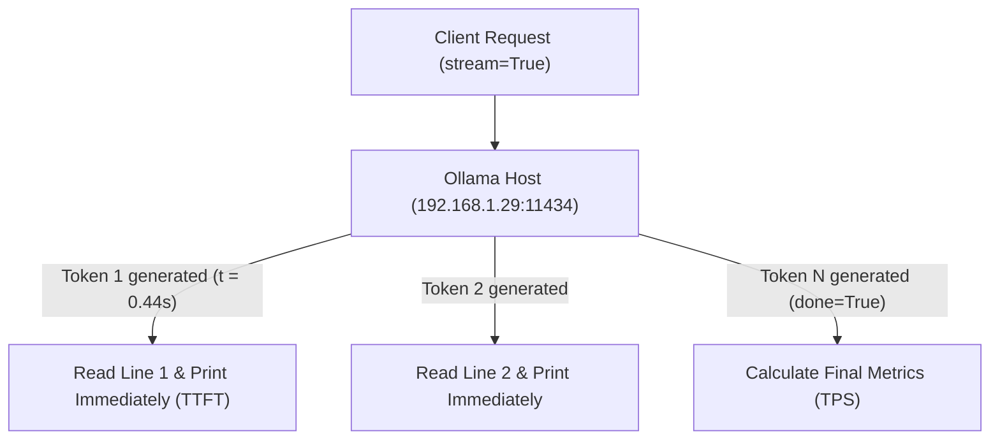

# Lab 2: Streaming Token Reader & Latency Profiling (SSE)
## 1. Concept & Data Flow
Streaming responses use Server-Sent Events (SSE) or chunked HTTP encoding over a persistent TCP connection. Instead of waiting for the full response payload, the client reads JSON chunks line-by-line as tokens are generated.

---
## 2. Rosetta Stone Jargon Mapping
| AI Buzzword | Actual Software Component / Standard Primitive |
| :--- | :--- |
| **Streaming** | HTTP Chunked Transfer Encoding / Server-Sent Events (SSE) |
| **TTFT (Time to First Token)** | Milliseconds elapsed until the very first JSON chunk is received |
| **ITL (Inter-Token Latency)** | Time gap between individual token chunks during generation |
> *"Btw, this is WHEN and WHY we need this framing concept (Streaming Transport / SSE):"*  
> **WHEN**: Any user-facing AI chat interface, code generation tool, or terminal harness.  
> **WHY**: Waiting 10–30 seconds for a full non-streaming HTTP response feels frozen. Streaming tokens immediately (0.44s TTFT) provides a real-time, responsive user experience.
---

---

## 3. Code Implementation & Execution Results

- **Script File**: [lab2_streaming_tokens.py](file:///labs/00_foundations/lab2_streaming_tokens.py)

python
import json
import sys
import time
import urllib.request

# 1. Configuration (Local Ollama LAN Endpoint & Model)
OLLAMA_URL = "http://192.168.1.29:11434/api/generate"
MODEL_NAME = "qwen3.6:35b-a3b-65k"

# 2. Data Contract with `"stream": True` enabled
payload = {
    "model": MODEL_NAME,
    "prompt": "Write a 3-step technical summary of why streaming HTTP responses reduces perceived latency.",
    "stream": True,  # Enable real-time streaming chunks
    "options": {
        "temperature": 0.0
    }
}

print(f"Connecting to Ollama stream at {OLLAMA_URL}...")
print("Sending HTTP POST request (stream=True)...\n")

start_time = time.time()
ttft = None          # Time To First Token (seconds)
token_count = 0      # Generated chunk counter
first_token_time = 0

json_bytes = json.dumps(payload).encode("utf-8")
req = urllib.request.Request(
    OLLAMA_URL, 
    data=json_bytes, 
    headers={"Content-Type": "application/json"}
)

print("=== REAL-TIME STREAMING OUTPUT ===")
try:
    with urllib.request.urlopen(req) as response:
        # Read the HTTP stream line by line as Ollama emits JSON chunks
        for line in response:
            if not line:
                continue
            
            # Record Time to First Token (TTFT) on the very first received line
            if ttft is None:
                first_token_time = time.time()
                ttft = first_token_time - start_time
            
            token_count += 1
            
            # Parse the JSON chunk
            chunk = json.loads(line.decode("utf-8"))
            token_text = chunk.get("response", "")
            
            # Print token to console immediately without newline buffering
            sys.stdout.write(token_text)
            sys.stdout.flush()

            # If chunk flags done=True, grab final execution metrics if present
            if chunk.get("done", False):
                eval_count = chunk.get("eval_count", token_count)
                eval_duration = chunk.get("eval_duration", 1)

    total_duration = time.time() - start_time
    decode_duration = total_duration - ttft
    tps = eval_count / (eval_duration / 1e9) if eval_duration > 0 else 0

    print("\n\n=== STREAMING PERFORMANCE METRICS ===")
    print(f"Time to First Token (TTFT)   : {ttft:.2f} seconds")
    print(f"Total Response Duration     : {total_duration:.2f} seconds")
    print(f"Generated Tokens            : {eval_count} tokens")
    print(f"Generation Speed (TPS)      : {tps:.2f} tokens/sec")

except Exception as e:
    print(f"\nError reading stream: {e}")


---

## 4.Living Discussion & Q&A Notes
- **Code Mechanism**: In Python, we iterate over the HTTP response stream:
  ````
`python
  for line in response:
      chunk = json.loads(line.decode("utf-8"))
      sys.stdout.write(chunk.get("response", ""))
      sys.stdout.flush()
  ```
- **App Harness Integration**: In production AI apps (Claude Code, Hermes), the backend agent streams these tokens over WebSockets or SSE directly into UI widgets.
